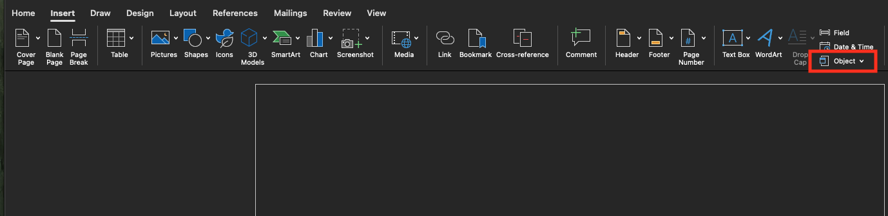
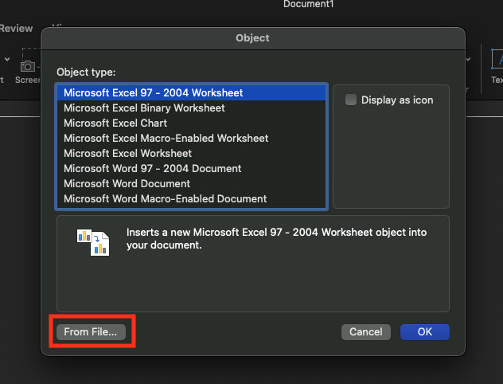

---
# General Information
category: "Computerized Systems"
title: "Microsoft Word (for labs)"
created: "2024-09-19"
---

# Insert Entire Excel sheet into word

Navigate to the `Insert` tab and select `Object`

This should open up the below panel. Once here select `From File` for Mac users 🍎 or `Create from File` for windows users 🖥️:

Browse for the file location of what excel sheet you want to link and that's it.

# Excel

📖 For this section of the notes please refer to the following resources from GCF Global

[Relative and Absolute Cell References](https://edu.gcfglobal.org/en/excel/relative-and-absolute-cell-references/1/)

The above chapter includes a practice workbook that we will complete in class.

# Exercise 1

To get started, open the [practice workbook](./assets/excel_cellreferences_practice.xlsx).

## Taxes

- Click the Paper Goods tab in the bottom-left of the workbook.
- In cell D4, enter a formula that multiplies the unit price in B4, the quantity in C4, and the tax rate in E2. Make sure to use an absolute cell reference for the tax rate because it will be the same in every cell.
- Use the fill handle to copy the formula you just created to cells D5:D12.
- Change the tax rate in cell E2 to 6.5%. Notice that all of your cells have updated.

## Invoices

- Click the Catering Invoice tab.
- Delete the value in cell C5 and replace it with a reference to the total cost of the paper goods. Hint: The cost of the paper goods is in cell E13 on the Paper Goods worksheet.
- Use the same steps from above to calculate the sales tax for each item on the Menu Order worksheet. The total cost in cell E14 should update. Then, in cell C4 of the Catering Invoice worksheet, create a cell reference to the total you just calculated. Note: If you used our practice workbook to follow along during the lesson, you may have already completed this step.

# Competition
