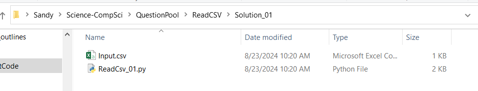

---
# General Information
category: "Computerized Systems"
title: "Hardware, Software, and Operating Systems"
created: "2024-09-03"
coverSrc: "./assets/"
---

# Computer Systems

Building on what we learnt last class, a lot of things could be considered a computer that works exclusively with 1s and 0s. So how do we get from that to what we know, love, and use every day?

In this class we will look at how we go from simple 1s and 0s to transistors, to hardware all the way up to operating systems and application software.

# Hardware and Software

Computers are designed to do any job that their operating systems and application software tell them to do. But how exactly do they manage this, and why?

Computers operate through a combination of hardware and software.

```text
   💽         ↔️      📲
hardware          software
```

# What is Hardware?

Hardware provides the physical components, like:

- The CPU
- Memory
- Storage
- Input devices
- Output devices
- ... and more

which are necessary for processing data. Expanding on our earlier emoji diagram:

```text
this is all "hardware"

          Memory
            💽
            ↕
⌨️ 📷🖱️  ↔️  💾  ↔️  📠 🖥️ 🔊
input      CPU     output
```

## What are Input Devices?

Input devices are components of a computer system, allowing users to interact with the computer by providing data and commands. These devices gather "input" in various forms and send it to the CPU for processing:

- Keyboard
- Mouse
- Touch screen
- Scanner
- Microphone
- Camera

Input devices act as a bridge between the physical world and the digital environment, enabling computers to understand and respond to human actions or other external signals.

```text
you       input devices
🧑    ↔️    ⌨️ 📷🖱️📲📞
```

## What is the CPU?

The CPU, or Central Processing Unit, is often referred to as the "brain" of the computer. It's the primary component responsible for interpreting and executing most of the commands from input devices and other system areas that we’ll explore soon. Just as our senses (like eyes, hands, and nose) send information to our brain for processing, input devices send information to the CPU.

In the same way that our eyes, hands and nose take in information to send to the brain, input devices take in information to send to the CPU for processing.

```text
👀🤲👃   ↔️   🧠

⌨️ 📷🖱️   ↔️   💾
```

Every action a computer performs—from running applications to processing data—relies on the CPU’s ability to execute instructions. If the CPU stopped working, the entire system would shut down, much like how our bodies would cease to function if the brain stopped working.

```text
The end of Poggie as we know her:
             🥔
👀🤲👃   ↔️   🧠

The end of your computer as you know it:
             🔥
⌨️ 📷🖱️   ↔️   💾
```

However, if an input device, like a mouse, fails, the CPU can continue to function perfectly fine. You can still interact with the system using other devices, such as a keyboard or track pad. Similarly, if your eyes require glasses, your brain can still process visual information correctly with the aid of glasses.

```text
20/20 vision was never an option:
👓
👀   ↔️   🧠

No mouse for you:
🔥
🖱️ ⌨️   ↔️   💾
```

So, while the CPU is essential, input devices are equally important for providing the information that the CPU needs to keep everything running smoothly. Remember those transistors we discussed yesterday? They are the building blocks of the CPU, acting as tiny switches that control the flow of electrical signals. Unlike our neurons, which send complex electrical signals requiring years of study to fully understand, transistors operate on a simpler system of "on" and "off" states, corresponding to the binary code (1s and 0s) that computers use to perform calculations and execute instructions.

```text
brain cells communicating with signals
🦠     ↔️      🦠

transistors communicating with signals
⎇      ↔️     ⎇
```

## What are Output Devices?

Output devices are the components of a computer system that take processed data from the CPU and present it in a form that humans can understand or use. These devices translate the computer's digital signals (1s and 0s) into physical output. Common examples include:

- Monitors
- Printers
- Speakers
- Projectors
- Headphones

Output devices are important for making the work of the CPU make sense to us. They bridge the gap between the computer’s digital processes and the physical world, allowing us to interact with and experience the results of computing tasks.

```text
📠 🖥️ 🔊       ↔️      🧑
output devices        you
```

Without output devices, we'd be left with raw 1s and 0s that would make 0 sense to us, much like how studying brain signals can be confusing to the average person. Even neuroscientists, with their advanced knowledge, must interpret complex patterns to draw meaningful conclusions.

```text
Neuroscientist observing cells and being confused:
🦠🦠🦠      ↔️       🔍🧑

You observing transistors and being confused:
⎇⎇⎇       ↔️       🔍🧑
```

Just as understanding brain signals requires a PHD in neuroscience, understanding the full workings of binary and CPU processes is way beyond the scope of a single lecture, and even of an undergraduate computer science course.

Computers are complicated, just like with people, and mastering even a single component can lead to an entire field of study.

# How do computers store information?

Computers only think in terms of 1s and 0s (binary). Every bit of information on your computer is coded in binary and the your computer will translate one set of of 1s and 0s to another when displaying information on your screen.

```text
10101010101010    ↔️    🔍😭
```

## What is a file?

On a computer, you probably have pictures, word documents, saved video games, applications, code, plus a whole lot more. It would be very difficult if every time you opened Word, every document that you ever wrote was all smushed together.

```text
literally everything on your computer    ↔️    🔍😭
```

So, to make your life easier, your computer organizes data into discrete elements, called files. Each file has the data for one thing only, for example, one picture, one Word Document, one application, etc.

```text
📁       📁         📁          ↔️    🔍👀
⬆       ⬆          ⬆
image    word doc    excel
```

In the old days, files used to be a document that was printed on paper. Today, most people refer to files as a document of some kind (picture, code, Word, etc) that is stored on your computer.

```text
files for boomers:
🗃️

files for zoomers:
📁

files for gen alpha:
📱
```

As we progress in society, the way information gets further abstracted away from how we store information on a computer.

## How are files organized?

Before computers were everywhere, most people and companies organized their files into folders.

```text
📁
```

Each folder would have a name, describing what types of files it contained (example: ‘Project 1‘, ‘Project 2‘)

```text
📁           📁
⬆           ⬆
project 1    project 2
```

Maybe, if the number of files were large, the owner of a company might reorganize their files, so that the folder ‘Project 1‘ might be contain more folders (example: grades, lectures, etc.)

```text
    project 1
      📁
      ⬆
📁          📁
⬆          ⬆
grades      lectures
```

With the advent of computers, we went from storing files on paper, in paper folders, in filing cabinets, to storing files on computers easier, the people in charge decided to use the same names.

So, in a folder you can have files and other folders. Since folders are not longer physical things, we need a way to envision them. In short, folders (or directories) are organized into a tree format:

```md
documents
├── english
│ ├── Assignment 1.docx
│ ├── Assignment 2.docx
├── computerized-systems
│ ├── Assignment 1
│ │ ├── raw-info.xls
│ │ ├── summary.pdf
│ ├── Assignment 2
│ │ ├── raw-info.xls
│ │ ├── instructions.pdf
```

## What does this look like on our computers?

Welcome to `File Explorer`, the way you will be navigating your information over the entirety of this course.



In the image above the top line indicates all of the folders relative to each other:

```text
Sandy > Science-CompSci > QuestionPool > ReadCSV > Solution_01
```

means that the folder Sandy contains the folder Science-CompSci which contains …

```md
Sandy
├── Science-CompSci
│ ├── QuestionPool
│ │ ├── ReadCSV
│ │ │ ├── Solution_01
```

And the list of files in the main window are the files that are contained in the folder `Solution_01`

# What is a file extensions?

The file extension is defined as the last bit of a file name that follows the last dot (.)

Example: `code.py` has a file extension` .py`. A word document typically has the extension `.docx`, so the filename is typically assignment `1.docx`.

## Why don’t I see them in File Explorer?

The developers at Microsoft have designed File Explorer to be easy(?) for non-programmers to use, and so by default they hide the file extension.

But, you are now a programmer, and you absolutely need to know what the file extensions are.

To see the detailed file view:

- In File Explorer, navigate to "View" and select "Details"
- You should see a "File name extensions" checkbox option. Click that!!

Enabling file extensions allow you to understand what sorts of files you are dealing with.

## Why do we use File Extensions?

The file extensions give a hint to the operating system (Windows/Linux/Mac) as to what type of data is in the file. So if the extension is .`png` then the operating system knows that it is a picture, and if you double click the filename in File Explorer, it will call the appropriate program that can show you the picture.

Likewise if the file extension is `.docx`, double clicking the file in File Explorer will open Microsoft Office which in turn will read the file and display it to you.

Some important File Extensions in this course:

- Images: `.png` `.jpeg` `.gif`
- Documents: `.docx` `.txt` `.html`
- Audio: `.mp3` `.flac`
- Compressed files: `.zip`

# Compressing / Uncompressing files

There are multiple ways to create a single file from a set of other files (LEA only accepts one document). We will only be discussing one method in this document.

## Compressing Files

- Open file explorer.
- To `zip`, select the files that you want to zip together, and right-click. Select `send to` then `compressed folder`

A new zipped folder with the same name is created in the same location. To rename it, right-click the folder and select `Rename` and then type the new name

## Extracting Files

- Locate the `zip`ped folder that you want to `unzip` (extract)
- Do one of the following:
  - to unzip a single file or folder, open the zipped folder then drag the file or folder to the new location. This way works but is deeply inefficient.
  - To unzip all the con6tents of the zipped folder at once, right click the folder and select `Extract All`

## Misleading Information

If you have double-clicked on a `zip` file, it will open a new window showing all the files within the zip file. This can be misleading because it looks just the same as if the files have been unzipped. However the contents of the zipped file are "READ ONLY". You will not be able to modify the contents unless you first `Extract` them.

TLDR: ALWAYS extract the compressed file before working on it.

# Exercise 1

In this exercise you will be creating a compressed folder. To get started

- Create a folder called `practice-2`
- Inside this folder, create a subfolder or each type:
  - Images
  - Documents
- Save several images of your favorite animal to your `practice-2 > Images` directory.
  - Take a screenshot that shows your different file extensions of the image. Are they `png`, `jpg`, or a `gif`?
  - Drag and drop your screenshot into your `practice-2 > Images` directory.
- Now open up excel where you will create and save an empty excel file:
  - Select `Save As` and store it under your `practice-2 > Documents`
- Compress your `practice-2` folder
- Rename your `practice-2` folder to be your `student ID` and upload it to Lea
