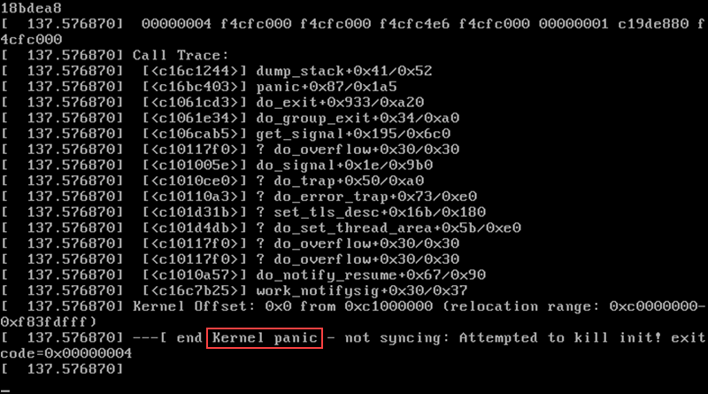

---
# General Information
category: "Computerized Systems"
title: "Software and Operating Systems"
created: "2024-09-04"
coverSrc: "./assets/"
---

# Recap

Hardware refers to any part of the computer with a physical structure. But which components are the most important?

## CPU (Central Processing Unit)

The CPU is the "brain" of the computer, responsible for executing the instructions of a software program. The "power" of a CPU is determined by how many instructions it can execute per second, usually measured in `gigahertz (GHz)`, representing billions of instructions per second.

## RAM (Random Access Memory)

RAM acts as the computer's "short-term memory." It temporarily holds information while the CPU processes it, allowing for quick access to the data needed for running programs and tasks.

## Storage Drives

Storage drives serve as the computer's "long-term memory." This means that data is saved even when the computer is turned off or unplugged. When you run a program or open a file, the computer copies some of the data from the storage drive to the RAM. When you save a file, the data is copied back to the drive.

The storage capacity of a hard drive is measured in `gigabytes (GB)`, the same unit used to measure RAM.

# Software

Software is a set of instructions that tells the hardware what to do and how to do it. The programs running on a computer are collectively referred to as "software" and can be divided into two main categories:

- Operating Systems: These include systems like MacOS, Windows, iOS, Android, and Linux. They manage the hardware and provide a platform for other software to run.
- Application Software: These are programs like Microsoft Word, Excel, and Google Chrome, designed to perform specific tasks for the user.

# Operating Systems

## Origin Story

In the early days of computing, machines could only run one program at a time. Programmers would write their code on punch cards and carry them to a room-sized computer for execution. This process was labor-intensive, requiring manual operation and often taking days or even weeks to produce an output. If a programmer made a single mistake, it could be incredibly costly.

With the advent of transistors, computers became exponentially faster and smaller. This created a need for a more efficient way to manage these machines, leading to the birth of operating systems.

## What are Operating Systems?

Operating systems (OS) are specialized programs with the ability to manage hardware directly. They control all other programs on a computer, making them essential for its operation. The OS is typically the first program to start when you turn on a computer, and it handles the launching and management of all other software.

## Why are Self-Managing Computers so neat?

Operating systems began to emerge in the 1950s as computers became more powerful and widespread. Early OSs helped automate the tedious tasks of loading and managing programs, making computers more accessible and efficient.

## Early Challenges

Initially, each computer was unique, requiring programmers to write code specifically tailored to the hardware of that particular machine. This lack of standardization was problematic as programs written for one computer often didn't work on another. Even when the CPUs were similar, differences in input and output devices meant that programmers had to write low-level code, requiring deep knowledge of each device.

To make things worse, programmers rarely had access to all the different models of devices they were coding for, making it a process of trial and error. Imagine if every time you got a new pair of headphones, you had to read hundreds of pages of manuals just to configure your phone to connect to them. Yeah it was like that for early programmers.

## How were these Problems Solved?

The industry addressed these challenges by moving towards standardization and developing operating systems. OSs provided a common interface between the hardware and software, allowing programs to run on different machines without needing specific adjustments for each device.

This abstraction meant that instead of writing low-level code for every possible configuration, programmers could rely on the operating system to handle the details, making their programs more portable and easier to maintain.

## Early Operating Systems

One of the most influential early operating systems was Multics, released in 1969. However, it sparked some controversy as
one of it's creators, Denis Ritchie, claimed that "it was over-engineered... There was too much in it." This led him to develop "Unix", a simpler OS.

## Early Error Handling

n the early days, if an error occurred in the OS, it would trigger a routine called `PANIC`, causing the machine go into a vegetable like state.



Why would we ever want this?

It was a simpler and more cost-effective solution that allowed the OS to run on a variety of hardware. Despite its limitations, this approach made the OS more portable and it went on to become all the rage in the 70s and 80s.

Later, operating systems like Microsoft Windows introduced their own methods of error handling, including the infamous "Blue Screen of Death," which signaled that a program crashed so badly that it took down the entire operating system.


Have you ever encountered this screen?

## Modern Operating Systems

Today, modern operating systems include:

- MacOS
- Windows
- iOS
- Android
- Linux

## Why are Modern Operating Systems Cool?

Modern OSs are more than cool because they:

- Run directly on the hardware
- Manage and communicate with the hardware, so we don't have to.
- Host and run application software, allowing it to work with the CPU, so we don't need to think about it.
- Provide a user interface for interaction.
- Support multitasking, allowing multiple programs to run simultaneously.

# Application Software

Application software consists of programs that run and execute instructions within the operating system. Examples include:

- Microsoft Office
- Excel
- All browsers
- Games
- and so much more

In this class, we’ll focus on the specific application software relevant to your field. Let's start with OneDrive.

## OneDrive

## What is OneDrive?

OneDrive is a "cloud" storage service provided by Microsoft that allows you to store, access, and share files online. It syncs your files across devices, so you can access them from anywhere with an internet connection.

This is what's known as a "Cloud" storage provider, which is just another fancy way of saying that the file is stored on Microsoft's servers instead of your own computer.

## Cloud Storage Benefits

OneDrive is particularly useful for:

- Files are stored on remote servers and can be accessed from anywhere with an internet connection.
- Files are automatically backed up in multiple data centers, reducing the risk of data loss due to hardware failure.
- Easily scalable. You can increase or decrease storage space as needed, often paying for only what you use.
- Facilitating collaboration on projects with others without needing to constantly send messages

## Traditional Storage Comparison

Traditional storage differs from cloud storage in several key ways, including accessibility, scalability, cost, and security:

- Files are stored locally on physical devices such as hard drives, USB drives, or external storage. Access is limited to the specific device.
- Backup is manual, meaning you need to create copies of your files yourself. If the device fails, recovery options are limited.
- Fixed capacity. Once a hard drive or other storage device is full, you have to purchase additional devices to expand storage.
- Collaboration is more difficult. Files need to be manually shared using external devices or email.

## Other Examples

Some other modern examples you might have heard of:

- Google Drive
- Dropbox
- iCloud

# Summary

Referring back to our diagram, a computer system functions through the interaction between hardware and software. Specializing in any particular area is a dedicated field of study and a career path.

```text
"hardware"

            Memory
             💽
input        ↕         output
⌨️ 📷🖱️  ↔️    💾   ↔️    📠 🖥️ 🔊
            CPU

"software"
              ↕
              🍎     ↔️     📊🛜🎶
operating system        applications

```

This foundation forms the basis of understanding how computers operate and the specific skills needed in various technical careers.

# Achnologements

The lecture content was adapted from Meghrig Terzian and Pretti Peal's course notes, and took inspiration from [Crash Course](https://www.youtube.com/watch?v=O5nskjZ_GoI&t=148s)
