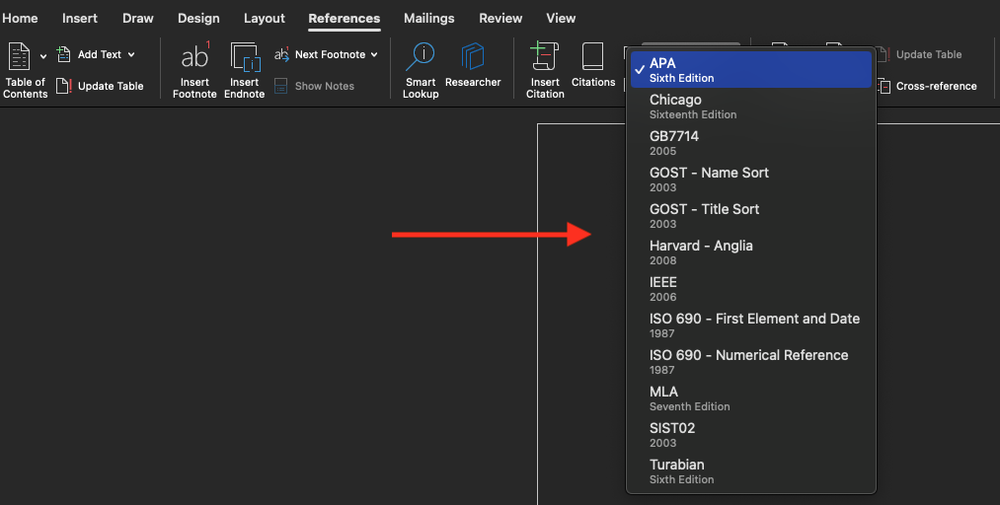
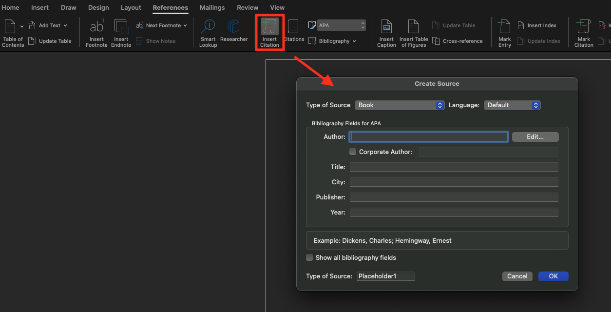
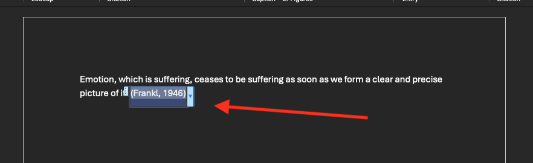
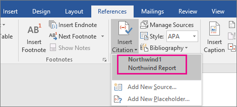
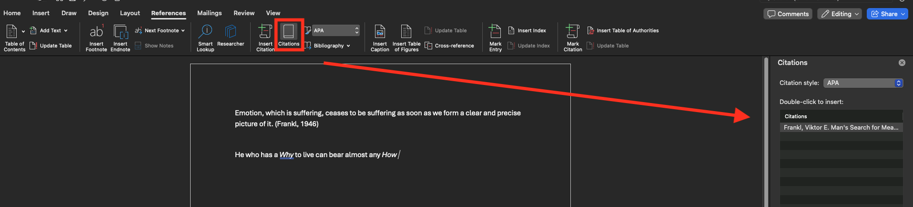
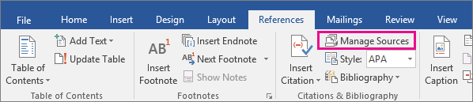

---
# General Information
category: "Computerized Systems"
title: "Microsoft Word (for papers)"
created: "2024-09-12"
coverSrc: "./assets/"
---

# Test 1

Test 1 will take place on October 1 sitting at 20% of your grade. It will focus on the content covered in Assignments 1 and 2 (to be released next week). This is not a memorization class, so these exercises you do during the class period are you studying for the test. If you put in the work during the exercise, you will hopefully find the test VERY easy.

# Quick Recap

- Headers & Footers with page numbers
- Styles text and justification
- Default headings and the TOC
- Templates
  - Templates in Microsoft Office may take some time to load because it's Microsoft. If you had any trouble using a newly created template from last class (e.g. me), it should open up fine now.

# Lists

TBD

# Footnotes and Endnotes

Sometimes you need to add important information to the document that is not necessarily considered as the main content.

## Where these appear?

- Footnotes appear at the bottom of the Page
- Endnotes appear at the bottom of the Document

## How do these relate to the text?

A number or symbol on the footnote or endnote matches up with a reference mark in the document.

## How do you add them?

Select the text you want to reference a footnote or endnote. Next, go to the "References" tab and select "Insert Footnote" or "Insert Endnote":

This should open up the below view. Here you can enter the text you want to add as a footnote or endnote:

Return to your place in the document by double-clicking the number or symbol at the beginning of the note.

## What happens if you get stuck?

Check out the official Microsoft documentation on footnotes/endnotes [here](https://support.microsoft.com/en-us/office/insert-footnotes-and-endnotes-61f3fb1a-4717-414c-9a8f-015a5f3ff4cb)

# Citations vs Bibliography vs References

These are not the same.

## What's the difference?

- In _Citations_, you only list items you have referred to AND cited in your paper.
- A _Bibliography_ is a list of all the sources you used to generate your ideas about the topic including those cited in your paper as well as those you did not cite.
- In _References_, you only list sources that you have cited IN TEXT in your paper.

# Citations

## Adding a New Citation

To add a new citation and source to a document, first go to the "References" tab, in the "Citations & Bibliography" section, click the arrow next to style and click the style you want to use for the citation:

Next click "Insert Citation" and add the following information:

Once complete, a citation in the style you selected (For example, I choose APA), should appear:

## Selecting a Previous Citation

To add a citation you have already added, first fo to the "References" tab and in the "Citations & Bibliography" section,

On Windows 🖥️ , click "Insert Citations" and from the list of citations under Insert Citation, select the citation you want to use:

On Mac 🍎, click "Citations". This should open up the "Citations" panel on the right and from the list of citations, double click the one you would like to insert:

## Editing a Citation

On the "References" tab, in the "Citations & Bibliography" section, on Windows 🖥️ you can click "Manage Sources."

Or on Mac 🍎, in the "References" tab, in the "Citations & Bibliography" section, in the bottom right hand corner select "Edit Source..."

## What happens if you get stuck?

Check out the official Microsoft documentation on citations [here](https://support.microsoft.com/en-us/office/add-citations-in-a-word-document-ab9322bb-a8d3-47f4-80c8-63c06779f127)
