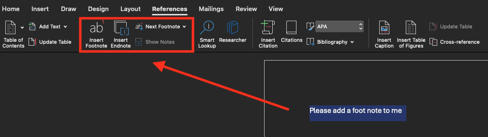

---
# General Information
category: "Computerized Systems"
title: "Microsoft Word (for labs)"
created: "2024-09-12"
coverSrc: "./assets/"
---

# Test 1

Test 1 will take place on October 1 sitting at 20% of your grade. It will focus on the content covered in Assignments 1 and 2 (to be released next week). This is not a memorization class, so these exercises you do during the class period are you studying for the test. If you put in the work during the exercise, you will hopefully find the test VERY easy.

# Footnotes and Endnotes

Sometimes you need to add important information to the document that is not necessarily considered as the main content.

## Where these appear?

- Footnotes appear at the bottom of the Page
- Endnotes appear at the bottom of the Document

## How do these relate to the text?

A number or symbol on the footnote or endnote matches up with a reference mark in the document.

## How do you add them?

Select the text you want to reference a footnote or endnote. Next, go to the References tab and select "Insert Footnote" or "Insert Endnote":

This should open up the below view. Here you can enter the text you want to add as a footnote or endnote:

Return to your place in the document by double-clicking the number or symbol at the beginning of the note.

# Bibliography

-

# Integration

-
