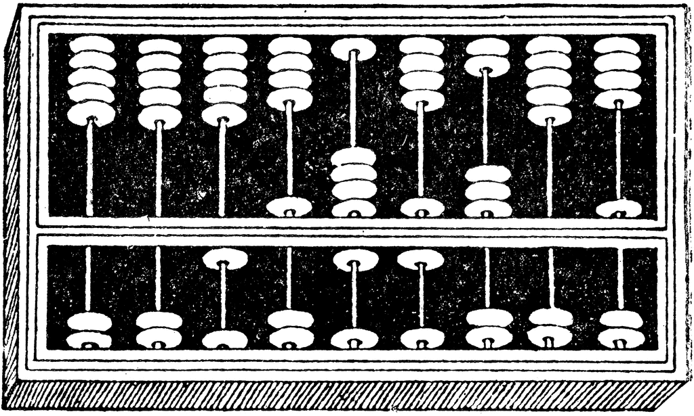
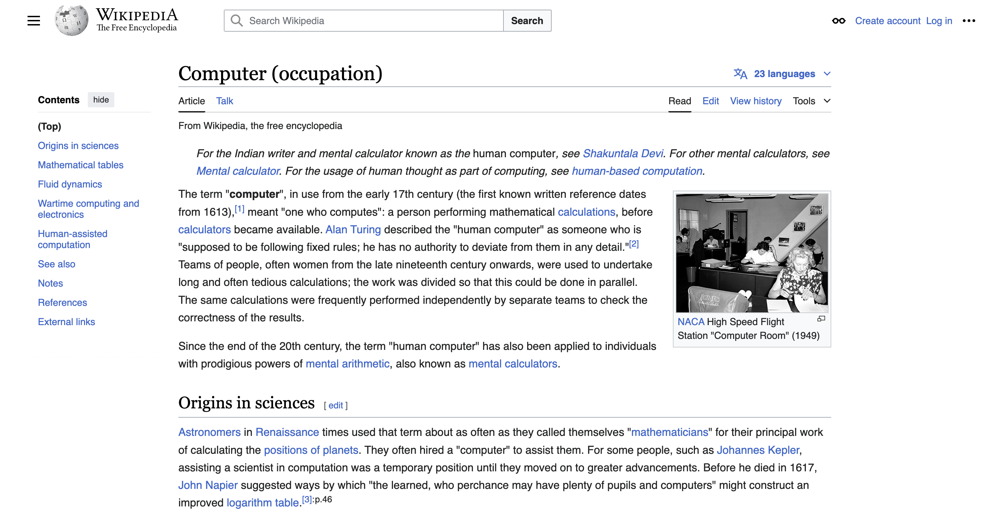
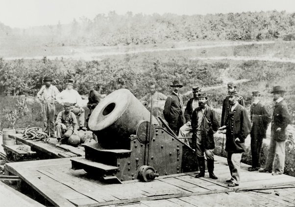
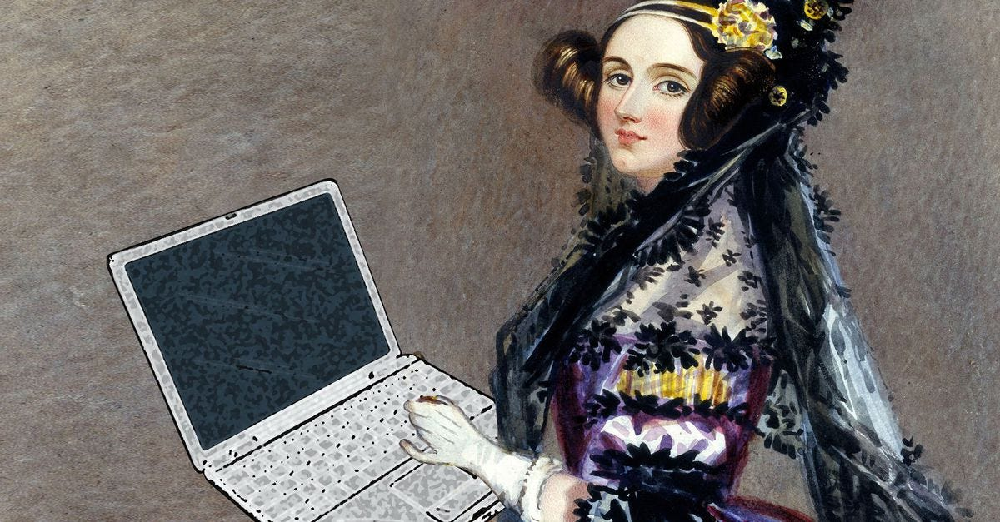
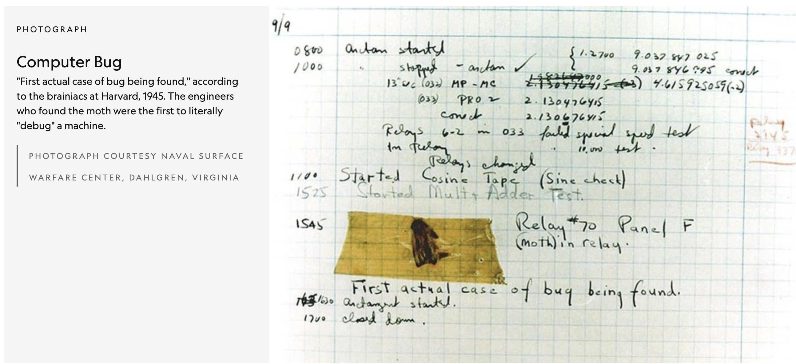
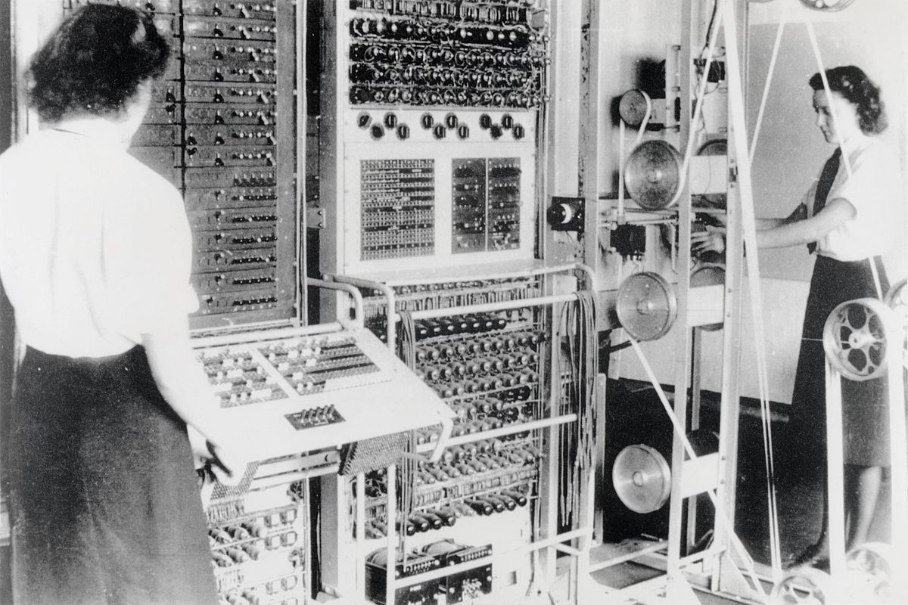

---
# General Information
category: "Computerized Systems"
title: "Computer Concepts"
created: "2024-08-29"
coverSrc: "./assets/ada.jpg"
---

# Why care?

To excel in a career in Biopharmaceutical Production Technology, you need to develop a solid understanding of several key computer concepts and skills. The truth is, many of you will be working with computers just as much as you will be working with people. Mastering the concepts covered in this class will not only help you succeed at JAC but will also give you a solid foundation for success in the industry.

## Industry Standards and Compliance

The biopharmaceutical industry is heavily regulated, with strict guidelines for data management, process control, and product quality. Data integrity is a top priority, as any issues can lead to potential legal problems. We always strive to minimize lawsuit potential in our work, as nothing jeopardizes job security faster than legal complications :^). Consequently, understanding how to use software that ensures compliance with regulations like those set by the FDA will set you up for success in the field.

## Data-Driven Decision Making

As personalized medicine becomes increasingly important, data analysis tools are essential for understanding complex biological data. When it comes to efficiently managing large amounts of sensitive data and minimizing human error, strong computer literacy is an asset.

## Collaboration and Communication

In the biopharmaceutical industry, teams are often multidisciplinary and spread across different cities, and sometimes even continents. Effective communication and collaboration tools are crucial to ensure projects are completed on time and that everyone stays aligned. Proficiency in using software like Microsoft Office and Google Workspace will be expected when you enter the field, so it's important to be comfortable with these tools.

# What's skills matter?

There are many skills needed to excel in this field. For the purposes of this class, we'll focus on the following:

## Basic Computer Concepts

Building skills in organizing, accessing, and managing digital files efficiently.

## Operating Systems

Understanding how to use different operating systems like Windows, macOS, and Linux.

## Spreadsheet Software

Developing proficiency in using spreadsheets for analyzing biological data.

## Word Processing Software

Becoming proficient with word processing and presentation tools such as Microsoft Office and Google Workspace.

## Database Software

Learning how to use and manage databases, including the ability to store and retrieve biopharmaceutical data.

## ... and more

While this class will focus on these areas, keep in mind that concepts like automation, laboratory information management systems, security, and basic programming will also be valuable in your career. However, these are beyond the scope of what we'll cover here.

# Computer Essentials

Computers are the life blood of today's world. If they were to suddenly turn off, all at once, the power grid would shut down, cars would crash, and planes would fall, water treatment plants would stop, the stock market would freeze, and employees wouldn't get paid.

Computers have not just changed the biopharmaceutical industry, but almost all of our lives.

## What are computers?

They are just simple machines that perform complex actions through many layers of abstraction. In the next few lectures we are going to break down those layers and build up from simple 1s and 0s to operating systems, the entire internet and beyond.

But before we get into the context of the computers we know and love today, we first need to understand the context behind them to better appreciate why there are so many different layers to begin with.

So let's start at the beginning...

# The People and the Inventions

## What's the earliest recognized device for computing?

The abacus, invented in Mesopotamia around 2500 BCE, is often recognized as the earliest computing device. Essentially, it is a hand-operated calculator. But why is it considered a computer? Despite being manually operated and lacking electronic components or software, the abacus performs calculations and processes data in a way that reflects the basic functions of modern computers. It embodies the fundamental principles of computation, serving as a precursor to today’s computing devices.

## What was the first use of the term computer?

Originally, the term "computer" referred to a person who performed calculations, often with the aid of machines. This role continued into the late 1800s, when the meaning of "computer" shifted from describing an occupation to referring to the machines we use today.

"As each increase of knowledge, as well on the contrivance of every new tool, human labour becomes abridged." - Charles Babbage, the pioneer of computing

Or, in other words, "Why work if a machine can do it for you?"

## Why did we need to create faster computers?

Speed and accuracy are especially important on the battlefield which is why the military was the first to apply computing to complex problems. What sort of problems you may ask? Well, how to effectively fire your cannons at your enemies despite weather conditions. The weather unfortunately can affect how accurately you can plow down the opposing parties so there was a larger need for faster computing devices.

Somewhat ironically, the first "computer device" that was created was with the intent to destroy people as opposed to it's more altruistic intents in modern society.

## What is the first general purpose computer?

Charles Babbage spent over two decades working on the creation of a massive 15-ton computer. As you might imagine, the project was eventually discontinued due to its massive cost, which far outweighed its practical applications at the time. Despite this, Babbage's work represents the first attempt to design a general-purpose computation device. For this reason, he is still celebrated as the father of computing, even though his project was well ahead of its time.

## What is the Analytical Engine?

The pros:

- Capable of performing various computations, not limited to a single task
- Could be given data and run operations in sequence
- Featured memory and a primitive printer
- Implemented conditional branches and looping, concepts that all the computer nerds continue to love to this day.

The cons:

- Never fully constructed due to being ahead of its time
- Being "easily transportable" was not a top priority during its design

In summary: The ability to automate a series of operations was groundbreaking and foreshadowed the development of modern computer programs

## The First Programmer

The Analytical Engine would inspire, arguably, the first generation of computer scientists. It was not long after it's proposition that Ada Lovelace, an English mathematician and writer, wrote hypothetical programs that could be run on the machine.

She was the first to recognize that the machine had applications beyond pure calculation, and went on to publish the first ever algorithm intended to be carried out by the Analytical Engine.

Consequently, she is considered the world's first programmer. Lovelace's notes on the Analytical Engine demonstrated a deep understanding of the machine’s potential, including concepts like looping and conditional branching, which are fundamental to modern programming.

# Exercise 1

- Organize yourselves into small groups of up to 4 people. Feel free to choose your group members based on your preferences or if you prefer to work independently, thats ok too.
- Discuss and list various devices that can be considered computers. Consider a wide range of examples, from traditional desktops and laptops to more unconventional devices.
- After brainstorming, each group will share their list with the rest of the class. Be prepared to explain why you classified each device as a computer and how it impacts our daily lives.

# Electronic Computing

## Early Electromechanical Computing

One of the largest electromechanical computers built between 1937 and 1944 was the Harvard Mark 1. Why? For the allies in World War I. The early uses for this machine was running simulations for the manhattan project. However these machines were massive, dark, and prone to error. These machines attracted bugs and from then on, when anything went wrong with a computer, we said it had bugs in it. What started as a literal moth in the machine, eventually became a euphuism to describe unexpected behavior in computer programs today.

## Colossus

Mechanical computers were far from perfect and therefore the need for purely electrical computers became necessary. When working with time sensitive information, you couldn't afford to have faulty calculations generated by literal moths. This is why the Colossus Mark 1 was considered ground breaking.

Why was this developed? Military purposes of course and this time the intent was to decode nazi communication in World War II. In 1943 developed by Tommy Flowers, 12 of these machines were built. This is considered the first programmable electronic computer and it's existence was shrouded in secrecy until the mid-1970s.

It was still a very complicated setup so while it is considered "programmable", it still had to be configured to perform any specific operation.

## ENIAC

A few years later, the Electronic Numerical Integrator and Computer (ENIAC) was developed to address these needs. Designed by John Mauchly and Presper Eckert, ENIAC was the world’s first computer that was:

- General Purpose: Capable of performing a wide range of tasks beyond specific calculations.
- Fully Programmable: Able to be programmed to execute various types of computations.
- Fully Electronic: Utilized electronic components rather than mechanical ones.

ENIAC could perform calculations in seconds, far surpassing the speed of any earlier computing device. It was operational for ten years and is estimated to have completed more arithmetic calculations than the entire human race up to that point.

## Why was ENIAC made?

You might notice a recurring theme: ENIAC was developed for military purposes. It was originally designed to calculate artillery trajectories and ballistic tables for the Army. These calculations were crucial for improving the accuracy of artillery fire and demanded significant computational power.

A big shout-out to Charles Babbage; his vision for a computing machine, developed about a century earlier, finally came to fruition with ENIAC. By the time ENIAC was built, technology had advanced enough to bring Babbage’s original ideas to life.

## Why do you think we needed to move away from ENIAC?

Back in the day, ENIAC used vacuum tubes for its electronics. Imagine these as early versions of light bulbs; like household bulbs, they had a tendency to burn out quickly, leading to frequent failures. As a result, ENIAC could only operate for half a day before needing before falling apart again.

Innovation was crucial to address these issues. To reduce costs, size, and enhance computational speed, new technology was developed. Thanks to John Bardeen, William Shockley, and Walter Brattain, we moved away from massive machines like ENIAC, which was 8 feet tall, 100 feet long, and over 30 tons. Their invention of the transistor paved the way for smaller, more efficient computers.

## Transistors

Unlike the fragile vacuum tubes made of glass, transistors are solid-state components. This shift led to smaller, more affordable computers that operated more efficiently and with greater reliability. While ENIAC could be kept running for only half a day before needing repairs, computers using transistors were consistently operational.

The introduction of transistors allowed IBM to transition all its computer systems to transistor-based architectures. This innovation made computing power more accessible to the general public, rather than being limited to military use. Today, transistors are incredibly tiny, measuring less than 50 nanometers. For perspective, a sheet of paper is about 100,000 nanometers thick, so if you stacked 2,000 transistors, you’d reach the thickness of that paper.

## How do Transistors work?

Transistors operate with two distinct states: on or off, represented as 0 or 1. Much like the earlier vacuum tubes, they either allow electricity to pass through or block it. This binary encoding enables us to represent a vast amount of information using just these two states.

# Exercise 2

- Organize yourselves into small groups of up to 4 people. Feel free to choose your group members based on your preferences or if you prefer to work independently, thats ok too.
- Discuss and brainstorm various types of information that can be encoded using two states: on (1) and off (0). Consider a range of applications, from simple to complex. For example:

  - Text: How can binary encoding represent letters and words?
  - Images: How can binary be used to encode visual data, like pixels in a picture?
  - Sound: Consider how sound waves can be represented in binary form
  - Data Storage: Explore how binary encoding is used in storing data on devices.

- Develop one example of information encoded in binary. You might use something more straightforward like a text message or more complex ones like image pixel data. Feel free to use online resources to help with your examples such as Google.
- Explain how binary encoding is applied in your example.

# Conclusion

So, how do we transition from 1s and 0s to actual computing? More on that soon :)

# Acknowledgements

The lecture content was adapted from Pretti Peal's course notes, and took inspiration from [Crash Course](https://www.youtube.com/watch?v=O5nskjZ_GoI&t=148s)
