---
# General Information
category: "Computerized Systems"
title: "Microsoft Word (with hotkeys)"
created: "2024-09-10"
coverSrc: "./assets/"
---

# Keyboard Shortcuts

Anything you can do with a mouse, you can do FASTER with a keyboard shortcut. In this class, we'll focus on learning how to use Microsoft Word efficiently so you can spend less time on assignments and more time on what matters to you.

# Universal Shortcuts

Whether you're using Mac, Windows, Linux, or even Word, there are certain shortcuts that will always be available to you.

```md
| Shortcut | PC 🖥️  | Mac 🍎      |
| :------- | :----- | :---------- |
| Copy 📑  | Ctrl+C | Cmd+C       |
| Cut 🪚   | Ctrl+X | Cmd+X       |
| Paste 🔩 | Ctrl+V | Cmd+V       |
| Undo ↩️  | Ctrl+Z | Cmd+Z       |
| Redo ↪️  | Ctrl+Y | Cmd+shift+Z |
```

# Microsoft Word Shortcuts

## Quick Save

It's important to save often, especially when making large changes. To quickly save your work, use the following shortcut:

```md
| PC 🖥️  | Mac 🍎 |
| :----- | :----- |
| Ctrl+S | Cmd+S  |
```

## Printing

Just as important as saving is knowing how to print your document efficiently:

```md
| PC 🖥️  | Mac 🍎 |
| :----- | :----- |
| Ctrl+P | Cmd+P  |
```

## Spelling and Grammar

If you want a quick summary of all your spelling and grammar mistakes, just hit the `F7` key. It will give you an instant overview of any potential roasts.

```md
| PC 🖥️ | Mac 🍎 |
| :---- | :----- |
| f7    | f7     |
```

Once clicked, you should see the following:

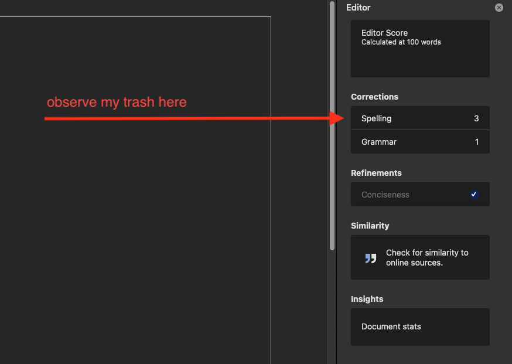

## Finder

The Finder tool opens the "Navigation" panel to quickly locate a word or phrase in your document.

```md
| PC 🖥️  | Mac 🍎 |
| :----- | :----- |
| Ctrl+F | Cmd+F  |
```

This shortcut is especially helpful when you're working with a large document and need to track down all instances of a specific error.

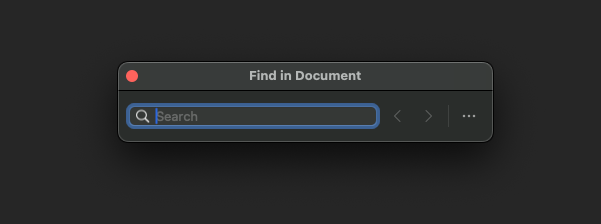

## New Page

Instead of hitting "Enter" repeatedly to push text to the next page, there's a quicker way to do it. Just use this shortcut:

```md
| PC 🖥️      | Mac 🍎    |
| :--------- | :-------- |
| Ctrl+Enter | Cmd+Enter |
```

And that's all you have to do :^)

## Opening & Creating Documents

There are a few simple ways to create a new document or open an existing one, making it easier to get started with your work.

```md
|                       | PC 🖥️  | Mac 🍎 |
| :-------------------- | :----- | :----- |
| Create a new document | Ctrl+N | Cmd+N  |
| Open an old document  | Ctrl+O | Cmd+O  |
```

## Text Formatting Shortcuts

Sometimes moving the cursor up to the Ribbon is annoying. These common text formatting shortcuts make it easier to quickly create and edit your text:

```md
| Style             | PC 🖥️  | Mac 🍎 |
| :---------------- | :----- | :----- |
| Underline         | Ctrl+U | Cmd+U  |
| Bold              | Ctrl+B | Cmd+B  |
| Italics           | Ctrl+I | Cmd+I  |
| Make font bigger  | Ctrl+] | Cmd+]  |
| Make font smaller | Ctrl+[ | Cmd+[  |
```

## Paragraph & Text Alignment

Equally important is adjusting the alignment of text on your page:

```md
| Alignment | PC 🖥️  | Mac 🍎 |
| :-------- | :----- | :----- |
| Center    | Ctrl+E | Cmd+E  |
| Left      | Ctrl+L | Cmd+L  |
| Right     | Ctrl+R | Cmd+R  |
| Justify   | Ctrl+J | Cmd+J  |
```

# More fun features

Let's start by making a blank document using `Ctrl+N` (Windows) or `Cmd+N` (Mac)

## Dictate

You don’t have to type everything yourself in Microsoft Word. Instead, use the `Dictate` feature for voice-to-text functionality:
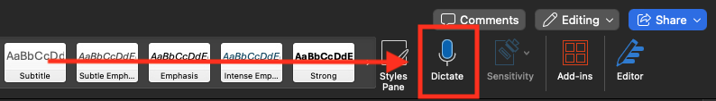

Why ever use this feature? Have you been stuck on a lab assignment or essay and not sure where to start? Try this approach:

- Start by using the above function or vomiting all your thoughts and ideas on the page, no matter how scattered they might be.
- Once you’ve written down your stream of consciousness, use ChatGPT to summarize and organize your draft.
- After the AI has put together a more structured version, tweak it to match your own voice and style, rather than relying on the default tone provided by the bot.

AI is everywhere, but the key is to use it as a resource, not as a shortcut to complete your work. Fun Fact: This is actually how I write these notes and it’s a core part of my workflow.

Just remember, each class has its own policy on AI use. For this class, consider it a tool to support your work, not a replacement for the effort you put in (otherwise you will find my tests painful)

## Clear Formatting

If you’ve made numerous changes to a document and want to revert the styles back to their original state, you have two options. You could hit "Undo" repeatedly, or you could simply highlight the text you want to revert and click the "Clear Formatting" button:

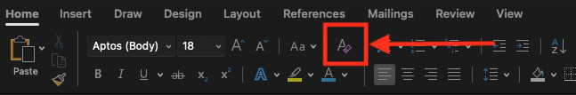

## Dark Mode

Let's save your retinas and enable "Dark Mode" for Microsoft Word, start by finding the "Preferences" tab:

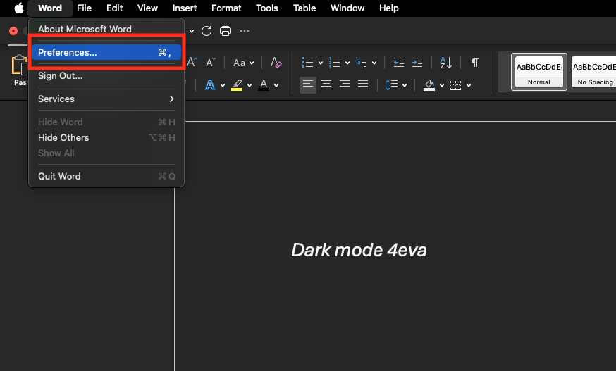

Next, use the search bar to type "Dark." You should see the option appear. Select it to switch to Dark Mode:

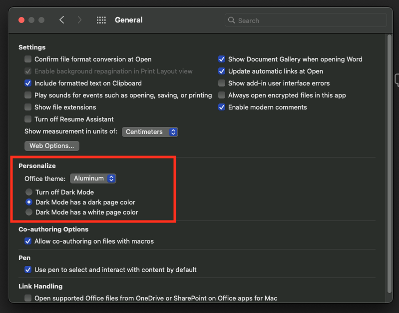

## Headers and Footers

To open up the `Header & Footer` tools, double-click the top or bottom section of your document. This action will reveal the following options:

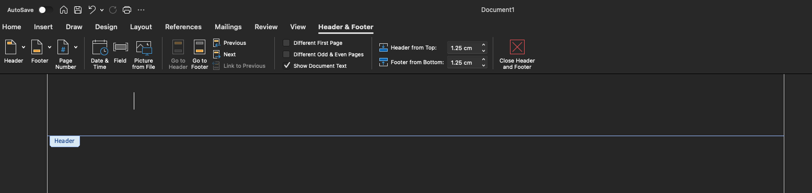

You can then easily add page numbers by selecting "Page Number" and choosing your preferred location.

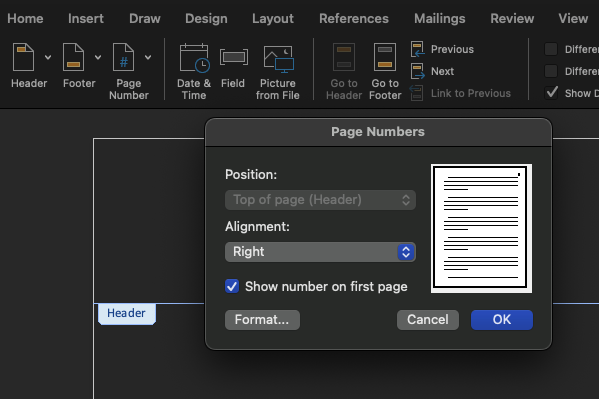

## Table of Contents

Inserting a Table of Contents (TOC) in Microsoft Word is a straightforward process that can be done automatically based on your document's heading styles.

Step 1: Before inserting the TOC, make sure you’ve applied Word’s built-in "Heading Styles" to your document headings.

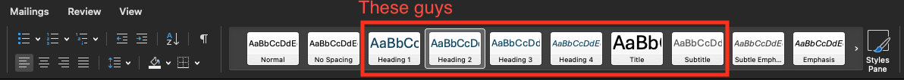

Step 2: If you want to customize the styles, open the "Styles Pane" where you can create new styles or modify existing ones.

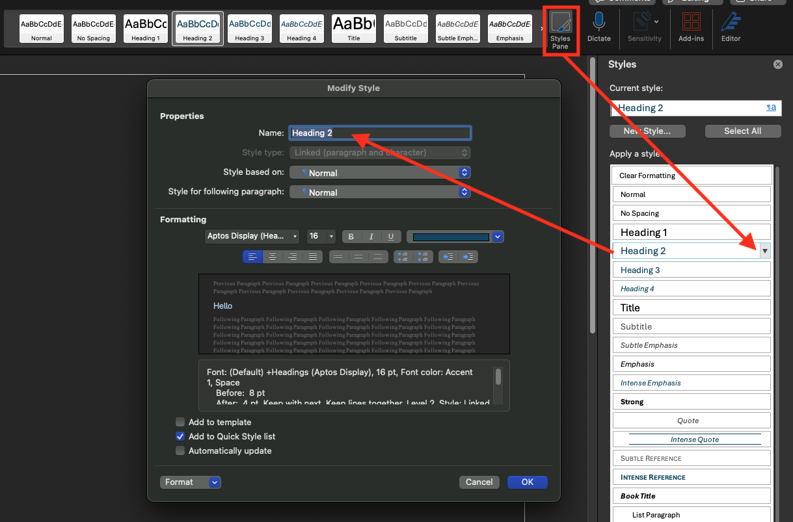

Step 3: Click where you want to insert the TOC. Go to the `References > Table of Contents` and choose your preferred style from the dropdown menu.


Step 4: As you update your document and make changes to headings, you can refresh the TOC by clicking inside it and selecting "Update."


# Collaborative Tools

You don’t always need to use the Word Desktop App and sometimes you don't have access to it. You can access your documents through [OneDrive](https://johnabbott-my.sharepoint.com/), provided by John Abbott.

## Version History

If you make some edits and decide you don’t like the direction of the document, you can track and revert changes easily. Just go to `File > Info > Version History` to see previous versions and restore the one you prefer.

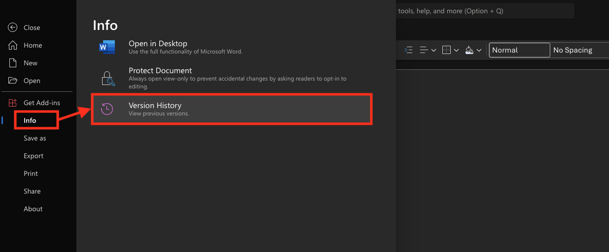

## Comments and Suggestions

To add a comment, highlight the text where you want to insert it. A 💬 icon will appear. Click on it and use the @ symbol to directly annoy your peers with updates to your doc.


## Real Time Co-Authoring

Multiple users can work on the document simultaneously.

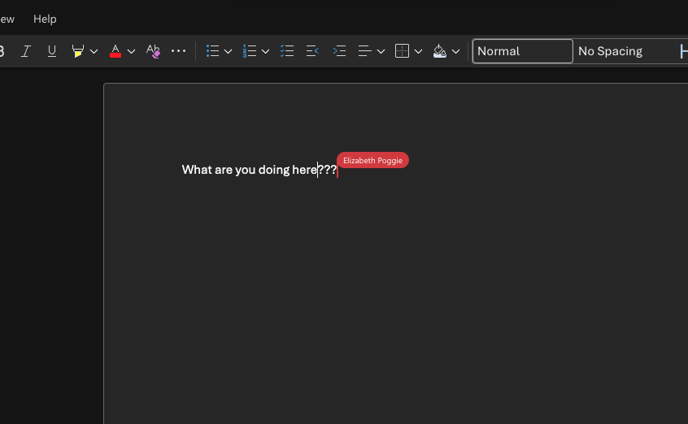

## Integration with Desktop Microsoft

Documents are automatically saved to OneDrive, so you can access them from anywhere. Try creating a document online, saving it, and then opening it on the desktop app using `Ctrl+O` (Windows) or `Cmd+O` (Mac).

# Exercise 1

In this exercise, you’ll create a draft Lab Report that you can use for your other classes. Follow these steps to get started:

- Step 1) Open up a new doc using `Ctrl+N` (Windows) or `Cmd+N` (Mac)
- Step 2) Save the document to your `OneDrive > Documents` folder. Create a new subfolder called `Templates`.
- Step 3) Save your document with a descriptive name, such as `Lab Report Template - JAC 2024`
- Step 4) Customize the document by adding text, headings, images, formatting, or placeholders. Try to include:
  - Headers & Footers
  - A Table of Contents (TOC)
  - An Introduction Page with your name and student ID
  - A table
- Step 5) Once you’ve completed the template, check how it looks in the online tool.
- Step 6) After you’ve created your template, I’ll show you how to export it soon.

# Templates

## Saving Templates

- Click on File in the top-left corner.
- Select `Save As`.
- Choose your `Templates` folder to Save your Template in
- In the Save as type dropdown (Windows) or File Format dropdown (Mac), select Word Template `\*.dotx`.

## Using the Template

- Start by creating a new document in Word.
- Select `New from Template`
- To find your custom templates, choose `Personal`. You should see your `Lab Report Template - JAC 2024` listed there.
- Happy creating :^)
