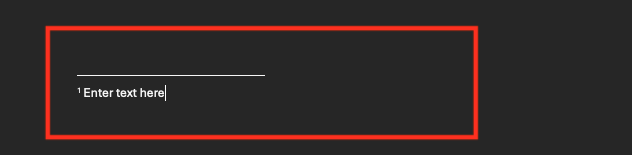
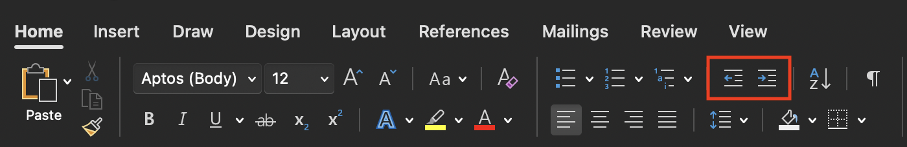

---
# General Information
category: "Computerized Systems"
title: "Microsoft Word (for papers)"
created: "2024-09-12"
number: 6
---

# Test 1

Test 1 is scheduled for October 1 and will account for 20% of your overall grade. It will cover the material from Assignments 1 and 2, which will be released next week. This class does not rely on memorization, so the exercises you complete during class are you studying for the test.

TLDR: If you put in the work during these exercises, you will hopefully find the test easy.

# OneDrive Links

For your assignment, please ensure you follow the OneDrive Exercise guidelines for sharing links correctly. I’m noticing a few `.zip` folders, but I need links to the locations of these `.zip` folders on your online OneDrive or links that had their access die by the time I tried to look at it. If you continue to experience issues after today’s exercises, we can work through them together.

I will dedicate part of today’s class to help you finalize this.

# Quick Recap

- Headers & Footers with page numbers 👉 You can format the page numbers to match any specific style you prefer.
- Styles text and justification 👉 Using hotkeys will save you time when styling text and adjusting alignment.
- Default headings and the TOC 👉 You can customize the default heading styles by using the "Styles" pane.
- Templates 👉 Microsoft Office templates may take some time to load because it's Microsoft. If you experienced any issues with a template from the last class (like me lol), it should open properly now.

# Footnotes and Endnotes

Sometimes, you may need to add important details that are not part of the main content of your document.

## Where do they appear?

- _Footnotes_ are located at the bottom of the page.
- _Endnotes_ are placed at the end of the entire document.

## How do they relate to the text?

Footnotes and endnotes use a number or symbol that corresponds to a reference mark in the main text.

## How do you add them?

First, select the text where you want to place the reference for a footnote or endnote. Next, go to the "References" tab and click "Insert Footnote" or "Insert Endnote":

This will open the area where you can add text:

To return to your spot in the document, double-click outside the view.

## What should you do if you get stuck?

If you run into any issues, refer to the official Microsoft documentation on footnotes & endnotes:

- For Windows 🖥️, [here](https://support.microsoft.com/en-us/office/insert-footnotes-and-endnotes-61f3fb1a-4717-414c-9a8f-015a5f3ff4cb)
- For Mac 🍎, [here](https://support.microsoft.com/en-us/office/add-footnotes-and-endnotes-in-word-on-mac-and-ios-a58d1685-94f6-43f5-ba26-aa15aa62c6ed)

# Citations vs Bibliography vs References

These terms may seem similar but they are NOT the same.

## What's the difference?

- _Citations_ 👉 Only list the sources you have specifically referred to and cited in your paper.
- _Bibliography_ 👉 A comprehensive list of ALL the sources you used, INCLUDING those you did not as well as those cited in your paper.
- _References_ 👉 Only include sources that are cited DIRECTLY in the text of your paper.

# Citations

## Adding a New Citation

To add a new citation and source, navigate to the "References" tab. In the "Citations & Bibliography" section, click the arrow next to "Style" and choose your preferred citation style:

Next, click "Insert Citation" and fill in the required information for the new source:

Once you’re done, a properly formatted citation in your chosen style (e.g. APA) will appear in your document:

## Selecting a Previous Citation

If you want to reuse a citation you’ve already added, follow these steps ...

On Windows 🖥️, go to the "References" tab, click "Insert Citation" in the "Citations & Bibliography" section, and choose the citation from the list:

On Mac 🍎: click "Citations". Click "Citations" in the same section. This will open the "Citations" panel on the right. Double-click the citation you want to insert:

## Editing a Citation

To make changes to a citation...

On Windows 🖥️, go to the "References" tab and click "Manage Sources" in the "Citations & Bibliography" section:

On Mac 🍎, In the "References" tab, click "Edit Source..." in the bottom-right corner of the "Citations & Bibliography" section:

## What should you do if you get stuck?

If you run into any issues, refer to the official Microsoft documentation on citations:

- For Windows 🖥️, [here](https://support.microsoft.com/en-us/office/add-citations-in-a-word-document-ab9322bb-a8d3-47f4-80c8-63c06779f127)
- For Mac 🍎, [here](https://support.microsoft.com/en-us/office/add-or-change-sources-citations-and-bibliographies-159264ec-0a8a-4e9e-acf7-21faa9c371c2)

# Bibliographies

Once you’ve added all your sources, you can generate a bibliography. Position your cursor where you want the bibliography to appear, then go to the "References" tab and select your format in the "Bibliography" section:

## What should you do if you get stuck?

If you run into any issues, refer to the official Microsoft documentation on bibliographies:

- For Windows 🖥️, [here](https://support.microsoft.com/en-us/office/create-a-bibliography-citations-and-references-17686589-4824-4940-9c69-342c289fa2a5)
- For Mac 🍎, [here](https://support.microsoft.com/en-us/office/add-or-change-sources-citations-and-bibliographies-159264ec-0a8a-4e9e-acf7-21faa9c371c2)

# Exercise 1

Please review the document on LEA and adjust the styles to match the requirements of your English class this semester. Look for and correct any formatting mistakes you find.

## Solution

The corrected document should address the following changes:

- Include a cover page.
- Place the Table of Contents (TOC) on its own page, which should be the second page.
- You should actually be able to read all the text.
- Format headings so they integrate with the TOC.
- Use Word's built-in features for citations.
- Create the bibliography manually rather than copying and pasting from external sources.
- Ensure headers and footers contain properly formatted page numbers, not in Roman numerals.
- If there is no data to present, the "data" section should not be included.
- Your paper should NOT include both endnotes and footnotes. Choose one type and use it consistently throughout the document.
- There should be no screenshots from ChatGPT.
- Make sure to save this to your _OneDrive_ so there's a proper backup in case anything gets deleted.

# Indenting and Tabs

Indenting is part of every english assignment as it helps structure your document. A quicker way to indent is with the `Tab` key. Alternatively if you want to make your life harder for yourself you can use these guys:

## Formatting Revealed

Ever need to review the formatting decisions you’ve made? You can easily double-check them by selecting this guy:

It reveals all hidden formatting details in the document, like tabs, spaces, and paragraph marks.

# Design Elements

## Horizontal Lines

If you want to modify the structural elements of your document, such as horizontal lines, select this option:

## Icons

Microsoft also provides access to an extensive library of icons and stock images, which you can include in your work if needed by selecting the "Insert" tab:

Also, take a moment to appreciate all the options available to you in the "Insert" tab.

One feature that could be especially helpful is the "Equation" section, especially when it comes to explaining your methods in your lab reports 👀

