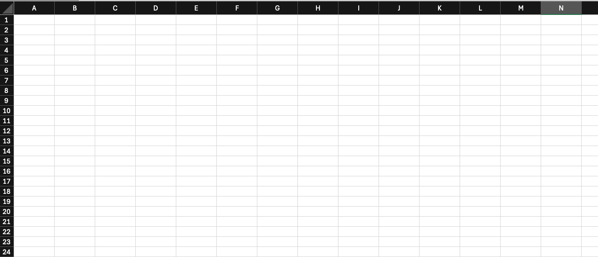
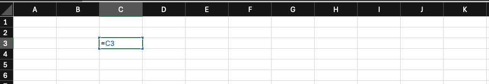
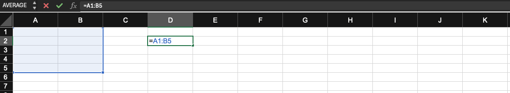

---
# General Information
category: "Computerized Systems"
title: "Excel (Functions & References)"
created: "2024-09-23"
---

# Spreadsheet Programs

## What is it?

Exactly what you think it is, a giant grid of columns and rows.

## What are some examples?

- Microsoft Excel
- Google Sheets
- Apple Numbers
- ... and many others

For this class, we’ll be focusing primarily on Excel. However, most of the concepts and logic we’ll cover can be applied across almost any spreadsheet software you might use. I personally use Google Sheets.

# Excel

## Who uses Excel?

Its one of the most popular tools on the planet. With around 750 million users globally, Excel is present in almost every company that exists.

## Why is it so popular?

It makes it really easy to analyze large sets of data.

## How do you get started?

Open up excel and let's get started. We will explore it together.

# Overview

## Workbooks

A workbook is the entire Excel file, and it can contain multiple sheets (also known as tabs). Each workbook is saved as a standalone file, allowing you to manage related sets of data in one place.

## Worksheet (Tab)

Each workbook includes one or more worksheets, commonly referred to as tabs. These worksheets are where the data is stored and displayed in a grid format made up of rows and columns.

## Rows & Columns

Rows are _horizontal_ and _numbered_ (e.g., 1, 2, 3), while columns are _vertical_ and _labeled_ with letters (e.g., A, B, C). Together, they form the grid that organizes your data.



## Cell

Cells are the individual units within a worksheet where data is entered. Each cell is identified by its unique _cell reference_, which combines the column letter and row number (e.g., C3).



## Formula Bar

When you click on a cell, the formula bar displays what’s inside that cell. This can include:

- Text, numbers, data
- Formulas
- Functions

## Ranges

A range is a selection of two or more cells, often used for performing calculations or applying formatting. You refer to a range by its starting and ending cells (e.g. A1:A10).

Ranges can be simple or span across multiple rows and columns:



# Functions

When we work with excel, we love to use functions.

## Inserting Functions

To insert a function, first select the cell where you want the result. Then, go to the Formulas tab and click on "Insert Function." This will open a formula builder to guide you through setting up your function.


You'll notice that when you click "Insert Function," Excel automatically inserts an `=` sign. That's because, once you get used to Excel, you can start typing functions directly by just beginning with `=`.

For functions, you can enter values manually or reference a specific cell by using its _cell reference_.

# Demo 1

Let's practice some basic functions using a dataset of the Instagram accounts with the most followers in 2024.

- `=AVERAGE()`
- `=MIN()`
- `=MAX()`
- `=STDEV()`

# Exercise 1

Now it’s your turn. Download the Excel sheet on Lea, which contains box office figures for the highest-grossing movies from 1915 to 2022. Use the functions above to analyze the data.

# Cell References

You will be using this a lot.

## Overview

There are two main types of cell references: relative and absolute. These references act differently when copied to other cells. Whats the difference?

- _Relative references_ change based on where the formula is copied
- _Absolute references_ remain fixed no matter where they are copied

## Relative References

By default, cell references are relative. This means they change when you copy them to other cells, adjusting based on the position of the rows and columns. For example, if you enter this formula in cell `C1`:

```text
=A1+B1
```

And then copy it to row 2, it will automatically adjust to:

```text
 =A2+B2
```

This tends to be most handy when we need to repeat the same calculation across multiple rows or columns.

## Absolute references

Sometimes, you don’t want a cell reference to change when copied. That’s where absolute references come in. You can lock part or all of a reference by adding the $ symbol. Here are the three common forms:

- `$A$2` 👉 The column and the row do not change when copied
- `A$2` 👉 The row does not change when copied
- `$A2` 👉 The column does not change when copied

By using `$`, you ensure that the part of the reference with the `$` remains constant.

## Sheet References

In Excel, you can also reference cells from different worksheets. To do this, start with the `'Worksheet Name'` followed by an exclamation mark `!`. For example:

```text
'Worksheet Name'!A1
```

This refers to cell `A1` on the worksheet called `'Worksheet Name'`. Notice the single quotations. This is because if a worksheet name contains a space, you'll need to include single quotation marks (' ') around the name for this to work.

# Demo 2

Let's say we have a bunch of students and we need to calculate their final grade. How do we do that?

```text
Final Grade = Total - (Number of mistakes * Penalty per mistake)
```

The above calculates the total grade is reduced by the number of mistakes multiplied by the penalty per mistake However, what happens if we want to factor in the late penalty? Then the equation would look more like:

```text
Final Grade = (Total - Number of mistakes * Penalty per mistake) * (1 -  Number of days late * late penalty)
```

The expression `(1 -  Number of days late * late penalty)` adjusts the final grade based on how many days late the submission is. By taking the product of the mistake penalty and the days late penalty, we get the student grade.

# Exercise 2

Download the Excel sheet on Lea that contains a list of the 20 richest people in the U.S. for 2024. Your task is to estimate their net income after deducting taxes and hydro fees.

# Documentation

Refer to here for the following resources:

- [Functions](https://edu.gcfglobal.org/en/excel/functions/1/)
- [Relative and Absolute Cell References](https://edu.gcfglobal.org/en/excel/relative-and-absolute-cell-references/1/)
