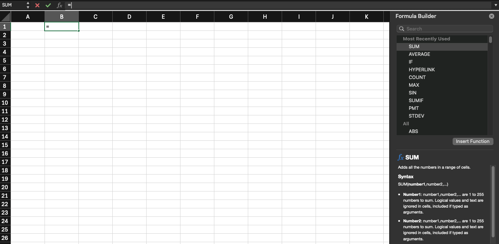

---
# General Information
category: "Computerized Systems"
title: "Excel"
created: "2024-09-23"
---

# Spreadsheet Programs

## What is it?

Exactly what you think it is, a giant grid of columns and rows.

## What are some examples?

- Microsoft Excel
- Google Sheets
- Apple Numbers
- ... and more

For the purposes of this class we will be focusing on excel, however a lot of the logic covered for this product is applicable for all spreadsheet software.

# Excel

## Who uses Excel?

Its one of the most popular tools on the planet. The application has about 750,000,000 million users worldwide and is present in almost every company that exists.

## Why is it so popular?

It makes it really easy to analyze large sets of data.

## How do you get started?

Open up excel and let's get started. We will explore it together.

# Overview

## Workbooks

A workbook is the entire Excel file that can contain multiple sheets (or tabs). Each workbook can be saved independently.

## Worksheet (Tab)

Each workbook consists of one or more worksheets, often referred to as tabs. Each worksheet contains a grid of cells where data is entered.

## Rows & Columns

Rows run horizontally and are numbered (e.g. 1,2,3), while columns run vertically and are labeled with letters (e.g. A, B, C)

## Cell

Cells are the basic units of a worksheet, organized into a grid of rows and columns. Each cell is identified by its cell reference, which combines the column letter and row number. (e.g. C3)

## Formula Bar

When you select a cell, the formula bar shows the contents of that cell. It may contain contents such as:

- Text, numbers, data
- Formulas
- Functions

# Functions

When we work with excel, we love to use functions.

## Inserting Functions

First, select the cell you would like to modify. Next, navigate to the formulas tab and select "Insert Function", this should open up a formula builder to help you get started.

You will notice that once you select "Insert Function", its auto-magically inserts an `=` sign. This is because when you start remembering all these function by heart, you can just enter that to insert.

## Summary

- `=AVERAGE()`
- `=MIN()`
- `=MAX()`
- `=STDEV()`

# Exercise 1

To get started, download the excel sheet on Lea. This contains the box office figures for the highest grossing movies each year, from 1915 to 2022.

# Cell References

## Summary

- Relative Cell References
- Absolute Cell References

# Exercise 2

To get started, download the excel sheet on Lea. This contains a list of the 20 richest people in the United States in 2024. For this exercise you will be estimating their net income after taxes and hydro.
