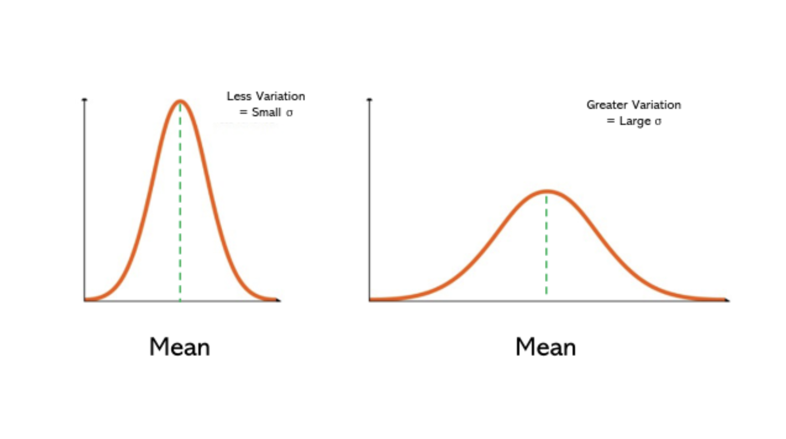

---
# General Information
category: "Computerized Systems"
title: "Excel (Formatting && Charts)"
created: "2024-09-26"
number: 9
---

# Why learn Excel?

As you progress in your career, you'll often find that your success comes in the form of higher pay and an increasing number of Excel spreadsheets. While working with spreadsheets can feel a bit dry, mastering this tool now will set you up for long-term success.

# Recap

## Functions

Excel offers a wide range of functions. You can either click through the menus or simply type `=` followed by the first few letters of the function you want to use.

## Cell References

Why are there dollar signs around some cell references and not others? This brings us to the difference between relative and absolute references.

## Relative Referencing

When you copy a formula with relative references to another cell, Excel adjusts the cell references based on the relative position of the new cell.

## Absolute Referencing

Absolute references remain fixed when you copy a formula, ensuring that the original reference stays the same.

## Locking

If you choose not to use dollar signs to lock a particular column or row in place, you may encounter some unexpected behavior when copying formulas.

## Lazy Dollars Signs

To quickly add `$` signs without manually clicking, select the cell you're interested in and tap `F4` on Windows or `Fn + F4` on Mac

# Custom Style Formatting

Improving the formatting of your sheet will significantly improve the readability.

## Text Styling

Much of what you can do in Word is also available in Excel. Some options include:

- Font Size
- Colors
- Text Alignment

## Cell Styling

To make your charts and tables easier to read, you can also modify the following:

- Borders
- Fill

# Custom Number Formatting

Excel allows you to customize various types of data for better representation:

- Currency (`$`)
- Percentage (`%`)
- Dates
- Times
- Fractions
- and SOOOOOO much more

## How?

- Highlight the cells you want format
- Right click the highlight and select `Format Cells`
- This should open up a new view where you can now select

Alternatively, you can directly change the selected cells in the Home tab if you are feeling lazy.

# Exercise 1

I'm attaching a somewhat rough Excel sheet that shows the distribution of global audiences for Instagram and Facebook in 2024, organized by age group. Your job is to make the following updates:

- Add the Instagram user data using relative references.
- Add the Facebook user data using relative references.
- Format the table to improve readability, using text and cell styling for better presentation.
- Adjust the numbers so they are displayed as percentages, with 1 decimal place for accuracy.

# Standard Deviation

When we measure various phenomena, we often observe trends and patterns. In naturally occurring measurements, values tend to cluster around a central value. Standard deviation helps us quantify how spread out these values are from this central "peak."

## What is Standard Deviation?

Standard deviation is a statistical measure that indicates the spread of data points around a central value. Essentially, it reflects the "distance" of individual values from the average.

## What do big and small numbers mean?

- A _low_ standard deviation signifies that the data points are closely clustered around the average, indicating consistency.
- A _high_ standard deviation suggests that the data points are widely dispersed, indicating greater variability.

## Why is this important?

Understanding standard deviation allows us to determine whether a specific value in our dataset falls within the expected variation or is statistically significant.

## Standard Deviation in Excel

Yesterday, you might have noticed that excel has multiple built-in equations for calculating the standard deviation. What's the difference?

- **STDEV.P** - This function calculates the standard deviation for an _entire population_
  - Used when every single element is included in your data
  - Eg. Stats Canada census since everyone has to do it.
- **STDEV.S** - Standard Deviation on a _Sample_
  - Used when you only have data for a subset of total data.
  - Eg. Taking a few student's heights from a classroom

Most of the time we are working with Standard Deviation on a _sample_ since we rarely have access to the entire data set.

# Charts

## Types

Excel offers a variety of chart types, allowing you to select the one that best represents your data.

## Creating a Chart

- Highlight the data you want to include in the chart (include the headers)
- Select Insert > Recommended Charts
- Pick your fav
- Select a chart
- Select OK

# Trends

## Why use them?

Trendlines in Excel provide a visual representation of patterns and trends within your data. They simplify the process of identifying relationships and can help you forecast future values with greater accuracy.

## Creating a Trendline

- Select a chart.
- Select Chart Design > Add Chart Element.
- Select Trendline and then select the type of trendline you want, such as Linear, Exponential, Linear Forecast, or Moving Average.

# Exercise 2

Building on your first exercise, please apply the following updates:

- Calculate the standard deviation for the distribution of global audiences. What do these numbers tell you?
- Create a chart for the data and format the styles.
- Add trendlines for the user distributions of both Facebook and Instagram to forecast future trends. Which platform is more likely to attract elderly users?

# Documentation

Refer to here for the following resources:

- [Charts](https://edu.gcfglobal.org/en/excel/charts/1/)
- [Create a chart from start to finish](https://support.microsoft.com/en-us/office/create-a-chart-from-start-to-finish-0baf399e-dd61-4e18-8a73-b3fd5d5680c2)
