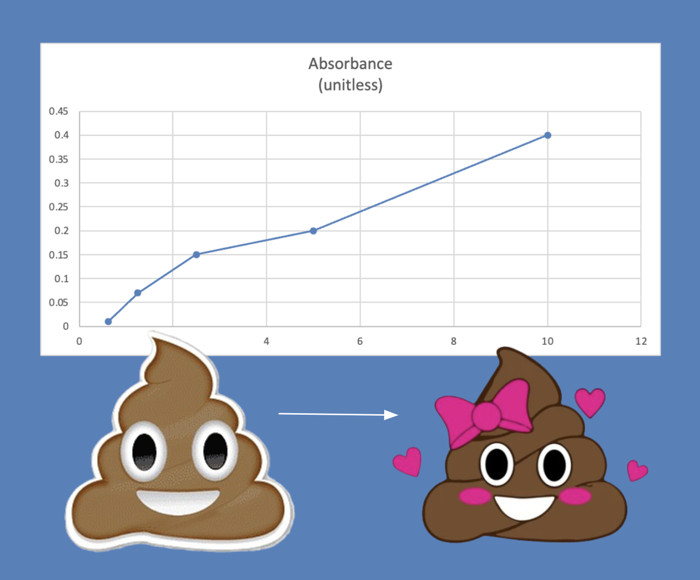

---
# General Information
category: "Computerized Systems"
title: "Excel (Advanced Graphs && Equations)"
created: "2024-10-10"
number: 10
coverSrc: "./assets/poop.png"
---

# Recap

## Referencing other sheets

If you often find yourself manually typing specific sheet names and checking the exact column letter and row number to reference a cell, you might be making it more complicated than necessary. Instead, simply add an `=` sign and click on the cell you want to reference :^)

## Text formatting

As with all Microsoft products, there are plenty of formatting options:

_maybe even more than necessary which is why Google sheets is becoming increasingly popular_ 👀

## Cell formatting

You are going to find the nifty little ⏹️ icon very handy when it comes to making your spread sheets look less like a potato:

## Number formatting

You have 2 options to format numbers to their appropriate type. Option 1 is the boomer way of doing things by right clicking on the cell(s) you would like to format:

Option 2 is the millennial way by navigating to the `Home` tab and just clicking to relevant icons % or ＄:

## Inserting Charts

Microsoft offers a bunch of fun charts for you to use, pick your fav:

## Inserting Trendlines

Trendlines are a handy feature that you will likely be using in your time here at JAC

or if not at JAC, then 100% in your career.

# Combo Charts

Today we are going to focus on making our data nicer.

## Secondary Axis

A typical graph is made of one X axis and one Y axis. However, sometimes different types of data can be collected on the same item. In Excel we can add a Secondary axis to display two sets of data **as long as the data shares a common axis**.

## Why do we want this?

If there is a relationship between these different types of measurements you might want to show it in the same graph.

## How do you do that?

Refer to the [official microsoft documentation](https://support.microsoft.com/en-us/office/add-or-remove-a-secondary-axis-in-a-chart-in-excel-91da1e2f-5db1-41e9-8908-e1a2e14dd5a9) for a step by step procedure

# In Class Activity

Let's take the following dataset and draw conclusions from it:

## Beutify the Data 💅✨

Lets add the following adjustments to the table so that it doesn't look like an unreadable piece of trash. First, adjust the column widths to be the same by selecting the columns you want to resize and adjusting the "Column Width":

In the above `.gif` im holding down the `shift` key so that i select columns A through D. Next, let's "freeze" the top row by navigating to the "View" tab:

This way, as I scroll down the sheet I always know what category the numbers I'm looking at belongs to :^)

## Making charts

One way to illustrate the relationship between thickness and hardness would be to create 2 different charts. However that's long and we want to be lazier (efficient) with how we do things.

Instead, let's demonstrate the relationship in one simple chart by following the below steps:

- First, select all the data we need by clicking on the column letter at the top (e.g., "A", "B", etc.) and hold down `Ctrl` on Windows 🖥️ or `Cmd` on Mac 🍎 as you click each individual column
- Pick the relevant chart such that the x-axis is what shares the data between the Thickness (mm) and Hardness (N)
- Once the chart has been created, right click the data series you want to turn into a "secondary axis". From the drop down select "Format Data Series".
- Under Series Options, you’ll see an option to plot the data series on the Secondary Axis. Check the box for Secondary Axis.

## Demonstration

If words aren't for you, please see attached the below demo:

# Scatter Charts

When you are not sure of the type of chart that will best describe your data, a good starting point is a Scatter Chart.

- Scatter Charts offer the most flexibility when trying to identify patters or relationships.
- It is guaranteed to represent your data series as X and Y data (unlike the line chart which will sometimes add the data as separate data sets).

# Exercise 1

Without my guidance this time, turn the graph located in "Absorbance" into a combo chart with the following axises:

- The _X-axis_ is the Tube #
- The two _Y-axises_ are Concentration (mg/ml) and Absorbance (unitless)

