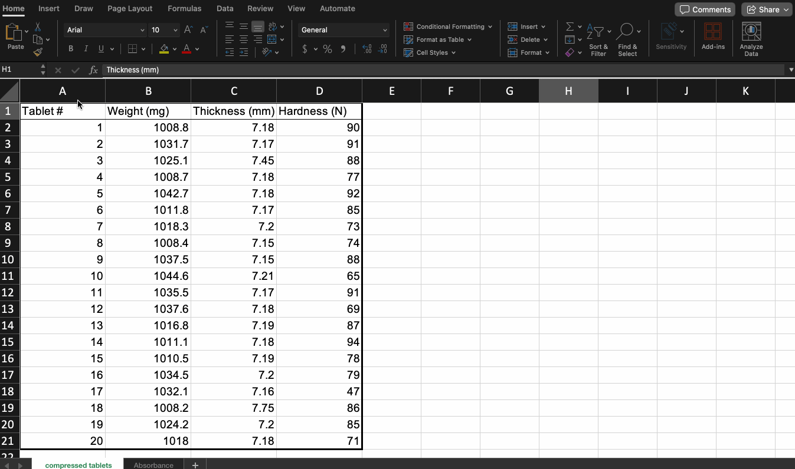
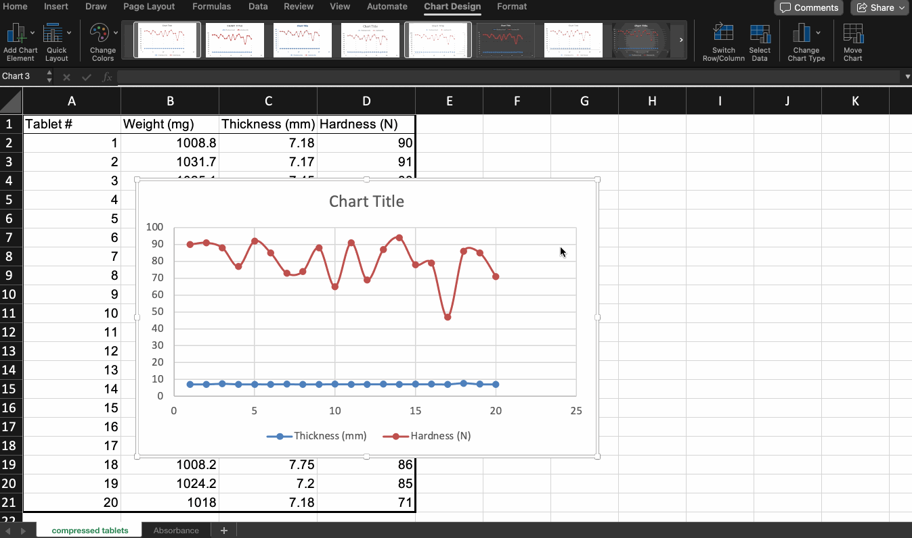

---
# General Information
category: "Computerized Systems"
title: "Excel (Math Edition)"
created: "2024-10-14"
number: 11
---

# Recap

## Important hotkeys

To select a range: `shift + click`



To select specific rows or columns: `ctrl + click` on 🖥️ or `cmd + click` on 🍎


## Scatter Charts

Scatter charts provide a straightforward way to explore and understand the relationship between data points, which is why they are commonly used as a default choice for data visualization.

## Combo Charts

In most cases, we want to compare the relationship between two sets of data, and this chart type makes that easy. The only catch is that the two sets of data need to have an overlapping x-axis.

## How can you make your combo charts cuter?

`Quick Layouts` and `Add Chart Element` will be your best friend :)



# Equations

In a previous lecture, we covered trendlines. Let's take it a step further. Once a trendline is added, you can extract the equation of that line. These values allow for deeper analysis, allowing more precise insights from your data set.

## How do we create an equation?

If the _slope_ and the _y-intercept_ are known, we can determine the corresponding Y value for any given X, and vice versa. By plugging in the values, we can easily predict points along the line, making it a common tool for data analysis.

# Equations in Excel

There are two ways of extracting the equations of a line from plotted data in Excel:

- Display the equation on the graph and manually write down the slope and Y-intercept constants.
- Use the built-in `SLOPE` and `INTERCEPT` functions (preferred method)

You can refer to [here](https://www.ablebits.com/office-addins-blog/2019/01/16/excel-trendline-types-equations-formulas/) for step by step instructions :)

# Exercise 1

- Using the sheet **Absorbance** create a Scatter chart and add a trendline to it.
- Extract the slope and the y-intercept and recreate the equation of a line.
- Using this new equation, find what would be the concentrations associated with the following absorbances:
  - 0.17
  - 0.11
  - 0.32

# Area Under a Curve (AUC)

There are many cases where calculating the Area Under the Curve (AUC) provides valuable insights into the data.

## Why calculate it?

The reason for calculating AUC is that it helps reveal the total effect or impact of the values represented by the curve over time. This is because _the area under a curve has a direct mathematical relationship with the curve itself_. You can read more about the basics of this in the [Introduction to Integration](https://www.mathsisfun.com/calculus/integration-introduction.html).

## What does this matter for you?

In the field of [pharmacokinetics](https://en.wikipedia.org/wiki/Pharmacokinetics), the AUC describes how the concentration [concentration](https://en.wikipedia.org/wiki/Concentration) of a drug in [blood plasma](https://en.wikipedia.org/wiki/Blood_plasma) changes over time, which helps understand how much of the drug has been absorbed by the body.

## What Does This Mean in Real-World Applications?

In practice, scientists and medical professionals measure drug concentrations at different times. To estimate the AUC from these measurements, they often use the [trapezoidal rule](https://en.wikipedia.org/wiki/Trapezoidal_rule) (rectangular approximation). This method simplifies the calculation by approximating the area using trapezoids.

## What does this mean for professionals in your industry?

For professionals in pharmacokinetics, the AUC is especially important because it helps determine how long a drug stays in the body and at what concentration. This depends on the rate at which the body eliminates the drug and the dosage given. The higher the AUC, the greater the exposure to the drug.

## How Do You Calculate It?

You can check out this more detailed explanation: [Area under the curve (pharmacokinetics)](https://en.wikipedia.org/wiki/Area_under_the_curve_%28pharmacokinetics%29) for the detailed mathematical explanation. However, here’s a simpler breakdown:

- Instead of calculating the area under the entire curve at once, we split it into smaller trapezoids between two points.
- To calculate the area of each trapezoid, take the average of the heights at two points (representing the concentration values) and multiply that by the width (representing the time difference between the points).
- Once you have the areas of each trapezoid, just add them together to get the total area.

# AUC in Excel

You can easily calculate the AUC in Excel using an approximation method. Here’s how:

- Break the area under the curve into smaller sections using the trapezoidal rule. The area of each trapezoid is much easier to calculate than that of a curve.
- Add up the areas of all the trapezoids to get the total AUC.

## Exercise 2

In Excel, you can calculate the AUC by finding the differences in time (∆x) and the average concentration (∆y) between two points. Then, multiply these values to estimate the area of each trapezoid.

Your formula should look something like this:

```md
| Time (hours) | Concentration (mg/L) | AUC Calculation     |
| ------------ | -------------------- | ------------------- |
| 0            | 0                    | 0                   |
| 1            | 5.2                  | =(B2+B3)/2\*(A3-A2) |
| 2            | 8.0                  | =(B3+B4)/2\*(A4-A3) |
| ...          | ...                  | ...                 |
|              |                      | =sum(C2:C??)        |
```
