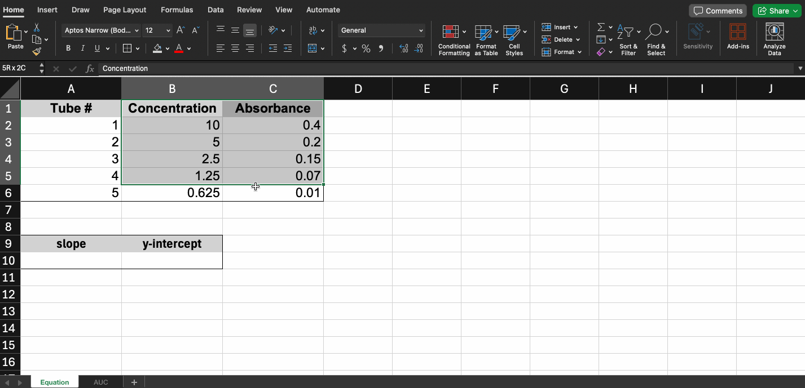
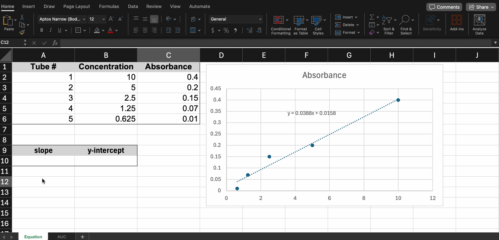
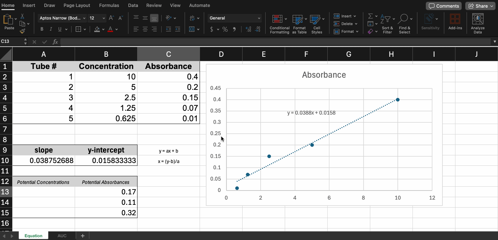
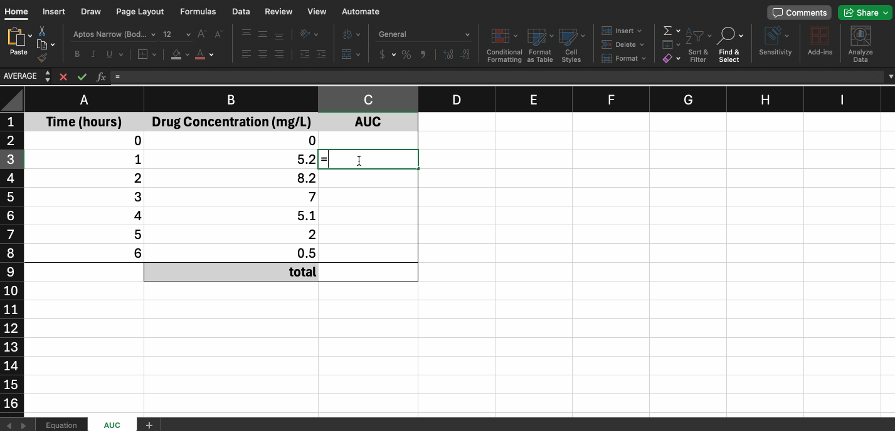
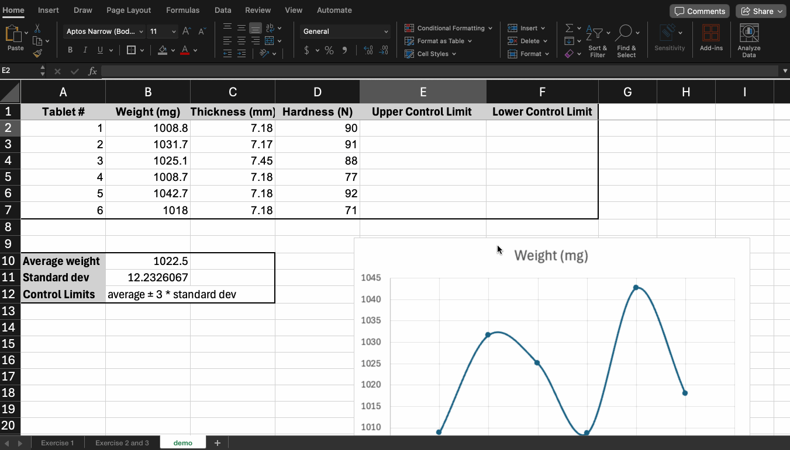

---
# General Information
category: "Computerized Systems"
title: "Even more excel"
created: "2024-10-16"
number: 12
---

# Course Update

Test 2 is scheduled for _October 31st_ (I’m sorry) and it will cover the material from Assignment 2 as well as some content we discuss next week.

To help you prepare, there will be a practice session on _October 29th_ :) If you do the practice, you'll find the test to (hopefully) be a breeze.

# Recap

## Displaying Equations

Using trendlines, you can display the equation on the graph:



## Creating Equations

You can also use the built-in `SLOPE` and `INTERCEPT` functions in excel:



This is the preferred method because now we can easily plug in values to predict other points along the line:



## AUC Applications

The Area Under a Curve (AUC) helps determine how long a drug stays in the body and at what concentration. The higher the AUC, the greater the exposure to the drug.

## AUC in Math

To estimate the AUC from these measurements, they often use the [trapezoidal rule](https://en.wikipedia.org/wiki/Trapezoidal_rule) (rectangular approximation). To break this down into simple steps:

- Split the curve into smaller trapezoids between two points.
- To calculate the area of each trapezoid.
- Once you have the areas of ALL trapezoids, just add them together to get the total area under the curve.

## AUC in Excel

Implementing the above approach in excel is relatively chill:



# Find && Replace

## Why?

When working with a lot of data in Excel, it can be difficult and time consuming to locate specific information. You can easily search your workbook using the Find feature, which also allows you to modify content using the Replace feature.

## How?

In excel the 🔎 icon in the Home tab is going to be your best friend:


If you don't life `gif`s, you can refer to [here](https://edu.gcfglobal.org/en/excel/using-find-replace/1/) for step by step instructions :)

# Exercise 1

In the workbook attached on Lea in the exercise 1 tab, complete the following:

- Find all instances of the abbreviation "API" in the spreadsheet and replace them with "Active Pharmaceutical Ingredient."
- Find all instances of "NDA" and replace them with "New Drug Application."

# Control Charts

## Why?

Control charts help for these main reasons:

- Track process stability – Show if the process is within acceptable limits.
- Spot outliers – Highlight values outside the control range, signaling issues.
- Monitor variation – Visualize how much a process fluctuates over time.
- Identify trends – Detect patterns like drift or cyclical behavior.
- Ensure compliance – Show that the process meets quality standards.
- Support decision-making – Provide data for making informed process adjustments.

## How?

Excel makes it easy to make these charts with the following features:

- Excel provides simple functions like `=AVERAGE()` and `=STDEV.P()`
- You can customize your chart’s data even if the chart already exists :)

## Calculating Control Limits

We will start by creating the upper and lower limits using the following equation:

```text
average ± three sigma
```

Or in other terms:

```text
Upper Control Limit = Average + 3 * Started Deviation
Lower Control Limit = Average - 3 * Standard Deviation
```



## Adding Control Limits to a Chart

This will plot horizontal lines representing the control limits on your chart:

- Right-click the chart and select Select Data.
- Click Add to add a new series.
- For the new series, set X values to Tablet # and Y values to the Upper and Lower Control Limit columns.


# Exercise 2

Control Chart Creation:

- Create line charts or scatter plots to the represent weight.
- Add control lines to represent the acceptable range (average ± three sigma) on the chart.

# Conditional Formatting

Refer to the notes on [Conditional Formatting](https://edu.gcfglobal.org/en/excel/conditional-formatting/1/) for step by step instructions :)

# Exercise 3

Apply conditional formatting to highlight any values outside the acceptable range (average ± three sigma) in red.
