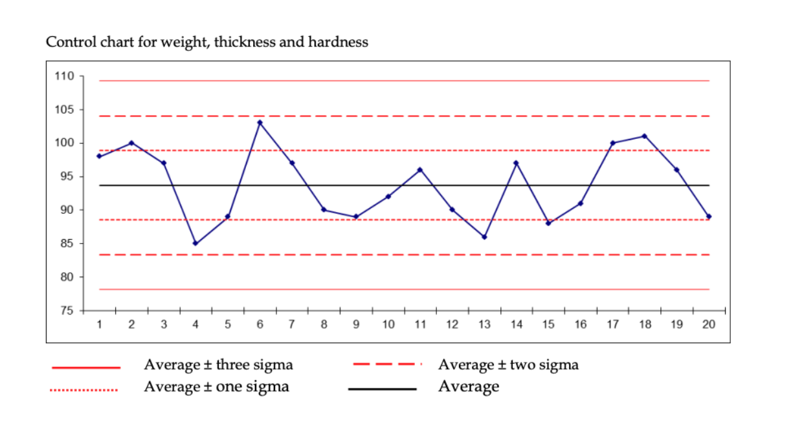
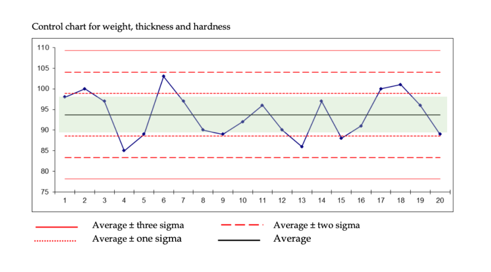
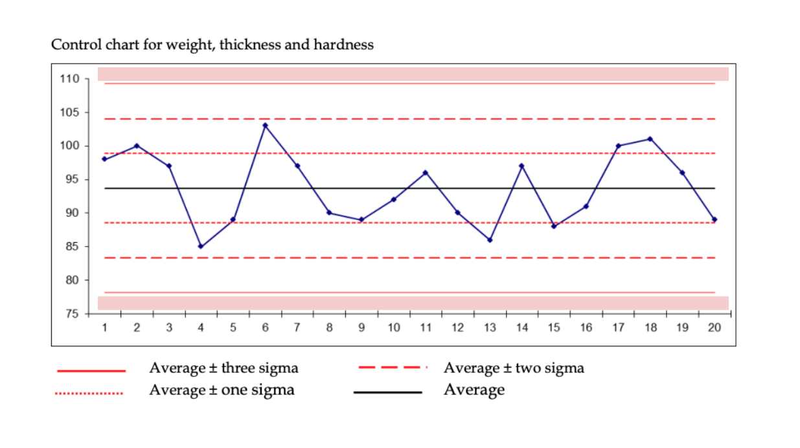
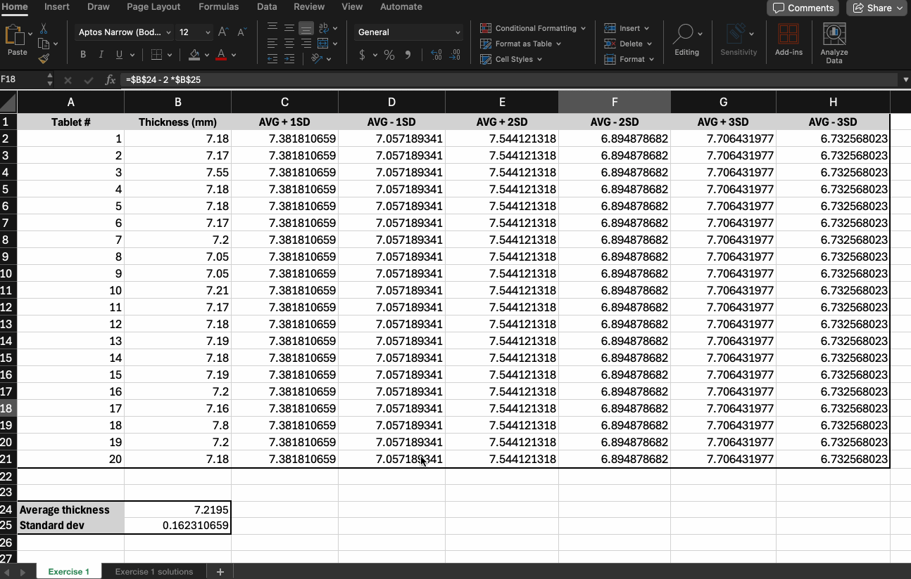
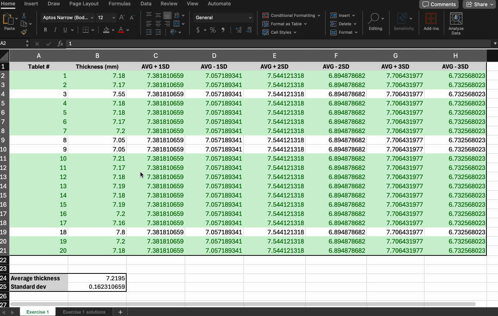
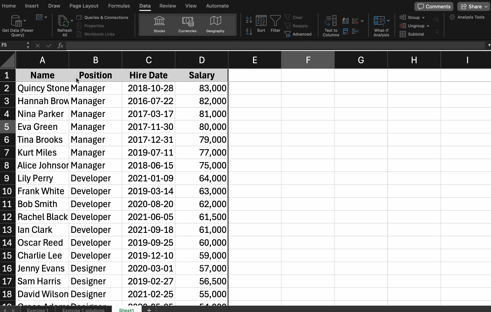
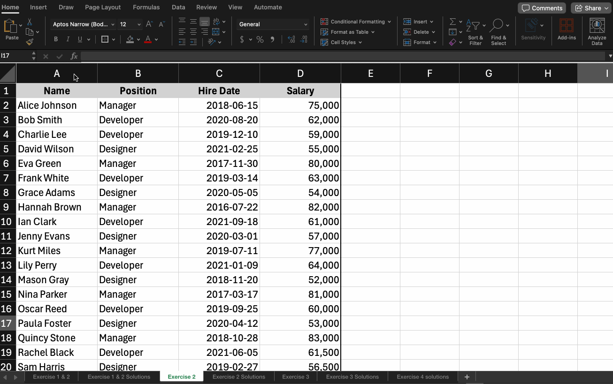

---
# General Information
category: "Computerized Systems"
title: "Conditional Formatting, Filtering, Sorting"
created: "2024-10-22"
number: 13
---

# Conditional Formatting

You don’t need to create a full control chart to determine whether tablets are in good condition or defective. Instead, we can use conditional formatting to make this information stand out clearly.

## How?

Let's go back to this diagram:



A tablet is considered "under control" when its value falls between `average - 1 sigma` AND `average + 1 sigma`:



A tablet is considered "out of control" when its value falls outside the range of `average - 3 sigma` OR `average + 3 sigma`



## What does this look like in Excel?

Let’s start with the condition that a tablet is "under control". The logic can be described like this:

```text
thickness >= average - 1 sigma

AND

thickness <= average + 1 sigma
```

We can translate this logic into a simple Excel function:

```excel
=AND($B2>=$D2, $B2<=$C2)
```

The `$` before the column letters (like `$B`, `$D`, `$C`) locks the column reference, ensuring that when you apply the formula across multiple rows, Excel will only adjust the row numbers (e.g., `B2` becomes `B3`, etc.), but the columns remain _fixed_.

Similarly, for defective tablets ("out of control"), the logic is:

```text
thickness < average - 3 sigma

OR

thickness > average + 3 sigma
```

In Excel, it looks like this:

```excel
=OR($B2>$G2, $B2<$H2)
```

## How do you apply conditional formatting?

To format your table based on these control limits in Excel, follow these steps:

- Select the entire table
- Click on the "Home" tab and click "Conditional Formatting"
- From the dropdown, choose "New Rule"
- Set up two rules: one for "under control" and one for "out of control"

Let’s start with the "under control" tablets...

## Under Control

Select "Use a formula to determine which cells to format" and follow this example:



## Out of Control

For tablets that are "out of control", follow the same steps and apply this rule:



# Exercise 1

In the workbook attached on Lea, in the exercise 1 tab, complete the following:

- Highlight all tablets that are "under control" in green
- Highlight all tablets that are "out of control" in red

# Sorting

## Why does this matter?

Sorting helps you quickly reorganize data based on specific criteria, making it easier to find, compare, and analyze information.

Let’s break down how to sort data in Excel step by step.

# Sorting Sheets && Ranges

Sorting a whole sheet allows you to reorganize all of your data based on a specific column.

## How?

- Select the Data
- Open the Sort Menu and go to the "Data" tab and click on Sort
- In the "Sort" dialog box, select the column that's in the range you want to sort
- Pick either Ascending or Descending

## Example

Imagine you have a list of employees with columns for "Name", "Hire Date", and "Salary". You can easily sort alphabetically by name or even by "Hire Date" to see who joined first.


# Custom Sorting

Custom sorting allows you to sort your data by multiple criteria or use a specific custom order, like sorting months in chronological order.

## How?

- Select the Data
- Open the Sort Menu and go to the "Data" tab and click on Sort
- In the "Sort" dialog box, click "Add Level"
- Choose a column and sorting order for each level. If needed, you can select "Custom List"

## Example

Imagine you’re managing employee data and want to sort first by multiple "levels" of criteria:



# Exercise 2

In the workbook attached on Lea, in the exercise 2 tab, create the following custom sort:

- First, sort by "Position"
- Then, within each position, sort by "Hire Date" to see who was hired first

# Filtering

## Why care?

Filters can be used to narrow down the data in your worksheet, allowing you to view only the information you need.

## How?



However if you don't like `gif`s, you can refer to the official docs [here](https://edu.gcfglobal.org/en/excel/filtering-data/1/) for step by step instructions

# Exercise 3

In the workbook attached on Lea, go to the Exercise 3 tab and follow the documentation to create a filter in the Exercise 2 tab. This filter should display only Managers and Developers who were hired in 2019.

# Official Docs

- [Conditional Formatting](https://edu.gcfglobal.org/en/excel/conditional-formatting/1/)
- [Sorting](https://edu.gcfglobal.org/en/excel/sorting-data/1/)
- [Filtering](https://edu.gcfglobal.org/en/excel/filtering-data/1/)
