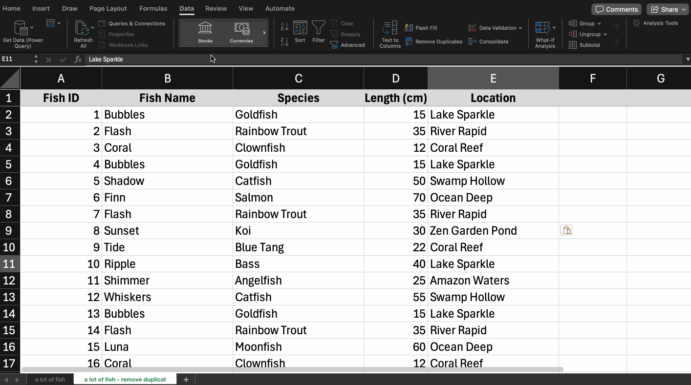

---
# General Information
category: "Computerized Systems"
title: "Recap && A New Way of Thinking"
created: "2024-11-04"
number: 15
---

# Course updates

We actually are way ahead of schedule for the Excel material, so today is going to be dedicated to recap, assignment 4, and I'll briefly cover another technique.

## Coming soon ...

On Thursday we will start getting a lot fancier with our data analysis tools starting with Pivot Tables then moving to databases next week :^)

# Removing duplicates

To quickly remove duplicates in Excel, you can use the tool on the Data tab:



Alternatively, you can use the Advanced Filter if you don't want to delete duplicates permanently however for those determined souls you can explore the concept in the docs below

## What if you don't like gifs?

You can refer to [here](https://www.excel-easy.com/examples/remove-duplicates.html) for step by step instructions :)

# Foundations of Boolean Algebra

Boolean logic and conditional statements are cool and all, however useless unless we know how we can translate every day problems into vocabulary the computer understands. So how do we go about doing that?

## Idea

```cs
"I should make myself a snack if I have bread AND peanut butter."
```

How do i make a snack?

- Should i put peanut butter on the bread?
- How do i put peanut butter on the bread?
- How do i open the peanut butter jar?
- How do i spread peanut butter?
- What do i use to spread peanut butter?
- What happens if I decide to use my elbow to spread peanut butter? It's a totally valid approach, however would require a lot of energy
- ... So how do ensure we only use energy efficient methods of spreading peanut butter??????

## Think like a computer

Computers are dumb and need step by step instructions. Every instruction has to be specific and precise for them to understand.

Soon, we’ll start writing queries to pull data from a table. Expect to make a lot of mistakes along the way, however that's 100% part of the process. So, if you find yourself frustrated because the computer isn't doing what you want, remember it’s only doing exactly what you’ve instructed it to do.

# Summary

TLDR: When working with conditions, Boolean logic, or formulas, think like a computer. Unlike us, computers don’t “get” context, they need everything laid out _explicitly_.
