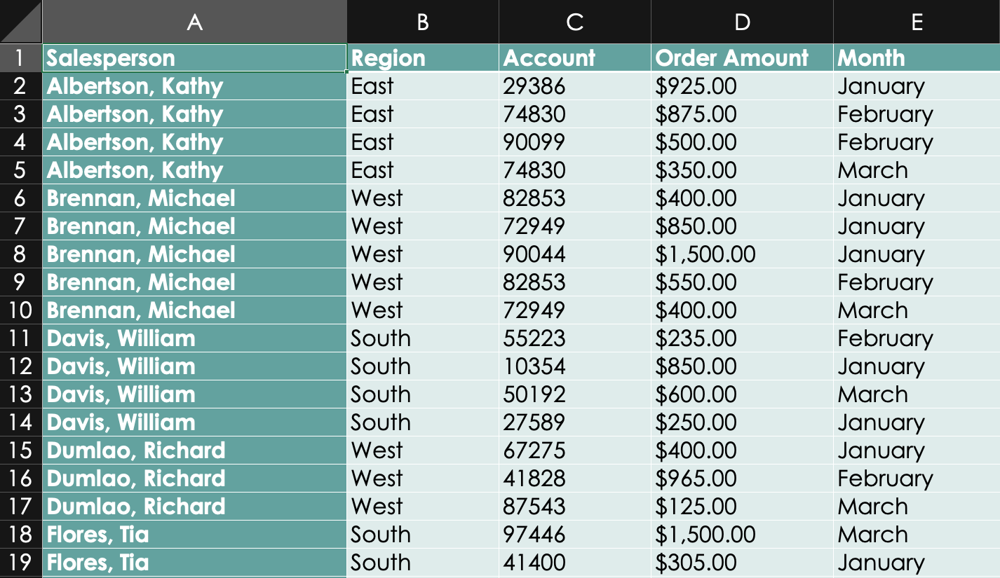
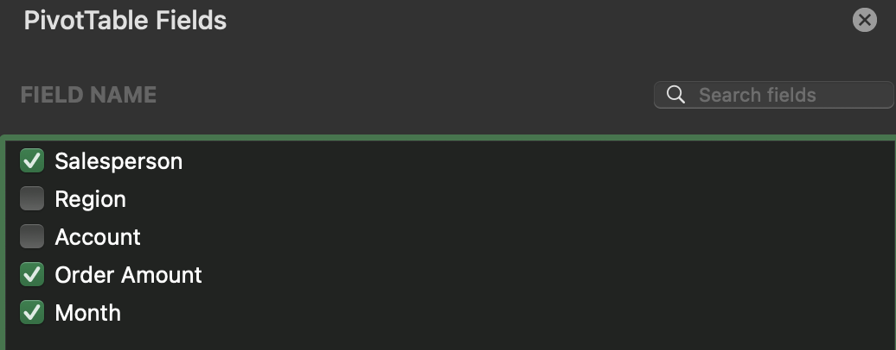
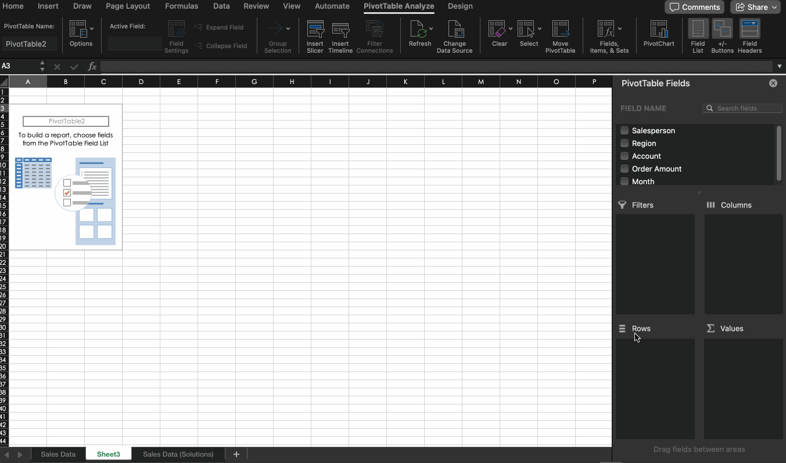
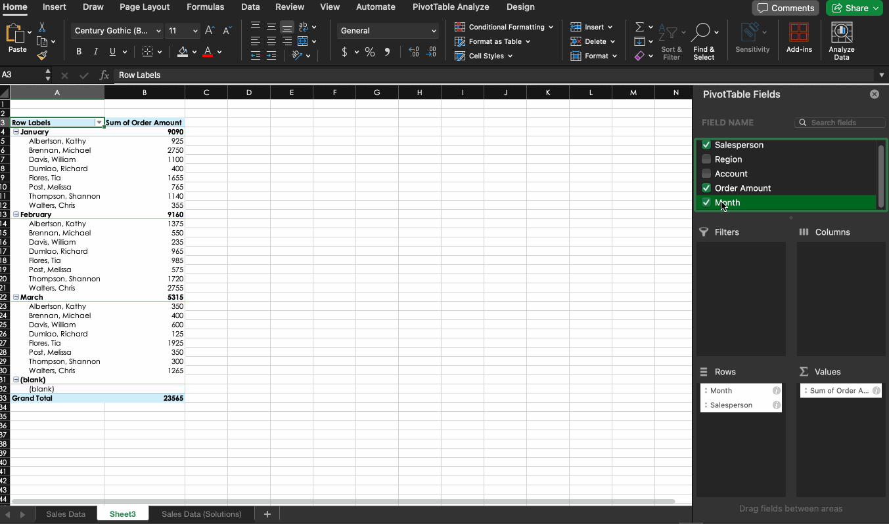
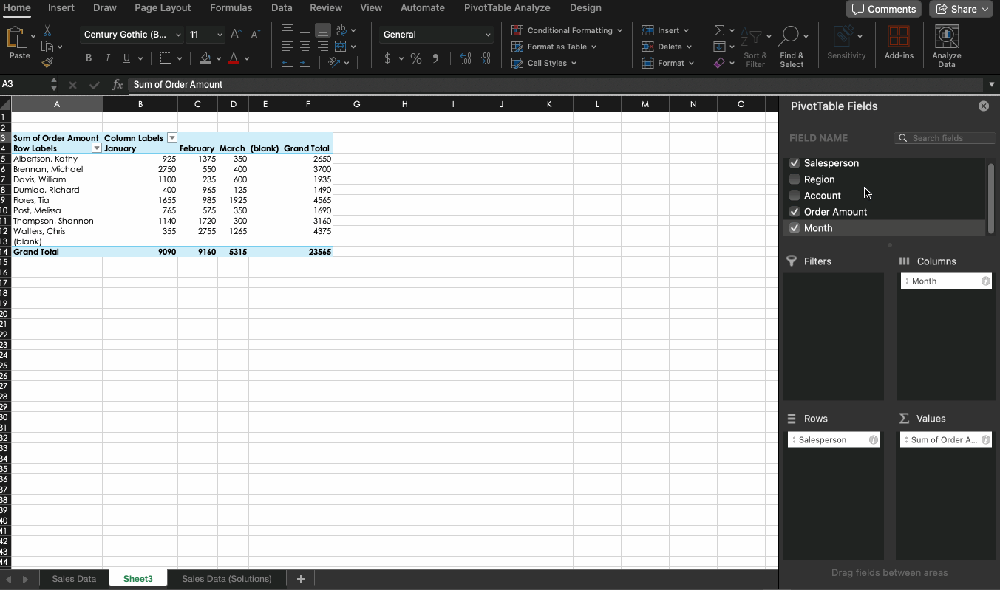
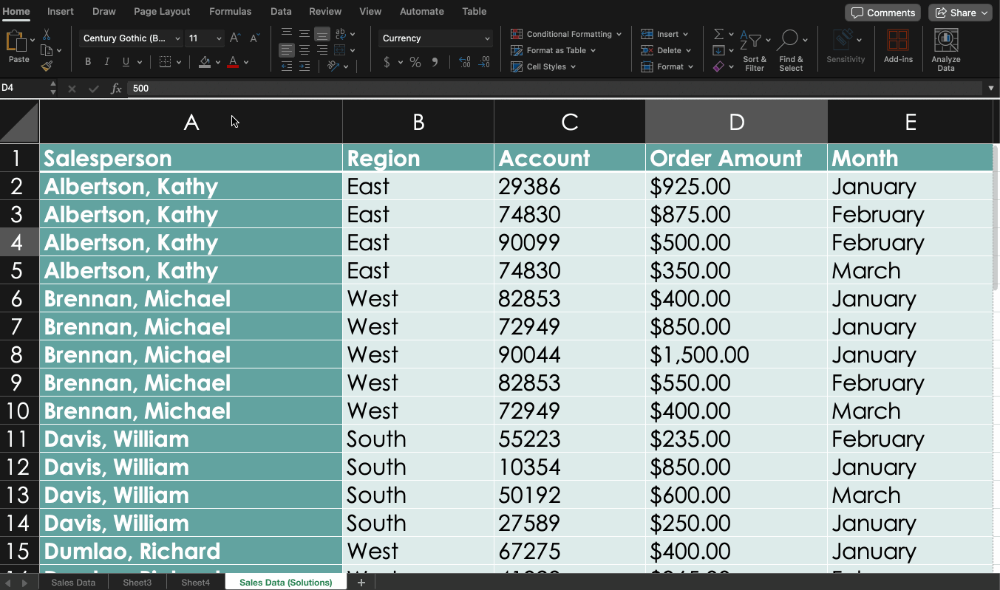
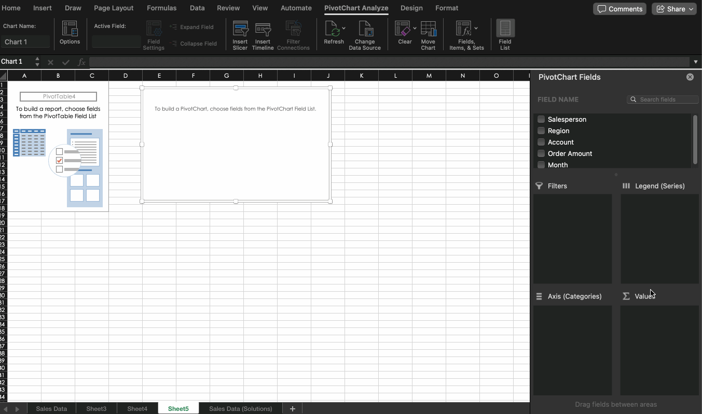
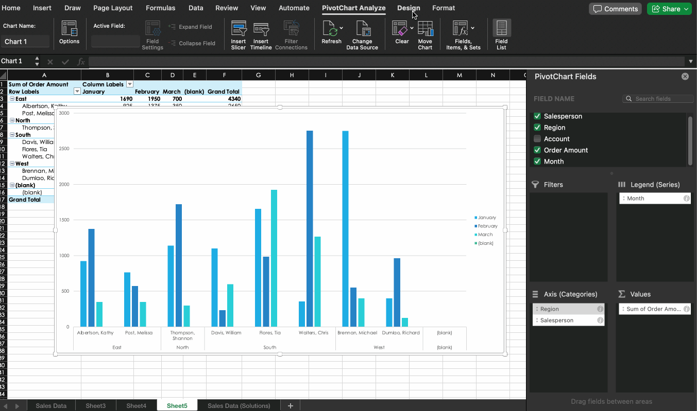

---
# General Information
category: "Computerized Systems"
title: "Freezing && Pivot Tables"
created: "2024-11-07"
number: 16
---

# Freezing

## Freeze first column

To freeze the first column in your worksheet:

- Select View
- Freeze Panes
- Freeze First Column


## Freeze first row

To keep the first row visible while scrolling:

- Select View
- Freeze Panes
- Freeze First Row


## Freeze first 2 columns

To freeze the first two columns:

- Select the third column.
- Select View > Freeze Panes > Freeze Panes


## Freeze first 2 rows

To freeze the first two rows:

- Select the third row.
- Select View > Freeze Panes > Freeze Panes


## Freeze multiple columns and multiple rows

To keep multiple columns and rows visible:

- Select the cell just below the rows and to the right of the columns you want to freeze.
- Select View > Freeze Panes > Freeze Panes.


# Exercise 1 - Assignment 4

Practice freezing rows and columns by completing the assignment sections that require these freeze options.

# PivotTables

## What are PivotTables?

When you’re dealing with a large dataset, analyzing all that information at once can be whelming. PivotTables make your data easier to manage and can make your life easier.

## How Should You Use Them?

PivotTables are incredibly flexible, allowing you to organize data in many different ways. HOWEVER, knowing the best way to structure the rows, columns, and values is not always straightforward.

## Getting Started

To set up a PivotTable that’s useful, start by asking yourself what kind of information you want to investigate. Identify the following:

```cs
"What am I trying to measure?"
```

The above question helps you define the _Value_ you’re looking for.

```cs
"How do I want this data organized?"
```

This helps you determine the _rows and columns_ that will structure your table.

## Concrete Example

Suppose we have a data table like this:



... and suppose we want to answer the question:

```cs
"How much was sold by each salesperson on a monthly basis?"
```

Calculating this manually would be challenging, as each salesperson’s orders appear on multiple rows. But with a PivotTable, we can simplify the process. To build it, start by answering these questions:

- What are we trying to measure? 👉 The total amount sold.
- How should we organize it? 👉 By salesperson and by month.

In the PivotTable, we’ll add "Order Amount" to Values, "Salesperson" to Rows, and "Month" to Columns:



## How Do You Decide Between Rows and Columns?

Choosing rows and columns depends on what makes the data easiest to understand. Try different arrangements to see what provides the clearest view.

💡 Note: When analyzing larger datasets, it's ok to be vibe driven lol. At this point in class, things get a bit less straightforward, as problem-solving is inherently a creative process.

There can be multiple _correct_ ways to approach a single problem :^) There is no "right" way, only "your" way. (and that's ok)

# Creating a Pivot table

## Step 1) Inserting a PivotTable

- Click on any cell within your dataset.
- Select the Insert tab > Choose PivotTable


## Step 2) Formatting a PivotTable

A blank PivotTable and a Field List will appear in a new worksheet:



## Step 3) Pivoting a PivotTable

Once you have your data in place, you can easily pivot between different views by rearranging fields:



## Step 4) We love granularity

For extra detail, try grouping data. For example, you might group sales by region:



## Documentation

📖 Check out these resources for detailed guidance:

- [Intro to PivotTables](https://edu.gcfglobal.org/en/excel/intro-to-pivottables/1/) from GCF Global
- [Create a PivotTable](https://support.microsoft.com/en-us/office/create-a-pivottable-to-analyze-worksheet-data-a9a84538-bfe9-40a9-a8e9-f99134456576?ui=en-us&rs=en-us&ad=us) by Microsoft

# Exercise 2 - Sales

- Download the `Sales.xlsx` from Lea
- Convert the dataset into a PivotTable:
  - Click within the dataset and select Insert > PivotTable
  - Confirm the range and choose New Worksheet
- Create a PivotTable to analyze:
  - Each salesperson’s revenue by region, organized on a monthly basis

# Creating a Pivot Chart

## Step 1) Inserting a PivotTable

Start by creating a PivotTable as the base for your chart:



## Step 2) Fields and Pivoting

Add and adjust fields within the PivotTable to shape the data for your chart to be clear (and cute):



## Step 3) Make it Cuter

You have lots of options to make a cute chart:



## Documentation

📖 If you don't like `gif`s, for a detailed walkthrough on creating PivotCharts, refer to [Create a PivotChart](https://support.microsoft.com/en-us/office/create-a-pivotchart-c1b1e057-6990-4c38-b52b-8255538e7b1c) by Microsoft

# Exercise 3

Create a Pivot Chart with the following elements:

- A chart title
- Axis titles
- Custom themes to replace the default (boomer) look
