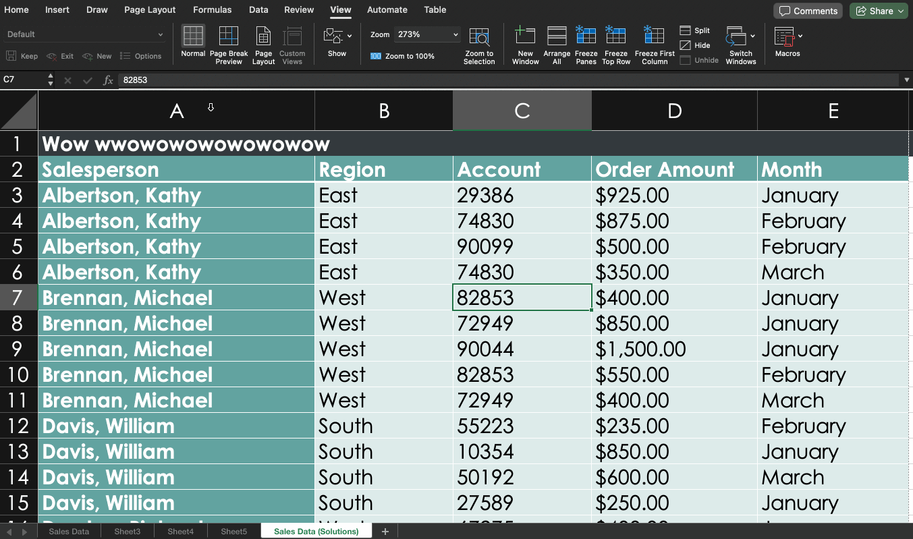
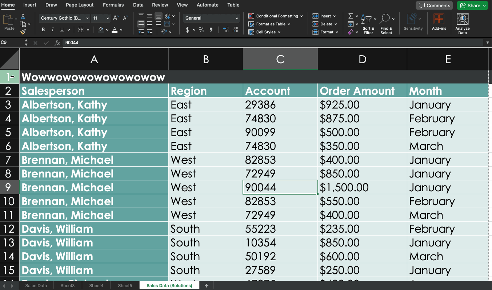
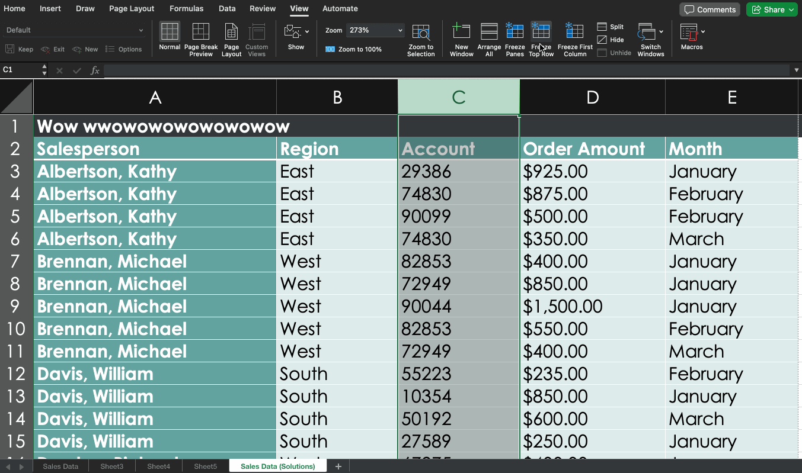
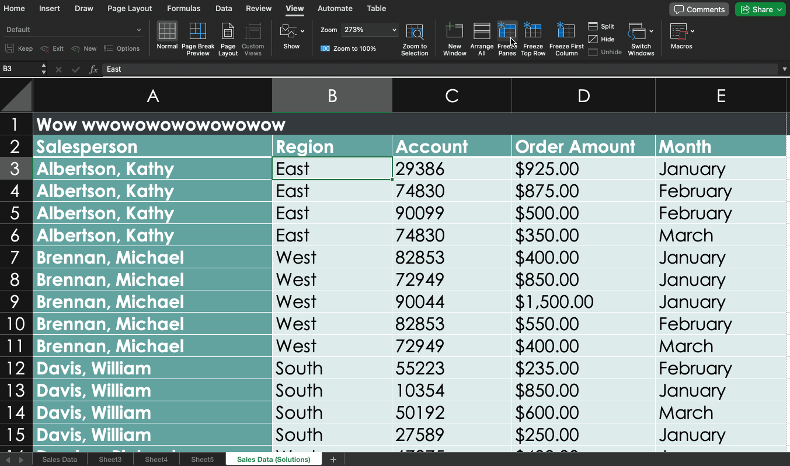

---
# General Information
category: "Computerized Systems"
title: "Freezing && Work Period"
created: "2024-11-07"
number: 16
---

# Freezing

## Freeze first column

To freeze the first column in your worksheet:

- Select View
- Freeze Panes
- Freeze First Column

## Freeze first row

To keep the first row visible while scrolling:

- Select View
- Freeze Panes
- Freeze First Row

## Freeze first 2 columns

To freeze the first two columns:

- Select the third column.
- Select View > Freeze Panes > Freeze Panes

## Freeze first 2 rows

To freeze the first two rows:

- Select the third row.
- Select View > Freeze Panes > Freeze Panes

## Freeze multiple columns and multiple rows

To keep multiple columns and rows visible:

- Select the cell just below the rows and to the right of the columns you want to freeze.
- Select View > Freeze Panes > Freeze Panes.

# Exercise 1 - Assignment 4

Practice freezing rows and columns by completing the assignment sections that require these freeze options.

# Work Period

Today turned into a work period, and I’ve made sure any feedback has been added directly to the assignment instructions.
