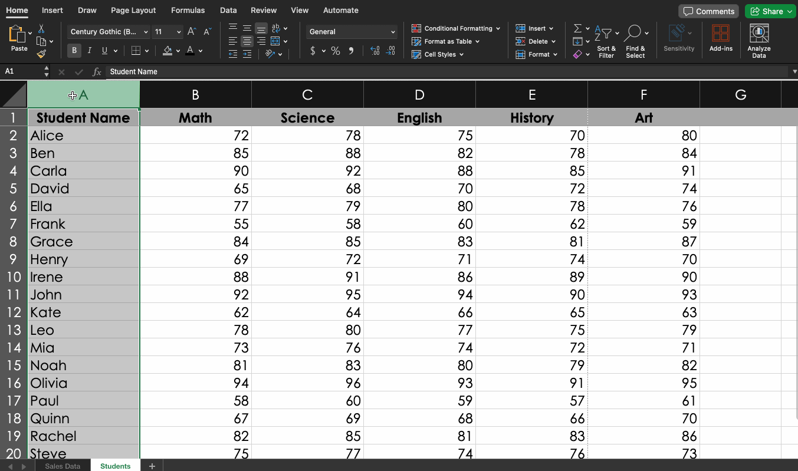
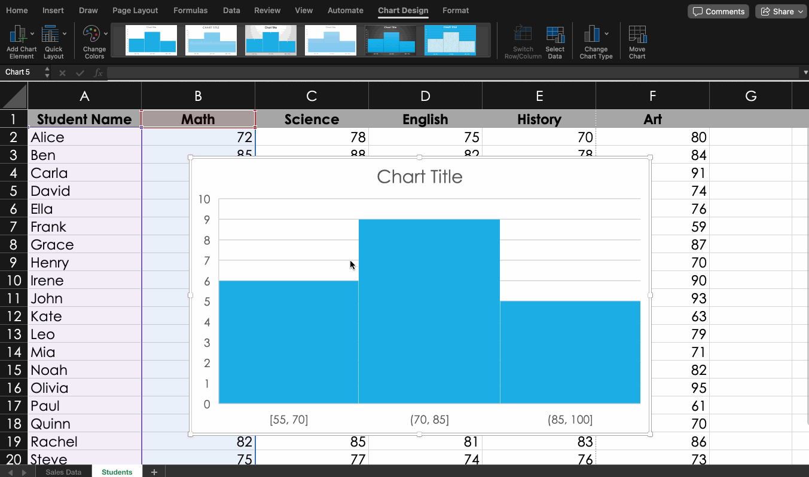

---
# General Information
category: "Computerized Systems"
title: "Histograms && Intro to MS Access"
created: "2024-11-14"
number: 18
---

# Creating a Histogram

## Why?

They help with visualizing data and help you see patterns

## Step 1) Inserting a Histogram

In the cute bar chart group, click on the Histogram chart icon:



## Step 2) Bin Modification

You have several options when it comes to organizing your histogram, all of which you can see by right clicking and selecting "Format Data Series". For example:



All available options include:

- Automatic
- By Category
- Bin Width (as shown in the `gif`)
- Number of Bins

These options let you control the _layout_ and _level_ of detail in your histogram.

## Documentation

📖 Check out [this resource](https://trumpexcel.com/histogram-in-excel/) for detailed guidance.

# Intro to MS Access

Spreadsheets are useful for analyzing data, but they come with some significant limitations:

- Data within tables isn’t directly linked or associated with data in other tables
- Entering and retrieving data can be challenging and not particularly user-friendly
- It’s hard to enforce "data accuracy", meaning that Excel allows for inconsistencies like numbers being entered as words or dates.

## Why learn about databases?

In many real-world scenarios, the information we need is spread across multiple tables, and managing this in Excel can be painful. That's why we love Databases. They make it easier to organize, connect, and retrieve data.

## What are Databases?

Databases in Microsoft Access consist of four main objects: tables, queries, forms, and reports. Each of these objects serves a unique purpose, and together they allow you to enter, store, analyze, and compile data in a relatively painless way when compared to fancier Databases like SQL, GraphQL, and other neat Database tools.

## Documentation

📖 For more details on database objects in Access, please see the [Introduction to Objects](https://edu.gcfglobal.org/en/access2016/introduction-to-objects/1/) by GCF Global.

# Tables

In Microsoft Access, tables are used to store data in a format similar to Excel, with rows and columns. However, Access uses specific terms for different parts of a table:

- **Records (rows)** 👉 Each record represents an individual item or entry, like a specific employee or product. For example, a record in an employee table might store all details about "Arthur Dent," including his position, department, and start date.
- **Fields (columns)** 👉 Each field represents one characteristic of the table’s subject, such as “First Name,” “Email Address,” or “Product Price.” Fields define the type of information that is stored across records. For instance, in a product table, fields might include “Product Name,” “SKU,” and “Price.”
- **Field value (cell)** 👉 Each cell in a table holds a specific data value for a record. For example, in the "Email Address" field for an employee, you might see the value someone@example.com, or in the "Company Name" field, you might have Contoso, Ltd. These field values represent actual data for each unique record.

## Example Table

Let's say we have the following

```md
| Employee ID | First Name | Last Name | Email Address        | Department |
| ----------- | ---------- | --------- | -------------------- | ---------- |
| 042         | Arthur     | Dent      | dont.panic@gmail.com | unknown    |
| 043         | Ford       | Prefect   | panic@gmail.com      | unknown    |
```

In this example:

- Each row represents a record (an individual employee. e.g. our boy Arthur).
- Each column represents a field (a specific detail about the employee, e.g. Email, Department, etc).
- Each cell contains a field value specific to that employee, such as "Arthur" in the "First Name" field.

This structure allows for easy data organization and retrieval.

# Queries

Since most tables are linked via different relationships, **queries** allows us to retrieve **specific data** from one of more tables.

- Queries need to be structured in order to ask specific questions.

For example:

_“What is the name, email and address of all customers who ordered product X in the last 3 months ?”_

# Forms

Forms offers us a more user-friendly way of manipulating the data in the tables.

It’s the same **data from the tables** but in a **different visual format**.

It makes entering and modifying data easier and it allows users to enter data into multiple tables at once.

# Reports

Reports present data from any table or query. in an **easy-to-read** (or print) format.

It is possible to customize reports in order to make it visually appealing.

# Exercise 1

Follow the steps in [Managing Databases and Objects](https://edu.gcfglobal.org/en/access2016/managing-databases-and-objects/1/) and complete the [practice database](https://media.gcflearnfree.org/content/56f1a8e2c87fa620e88dccb8_03_22_2016/access2016_sampledatabase.accdb)
