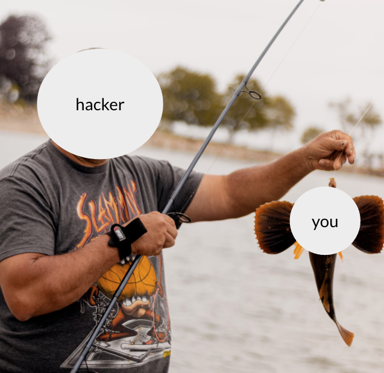

---
# General Information
category: "Computerized Systems"
title: "Technical Health"
created: "2024-11-28"
number: 21
---

# Phishing

Phishing is an attack where hackers trick people into sharing sensitive information, such as passwords, credit card numbers, or private personal details.

The term "phishing" comes from the idea of "fishing" for information by luring victims with a bait. What's the bait? Usually a fake website or email that look like legitimate source you are familiar with.

## How it works

- Step 1) The Bait 👉 A fake message or website that looks legitimate
- Step 2) The Hook 👉 You are encouraged to click on a link or download an attachment
- Step 3) The Catch 👉 All information entered is to later be used against you :^)

## Types of Phishing

- Email 👉 The most common.
  - _"Your Netflix subscription is about to expire. Update your payment details now."_
  - _"Unusual login detected on your account. Update your account details."_
- Spear 👉 Similar to email however the messages are more personalized to add to it's credibility.
  - _"Hi [Your Name], here’s the invoice you requested."_
- Smishing 👉 Same vibe as email phishing, except this time it is through SMS/text messages.
  - _"Your package is delayed. Click here to confirm your address."_
- Vishing 👉 Getting calls with someone role playing a trusted organization
  - _"This is your bank. We noticed suspicious activity on your account. Please verify your PIN"_
- Cloning 👉 A legitimate email you’ve received gets copied and is resent with malicious links or attachments.

## Vibe Check

Signs of a Phishing Attack
Urgency: "Act now or your account will be deactivated!"
Misspellings and Grammar Mistakes: Legitimate companies rarely make obvious mistakes.
Suspicious Links: Links that don’t match the sender's real domain (e.g., "www.paypalsecurity.com" instead of "www.paypal.com").
Requests for Personal Information: Legitimate organizations rarely ask for sensitive details via email or text.

## Protecting yourself

Verify Messages: Double-check with the company through official channels (e.g., call the customer support number on their website).
Inspect Links: Hover over links before clicking to see the actual URL.
Use Security Tools: Install antivirus software and spam filters.
Enable MFA: Even if a hacker gets your password, they can't access your account without the second authentication factor.
Stay Informed: Familiarize yourself with phishing techniques to recognize them.

# Man in the Middle

# VPNs

# Password Managers
