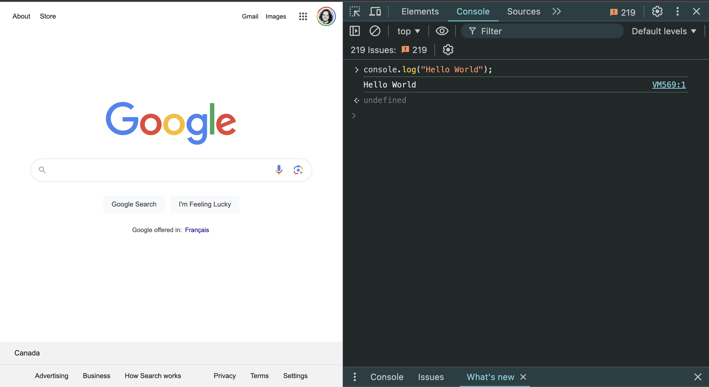

---
# General Information
category: "Web Programming I"
title: "Intro to JavaScript"
created: "2024-08-23"
coverSrc: "./assets/"
---

# What is JavaScript?

JavaScript is a high-level interpreted language that is supported by all modern web browsers, used by 92% of websites.

It is also probably one of the most hated.

# WTFJS

JavaScript is a great language. It has a simple syntax, large ecosystem and, what is most important, a great community.

At the same time, we all know that JavaScript is quite a funny language with tricky parts. Some of them can quickly turn our everyday job into hell, and some of them can make us laugh out loud.

If you want to learn about more of the crazy examples in JavaScript and how they work, you can see the full list here: https://github.com/denysdovhan/wtfjs

## However this is a quick Summary

[coding standup comedy](https://www.youtube.com/watch?v=et8xNAc2ic8)

# Beyond HTML and CSS

Despite all it's fun quicks, it is the most popular language in 2024


Why? JavaScript is what brings your website to life

# History time

Christmas 1990 came with the birth of the internet. In the early 90s Netscape took up about 80% of the market share and browsers needed to become more dynamic. At the time they turned to the trendy Java language but they quickly didnt like it just as many do and instead came up with something else.

## How long do you think it took to create JavaScript?

10 days.

It was intended to be a simple scripting language and the creater, Eich, couldn't have predicited how almost every website today uses it.

## The evolution of naming

Mocha -> LiveScript -> JavaScript (Java popular) -> JScript (Marketing Team) -> ECMAScript (ES6, ES7, ES2017)

## What is ECMA?

Well, imagine taking one of your hackathon projects and giving it to the entire world to tinker with. Things are inevitably going to break everyone is going to come up with fun ways to bring it to the extremes. We needed a way to keep chaos to a minimum and thats what ECMA was developed.

Think of it as a book to develop standards and technical reports to facilitate and standardize the use of information communication technology. Like your course outline that you probably only glance at once and the "Terms of conditions" that you quickly scroll through, you can imagine that people people didn't full respect these conventions.

## Miscrosoft being Microsoft

Well Netscape wenton to become obsolete and got taken over by Microsoft's very popular internet explorer. In the early 90s IE went on to control 90% of the market share and decided to do its own thing. They made up it's own extensions for JavaScript.

And thats why we are paying for the consequences of this decision almost 2 decades later as this created a lot of fragmentation withg the language that we need to factor in to our sites when supporting some of these legacy browsers.

## The 2000s

Here was the time of the Rise and fall of the 4rth iteration of ECMA. The rise and fall of ActionScript. And the rise and fall of Flash.

Think of this as the dark ages of JavaScript.

## Modern JavaScript

With the release of Google Chrome and the V8 Engine came the JavaScript that we know today.

# How does JavaScript Work?

JavaSCRIPT is a SCRIPTING language, but what exactly does that mean? How does it differ from traditional compiled languages?

## Compiled Languages

Compiled languages work like this:

- human-readable code translated to machine-readable code (bits)
- step before being able to run
- catch errors - fix once, run many times, but have to regenerate executable
- precompiled runs faster

Some examples include:

- Java
- C#

## Scripting Languages

Scripting languages, on the other hand, function differently:

- interpreters translate into machine-readable code on the fly
- always rely on the source-code
- hit same error every run, but just reload once fixed.
- translating less performant in theory (but caching, optimizations)
- Line getting blurred (compile JavaScript into an exec, very fast compilation JIT)

Some examples include:

- JavaScript
- PHP
- Python

# Where can I write JavaScript?

You can write JavaScript in several places ...

Inside a `<script>` tag within an HTML document. This is the most straightforward way to add JavaScript to a webpage.

```html
<script>
  // TODO
</script>
```

In a separate JavaScript file. This file can be linked to in your HTML document, which helps keep your code organized and makes it easier to maintain.

```js
// example.js
```

You can also type it directly in your browsers? Most modern browsers have a console where you can type and run JavaScript code immediately, which is great for testing small snippets or debugging.



But how is this allowed?

# Where can I run JavaScript?

## In the browser

Going back to our history lesson, JavaScript was originally designed to run ONLY in browsers. All browsers have a JS Engine that allow you to execute the code.

For example, in firefox and chrome, the Javascript engine that's used is spider monkey and v8.

## But what happens if we want to run JavaScript outside of the browser?

Well in 2009, a smart dude named Ryan Dahl took the open-source JavaScript engine that was in chrome and embedded it inside a C++ program. He called this Node.

Now with Node we can run JavaScript outside of a browser allowing us to use JavaScript for the backend for our web and mobile applications.

This innovation is largely why it continues to establish itself as the most popular coding language.

## Why care?

We will cover Node a bit later in week 4. For now why this is so cool is that:

- Cross-Platform: Node.js is compatible with various operating systems, including Windows, macOS, and Linux, making it highly versatile for developing applications across different platforms.

- Package Management: Node.js comes with npm (Node Package Manager), the largest ecosystem of open-source libraries and modules for JavaScript, enabling developers to easily integrate third-party packages into their projects.

- Single Programming Language: With Node.js, developers can use JavaScript for both client-side and server-side development, streamlining the development process and fostering code reuse between the front end and back end.

- High Performance: Node.js leverages the V8 JavaScript engine, renowned for its high performance and optimization, resulting in fast execution speeds for JavaScript code.

Node.js is widely adopted by developers and companies for building scalable, high-performance applications, including web servers, APIs, microservices architectures and real-time chat applications. It's immense impact on software development practices, business agility, and the broader technology ecosystem undoubtedly underscores its significance and value in the digital era.

# Getting Started

Let's open up Chrome DevTools and try the following

```js
// 👉 Variables
let name = "wow";
let name = 30; // dynamic typing in action
const isLearningJavaScript = true;

// 👉 Objects
let date = new Date();
let person = {
  firstName: "Ford",
  lastName: "Prefect",
  age: 25,
  isStudent: true,
};

// 👉 Arrays
let brandsWithFruits = ["apple", "banana boat"];
let numbers = [1, 2, 3, 4, 5];

// 👉 Conditions
if (condition) {
  // do stuff
} else if (otherCondition) {
  // do other stuff
} else {
  // default stuff
}

// 👉 Loops
for (let i = 0; i < 5; i++) {
  console.log("Counting: " + i);
}

let fruitBasket = ["apple", "banana", "cherry"];
fruitBasket.forEach((fruit) => {
  console.log("I have a " + fruit);
});

// 👉 Functions
function greet(name) {
  return "Hello, " + name + "!";
}

// ... and so much more
```

And this is just the beginning.

## What's the interactive part?

We can actually select and modify styles on the fly. Let’s open up Google and try modifying the CSS using JavaScript.

```js
// JS to make google pink
document.body.style.backgroundColor = "pink";
```

You can use JavaScript to dynamically alter styles, hide elements, or create interactive effects.

# Exercise 1

Try to dynamically change the logo of google to your favorite animal.

# Exercise 2

Theory is cool, but let's put it in action. Fork the [Pen](https://codepen.io/elizabeth-poggie/pen/xxojdba) and try to make the spider go away. We will go over the solution soon.

## Solution code

```js
// JS to make a spider disappear
function goAwaySpider() {
  document.querySelector("#no").style.visibility = "hidden";
}
```
