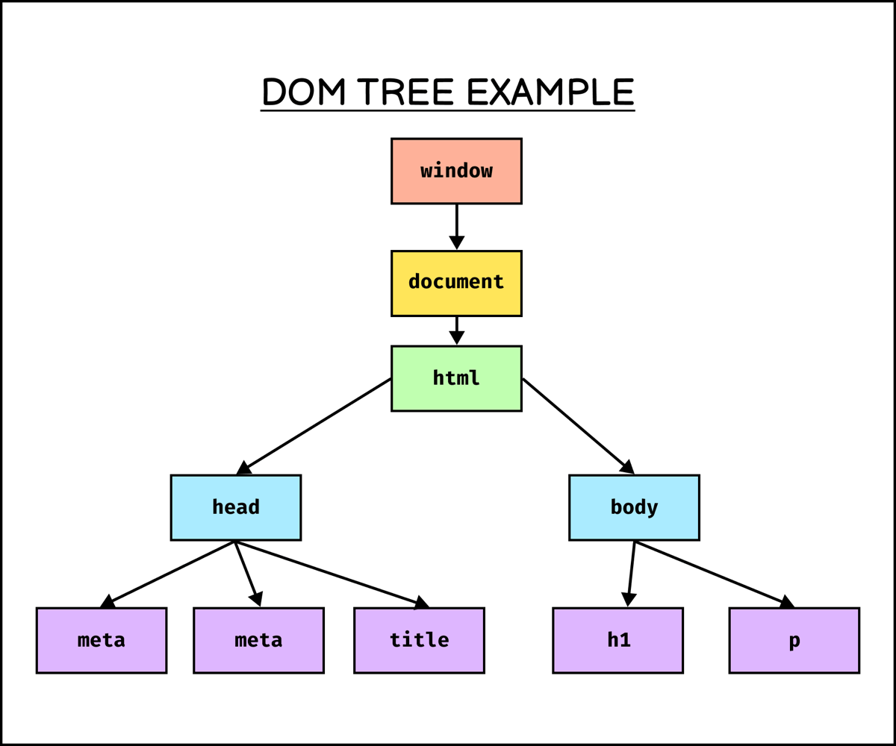

---
# General Information
category: "Web Programming I"
title: "Functional JS & The DOM"
created: "2024-09-08"
coverSrc: "./assets/"
---

# What is Functional Programming?

## Introduction

n our last class, I introduced the `forEach()` loop for working with arrays, assuming you were already familiar with the idea of passing functions as arguments. However, after reviewing your program outline, I found out that this concept is only introduced at the end of Programming 4.

This raises a couple of questions:

- Why is this class scheduled before you’ve covered this concept?
- How has this issue gone unnoticed until now?

I will be discussing this issue with the department to address the curriculum gap. In the meantime, I’ll provide a quick crash course on passing functions as arguments, as it’s a fundamental aspect of JavaScript and frequently appears in its syntax.

## Who uses Functional Programming?

- Web developers 👉 Including you in this class, use functional programming for array manipulation to write cleaner and more efficient code.
- Data Scientists 👉 Appreciate its ability to handle large datasets with fewer errors.
- Financial Institutions 👉 Banks and other financial institutions use it for its stateless nature, which avoids maintaining or modifying state.

## Pros & Cons of Functional Programming

The Pros:

- Clean Code 👉 Promotes clarity and simplicity.
- Syntactic Efficiency 👉 Allows for concise and expressive code.
- Reduction of Errors 👉 Decreases the likelihood of mistakes over time.

The Cons:

- Abstract Concepts 👉 Can be more challenging to learn due to its abstract nature and symbolic coding style.

## Key Concepts

- Pure Functions 👉 Functions that, given the same inputs, always produce the same outputs without causing any side effects (such as modifying variables outside the function).

- Immutability 👉 In functional programming, data is not modified. Instead, new data is created when changes are needed, avoiding the concept of mutable state.

- No Side Effects 👉 Since pure functions do not alter any state, they don't produce unexpected results that depend on external factors.

What exactly do all these concepts mean in code, let's get into it :)

# Pure Functions

In functional programming, a “pure” function is one that consistently returns the same result given the same parameters. For example:

```js
// This is a "pure" function
function add(a, b) {
  return a + b; // returns a + b
}
```

This is "pure" because when we call the function `add(2,5);` it will ALWAYS return `7`. The results are PREDICTABLE.

What would make this function "impure"?

```js
// This is an "impure" function
function add(a, b) {
  return Math.random(); // returns ????
}
```

Since `Math.random()` generates different values each time, the function does not produce consistent results, making it "impure".

Why am I mentioning this? Well, in JavaScript not all functions are "pure".

## Purity vs Impurity

Consider this impure function:

```js
// This is an "impure" function
const c = 9;
function add(a, b) {
  return c + a;
}
add(2, 5); // 11
```

Here, the function `add` depends on the external constant `c`, making it impure because its result is influenced by something OTHER THAN its parameters.

What if we instead modify the function to use a fixed value internally:

```js
// This is STILL an "impure" function
const c = 9;
function add(a, b) {
  return 9 + a;
}
add(2, 5); // 11
```

Although it no longer depends on the external variable `c`, it still uses a fixed value `9` internally, which reduces its flexibility and purity while leaving `b` unused. To make it pure, it should only depend on its input:

```js
// This is a "pure" function
function add(a) {
  return 9 + a;
}
add(2); // 11
```

This function is pure because it:

- DEPENDS ONLY on its input.
- ALWAYS returns the same output given the SAME inputs.
- Is STATELESS and doesn't modify external state OR rely on external variables.

In other words, whatever happens in that function, stays in that function.

## Summary

In summary, a pure function:

- Depends solely on its input parameters, not on external state or variables.
- Always returns the same output given the same inputs.
- Has no side effects and does not modify or rely on external state.

# Traditional Programming vs Functional Programming

Let’s revisit our original approach to traversing an array:

```js
const nums = [1, 2, 3];
let total = 0;

for (let i = 0; i < nums.length; i++) {
  total = total + nums[i];
}

console.log(total); // 6
```

In this example, we are iterating over an array and adding each item to a `total`. To adopt a more functional programming style, we’ll focus on separating these two tasks:

- Part 1) Iterating over the array
- Part 2) Performing an action on each item in the array

```js
// ...

// Part 1) Iterator using a for loop
for (let i = 0; i < nums.length; i++) {
  // Part 2) Action
  total = total + nums[i];
}

// ...
```

In functional programming, these two tasks are separated, leading to a cleaner approach. We can rewrite the `for` loops using the `forEach()` method:

```js
const nums = [1, 2, 3];
let total = 0;

// Part 1) iterator using forEach()
nums.forEach(function (num) {
  // Part 2) action
  total += num;
});

console.log(total); // 6
```

In this version, the iterator (`forEach()`) and the action (adding to `total`) are INDEPENDENT of each other.

However, this function still isn’t pure. Why? Because it modifies and depends on external state (e.g. `total`). . To achieve purity, we need to avoid altering external state. We’ll cover this in more detail in week 10, where we’ll explore additional array methods like `map`, `filter`, and my favorite, `reduce`.

Why is this so cool? ust like building with Lego blocks, you can mix and match functions and iterators to create various structures. This modularity allows you to reuse and combine functions in different ways, enhancing your code’s maintainability and readability.

## Example

Let's say we created the following "PURE" functions in one part of our code base.

```js
// Function to log elements
function logElement(element) {
  console.log(element);
}

// Function to check if the element is even
function checkEven(element) {
  if (typeof element !== "number" || !Number.isInteger(element)) {
    throw new Error("What are you doing giving me trash?");
  }
  const output = element % 2 === 0 ? element + " is even" : element + " is odd";
  console.log(output);
}
```

We can actually use these functions in multiple ways. For starters, on just individual elements of type `number`

```js
console.log(checkEven(42)); // 42 is even
console.log(checkEven(13)); // 13 is odd
console.log(checkEven("hello")); // trash
console.log(checkEven(19.99)); // trash
console.log(logElement(":^)")); // :^)
```

And we can also plug them directly into our array to be used:

```js
const nums = [1, 2, 3, 4, 5];
nums.forEach(checkEven);
nums.forEach(logElement);
```

Because the action AND iterator are decoupled from each other, if we ever need to make an adjustment to the `checkEven` function, the changes will impact all areas of the code base that use it.

## Exercise 1

# The DOM

As we dive deeper into building interactive User Interfaces, we'll explore how to integrate the JavaScript concepts we've learned with `HTML` and `CSS` to create dynamic webpages

## What is the DOM?

The Document Object Model (DOM) represents the structure of an HTML document as a tree of objects, which JavaScript can interact with. Although the DOM is not a part of the JavaScript language itself, it is an essential interface provided by the browser that allows JavaScript to engage and access the content and structure of a webpage.

## Key Points

The DOM is _NOT_:

- Part of the JavaScript Language

The DOM is:

- Constructed by the browser
- Accessible `globally` via the document object in JavaScript.

## The DOM and Trees

The Document Object Model (DOM) is organized as a tree structure with interconnected nodes, each representing a part of the HTML document:



Each node in this tree is an object accessible through JavaScript. Just like other JavaScript objects, DOM nodes have key-value pairs. These pairs include both data and functions. For example, you can access specific elements in the DOM using methods like ...

```js
const element = document.getElementById("footer");
```

This line of code returns the HTML element with the ID `footer` if it exists. If no such element is found, it returns `null`.

# DOM Properties

The `HTMLElement` object is packed with _MANY_ properties. And when I say a lot, I mean _A LOT_. You can explore the complete list of properties [here](https://www.w3schools.com/jsref/dom_obj_all.asp)

However not all properties are created equal. Here are a few key _element properties_ that are particularly useful:

## innerHTML

`element.innerHTML` 👉 Modifying this property changes the content of the element. For example, setting `element.innerHTML` to a new value will update the text or HTML inside that element.

## id

`element.id` 👉 Sets or gets the `id` attribute of an element. This is useful for uniquely identifying an element within the DOM.

## style

`element.style` 👉 Provides access to the inline styles of an element. You can use it to change the appearance of the element directly through JavaScript.

## setAttribute

`element.setAttribute(name, value)` 👉 Sets a specified attribute on an element to a given value. This method is useful for setting any attribute that doesn’t have a direct property.

## children

`element.children`👉 Returns a live HTMLCollection of child elements of the specified element.

# DOM Methods

Here are a few key _document methods_ you will use a lot:

## getElementById

`document.getElementById(id)` 👉 This method returns an element with the specified id.

## getElementsByClassName

`document.getElementsByClassName(name)` 👉 This method returns a collection of elements with the specified class name, encapsulated in an HTMLCollection. Since a class name can be used by multiple elements, this method is designed to handle multiple matches.

## getElementsByTagName

`document.getElementsByTagName(name)` 👉 Similar to the class name method, this one returns a collection of elements with the specified tag name. This method also returns an HTMLCollection, as tag names can be shared by several elements.

# Exercise 2

So far we have been working mainly in CodePen, today is when we finally return to VSCode. Copy and paste the Pen on LEA into your VSCode and complete the exercise.

## Solution

```html
<!DOCTYPE html>
<html lang="en">
  <head>
    <meta charset="UTF-8" />
    <meta name="viewport" content="width=device-width, initial-scale=1.0" />
    <title>FUNKY DOM Example</title>
    <style>
      .highlight {
        background-color: yellow;
      }
    </style>
  </head>
  <body>
    <h1 id="header">Welcome to the FUNKY DOM Example</h1>
    <p class="description">This is an example paragraph.</p>

    <script>
      const header = document.getElementById("header"); // Fixed
      console.log("Header:", header);

      // Change the content of the header
      header.innerHTML = "Content Updated!"; // Fixed
      console.log("Updated Header Content:", header.innerHTML);

      // Access the paragraph element by its class
      const paragraphs = document.getElementsByClassName("description"); // Fixed
      const paragraph = paragraphs[0]; // Get the first element from the HTMLCollection
      console.log("Paragraph:", paragraph);

      // Add a class to the paragraph
      paragraph.className = "highlight"; // Fixed
      console.log("Paragraph Class Name:", paragraph.className);
    </script>
  </body>
</html>
```
