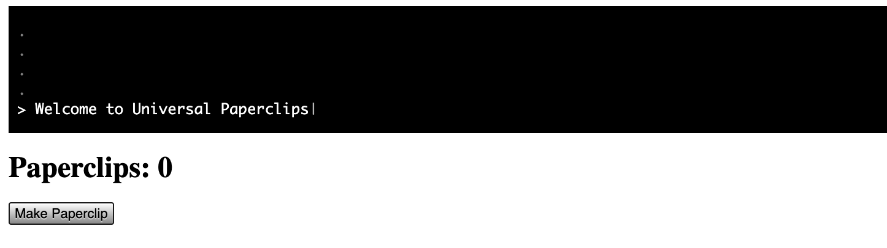

---
# General Information
category: "Web Programming I"
title: "Events & Event Listeners"
created: "2024-09-13"
coverSrc: "./assets/"
---

# HTML Events

HTML events can occur due to browser actions or user interactions. Here are a few common examples:

- An HTML web page has finished loading
- An HTML input field was changed
- An HTML button was clicked

## Common Events

For those that are curious, you can see the full list [here](https://www.w3schools.com/jsref/dom_obj_event.asp). For this class, focus on the following events:

- `click` 👉 Triggered when an element is clicked.
- `dblclick` 👉 Triggered when an element is double-clicked.
- `change` 👉 Triggered when the value of an input element has been changed.
- `mouseover` 👉 Triggered when the mouse pointer hovers over an element.
- `mouseout` 👉 Triggered when the mouse pointer leaves an element.
- `load` 👉 Triggered when an element (usually an image or script) has finished loading.

## Reacting to Events

JavaScript can respond to events by executing code when certain actions occur on HTML elements. For example:

```js
<button onclick="doStuff()">What are you doing?</button>
```

here, the attribute `onclick` on the `button` element triggers `doStuff()` function when the `button` is clicked.

```html
<button onclick="doStuff()">What are you doing?</button>
<p id="stuff"></p>
<script>
  function doStuff() {
    document.getElementById("stuff").innerHTML = "I'm doing stuff, excuse you.";
  }
</script>
```

In this code, the `doStuff()` function updates the content of the `<p>` element with the id `stuff` to display a message. The `onclick` attribute is used to "listen" for the click event on the button and execute the specified function in response.

## Event Listeners

Instead of using HTML attributes to handle events, you can use JavaScript to add "event listeners" to elements on your page. For example:

```html
<button>What are you doing?</button>
<p id="stuff"></p>
<script>
  document.addEventListener("click", function () {
    document.getElementById("stuff").innerHTML = "I'm doing stuff, excuse you.";
  });
</script>
```

In this example, the `addEventListener` method is used to attach a `click` event listener to the `document`. When the `document` is clicked, the specified function is executed, updating the content of the `<p>` element.

## Arts & Crafts

Why is this so cool? Now we can have a lot more fun creating interactive web pages. Let's say we have the below HTML page with a sad cat:

```html
<!DOCTYPE html>
<html lang="en">
  <head>
    <meta charset="UTF-8" />
    <meta name="viewport" content="width=device-width, initial-scale=1.0" />
    <title>Cat Pat Demo</title>
    <style>
      #cat {
        width: 200px;
        height: auto;
      }
    </style>
  </head>
  <body>
    
  </body>
</html>
```

Suppose we want to change the image to a happy cat when the mouse hovers over it (`mouseenter` event) and revert it back to the sad cat when the mouse leaves (`mouseleave` event). Well we can do that :^)

Add the following to the `<script>` section

```js
const image = document.getElementById("cat");
image.addEventListener("mouseenter", () => {
  image.src = "./pet-cat.png";
});

image.addEventListener("mouseleave", () => {
  image.src = "./sad-cat.jpg";
});
```

Purfection. This code listens for `mouseenter` and `mouseleave` events on the image and updates the `src` attribute to show the appropriate cat image >:^)

To improve code maintainability, you can define the image URLs as constants and organize the JavaScript code a bit better:

```html
<!DOCTYPE html>
<html lang="en">
  <head>
    <meta charset="UTF-8" />
    <meta name="viewport" content="width=device-width, initial-scale=1.0" />
    <title>Cat Pat Demo</title>
    <style>
      #cat {
        width: 200px;
        height: auto;
      }
    </style>
  </head>
  <body>
    
    <script>
      const image = document.getElementById("cat");
      const sadCatSrc = "./sad-cat.jpg";
      const happyCatSrc = "./pet-cat.png";

      image.addEventListener("mouseenter", () => {
        image.src = happyCatSrc;
      });

      image.addEventListener("mouseleave", () => {
        image.src = sadCatSrc;
      });
    </script>
  </body>
</html>
```

# Exercise 1

Create an event listener that displays an `alert` whenever a user clicks on a camera. Make sure the `alert` message reflects the correct cat name.

## Solution

```js
const camera1 = document.getElementById("camera1");
const camera2 = document.getElementById("camera2");
const camera3 = document.getElementById("camera3");
const camera4 = document.getElementById("camera4");

function showAlert(catName) {
  alert(`Sending a photo to ${catName}`);
}

camera1.addEventListener("click", () => showAlert("chonky_boi_420"));
camera2.addEventListener("click", () => showAlert("sleepy_bean"));
camera3.addEventListener("click", () => showAlert("yee-paw"));
camera4.addEventListener("click", () => showAlert("fluffcrate_9000"));
```

# Exercise 2

Set up an event listener to change the profile image when a user hovers over it. The image should revert to the original when the user moves the mouse away.

## Solution

```js
const hoverImages = {
  profile1:
    "https://i.pinimg.com/originals/e8/66/95/e866952236eae173834989268c360194.jpg",
  profile2:
    "https://i.pinimg.com/originals/e8/66/95/e866952236eae173834989268c360194.jpg",
  profile3:
    "https://i.pinimg.com/originals/e8/66/95/e866952236eae173834989268c360194.jpg",
  profile4:
    "https://i.pinimg.com/originals/e8/66/95/e866952236eae173834989268c360194.jpg",
};

const originalImages = {
  profile1: "./images/chonky-cat.jpeg",
  profile2: "./images/sleepy-cat.png",
  profile3: "./images/sad-cat.jpg",
  profile4: "./images/box-cat.jpeg",
};

function handleMouseOver(element) {
  const profileId = element.id;
  element.src = hoverImages[profileId];
}

// Function to handle mouseleave event
function handleMouseLeave(element) {
  const profileId = element.id;
  element.src = originalImages[profileId];
}

// Attach event listeners to each profile element
profile1.addEventListener("mouseover", () => handleMouseOver(profile1));
profile1.addEventListener("mouseleave", () => handleMouseLeave(profile1));

profile2.addEventListener("mouseover", () => handleMouseOver(profile2));
profile2.addEventListener("mouseleave", () => handleMouseLeave(profile2));

profile3.addEventListener("mouseover", () => handleMouseOver(profile3));
profile3.addEventListener("mouseleave", () => handleMouseLeave(profile3));

profile4.addEventListener("mouseover", () => handleMouseOver(profile4));
profile4.addEventListener("mouseleave", () => handleMouseLeave(profile4));
```

# Introduction to jQuery

## What is it?

jQuery is a fast and small JavaScript library! You can read more about it [here](https://jquery.com/)

## Why do we care?

Writing JavaScript can be painful most of the time. It makes things like HTML document manipulation, event handling, and a whole bunch of other things much easier.

## How to Use jQuery?

You know all the million methods used to `getElementById()`, `getElementsByClassName()`, or `getElementsByTagName()`? Well in your console in Chrome DevTools, `$` is a variable, mapped to the jQuery function and it makes accessing all this information easier

```js
// 👉 Select elements with a class
$(".someClass"); // better way
document.getElementsByClassName("someClass"); // lame way

// 👉 Select the element with an ID
$("#myId"); // better way
document.getElementById("myId"); // lame way

// 👉 Select all <p> elements
$("p"); // better way
document.getElementsByTagName("p"); // lame way
```

# Accessing jQuery

To use jQuery in your projects, you need to include the jQuery library in your HTML document.

## via CDNs

The easiest way to include jQuery is by using a Content Delivery Network (CDN). This method provides a hosted version of jQuery that you can include directly in your HTML file. Here’s how:

```html
<!DOCTYPE html>
<html lang="en">
  <head>
    <!-- other head stuff ... -->

    <!-- ADD THE BELOW HERE -->
    <script src="https://code.jquery.com/jquery-3.6.4.min.js"></script>
  </head>
  <body>
    <!-- other html stuff ... -->
    <script>
      // other js stuff ...
    </script>
  </body>
</html>
```

no need for `type="text/javascript"` inside the `<script>` tag. It is the default
scripting language in HTML5 on all modern browsers

## via Local Hosting

Alternatively, you can download the jQuery library and include it locally in your project. However that takes longer so we aren't going to do that lol.

# Working with jQuery

## Selectors

Once jQuery is included in your project, you can use it like so:

```js
$(selector).action();
```

What does this all mean?

- `$` 👉 The jQuery function.
- `selector` 👉 A jQuery selector to target elements.
- `action` 👉 The action you want to perform.

What are your options to target elements? You have 3:

```js
$("tag");
$(".class");
$("#id");
```

## DOM Manipulation

Now changing content is a bit easier to:

```js
// Modify Text
$("p").text("Wow!!!!");

// Modify HTML
$("#coolDiv").html("<strong>a VERY bold WOW</strong>");

// Modify Attributes
$("img").attr("src", "./cats/pet-cat.png");
```

## Event Listeners

In HTML to directly listen to an event, it would look like this:

```html
<button onclick="handleEvent()">Click Me!</button>
```

Where:

- `handleEvent()` is the handler
- `onclick` is the listener
- and there is NO NEED for a selector

In pure JavaScript, it would look like this:

```js
document
  .getElementsByTagName("button")[0]
  .addEventListener("click", handleEvent);
```

Where:

- `handleEvent` is the handler
- `addEventListener("click", ...)` is the listener
- `document.getElementsByTagName("button")[0]` is the selector

However that is a very ugly approach. We can rewrite this in JQuery to be the following:

```js
$("button").on("click", handleEvent);
```

Where:

- `handleEvent` is the handler
- `on( "click", ...)` is the listener
- `$( "button" )` is the selector

Which is MUCH cleaner and easier on our retinas.

# Exercise 3

Get into groups of up to 4 people, if you prefer to work independently that's ok too. Together you are going to create the foundations for a paperclip clicker game using JQuery.

For this task:

- Add one button to an HTML document that contains the text "Make Paperclip"
- At the top of the screen it should contain the text "Paperclips: " followed by the number of paper clips made.

When "Make Paperclip" is clicked:

- change the text on it to be the next number.

The end result should look something like [Universal Paperclips](https://www.decisionproblem.com/paperclips/index2.html), as captured below:



## Solution

```html
<html lang="en">
  <head>
    <meta charset="UTF-8" />
    <meta name="viewport" content="width=device-width, initial-scale=1.0" />
    <title>Universal Paperclips</title>
    <!-- NOTICE THE IMPORT -->
    <script src="https://code.jquery.com/jquery-3.6.4.min.js"></script>
  </head>
  <body>
    <h2 id="paperclip-count">Paperclips: 0</h2>
    <button id="make-paperclip">Make Paperclip</button>
    <script>
      let paperclipCount = 0;

      function makePaperclip() {
        paperclipCount++;
        $("#paperclip-count").text("Paperclips: " + paperclipCount);
      }

      // Event handler for button click - could use the traditional way tho, it's fair game.
      $("#make-paperclip").click(makePaperclip);
      $("#make-paperclip").click(makePaperclip);
    </script>
  </body>
</html>
```
