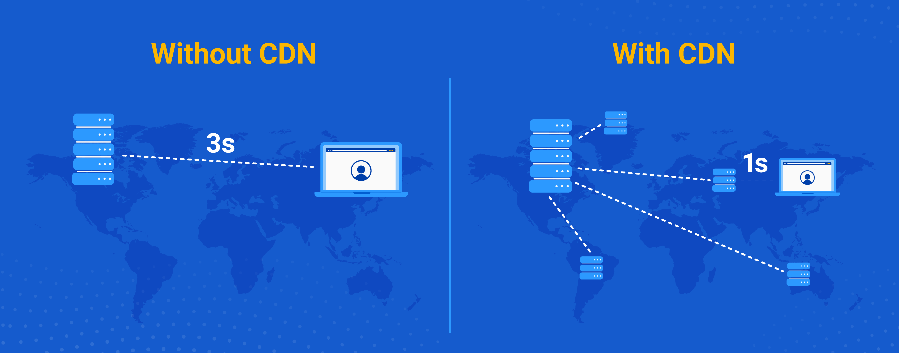
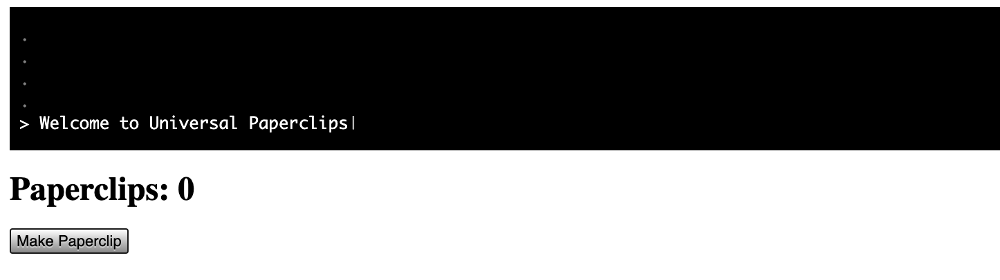

---
# General Information
category: "Web Programming I"
title: "jQuery & Event Listeners"
created: "2024-09-15"
coverSrc: "./assets/"
---

# Why do i need to learn this?

This library is one of the most popular tools for JavaScript, powering over 80% of the top 1 million websites globally. It’s more widely used than the major frameworks you've probably heard of, such as Angular, Vue, and React combined.

JavaScript is an ugly language and we want to write less of it. This is how you do that.

# Accessing jQuery

To use jQuery in your projects, you need to include the jQuery library in your HTML document.

## Via CDNs

The easiest way to add jQuery is by using a Content Delivery Network (CDN). This method provides a hosted version of jQuery that you can directly include in your HTML file:

```html
<!DOCTYPE html>
<html lang="en">
  <head>
    <!-- other head stuff ... -->

    <!-- ADD THE BELOW HERE -->
    <script src="https://code.jquery.com/jquery-3.6.4.min.js"></script>
  </head>
  <body>
    <!-- other html stuff ... -->
    <script>
      // other js stuff ...
    </script>
  </body>
</html>
```

You don’t need to specify type="text/javascript" inside the `<script>` tag because JavaScript is the default scripting language in HTML5 for _ALL_ modern browsers.

## Via Local Hosting

Alternatively, you can download jQuery and include it locally in your project. However, that takes longer so we aren't going to do that lol.

## Via Copy and Pasting

If you were determined enough, you could copy the source code from [github](https://github.com/jquery/jquery) and paste it directly into your header `<script>` tag. While this is possible, it’s not the best practice and can make your simple HTML doc much beefier than it needs to be.

Why mention this? In JavaScript, a "library" is a collection of pre-written code that offers helpful functions and tools to solve common problems without starting from scratch. Think of it like saving all your assignment functions in one place for easy reuse across projects. Fun fact: I do this too. You think I start every website project from scratch? Absolutely not. Why would I when I have all these handy functions ready to go?

Using a CDN keeps your code clean and efficient. Copy-pasting the library code into your header is like reinventing the wheel. Stick to the CDN method.

# CDN Crash Course

## What are CDNs?

A CDN, or Content Delivery Network, is a global network of servers designed to deliver content efficiently. When a user requests a file, such as a JavaScript library, the CDN serves it from the server closest to the user's location rather than from the original, potentially distant server.



For example, if a user is in Montreal, the CDN will serve the file from a nearby server, reducing delays.

## Why are CDNs cool?

CDNs significantly reduce the time it takes for data to travel between the user and the server, which is more formally referred to as _latency_. By doing so, they improve the load times of websites and applications, making them faster and more responsive (which is important in web dev land)

## Where do I access the jQuery CDN?

The official jQuery CDN can be accessed through the following URL: [code.jquery.com](https://code.jquery.com/). Select the latest version in the format you desire and copy and paste that into your `<head>` section


Alternatively, insert the following in the `<head>` of your HTML page:

```js
<script src="https://code.jquery.com/jquery-3.6.0.min.js"></script>
```

If you want to use the google hosted jQuery for whatever reason, that can be accessed through this URL: [developers.google.com](https://developers.google.com/speed/libraries). To used the latest version, insert the following in the `<head>` of your HTML page

```js
<script src="https://ajax.googleapis.com/ajax/libs/jquery/3.6.0/jquery.min.js"></script>
```

# Recap on Syntax

With the mighty `$` symbol you are able to do a lot more with less.

```js
$(selector).action();
```

Here’s what each part means:

- `$` 👉 represents the jQuery function.
- `selector` 👉 is a jQuery selector to target elements. (e.g. `tag`, `.class`, `#id` )
- `action` 👉 is the action you want to perform. (e.g. `.text()`, `.html()`)

## Can you do multiple actions?

Yes, we are going to explore the idea of method chaining shortly

```js
$(selector).action().anotherAction().evenMoreActions();
```

## What is the $ symbol anyways?

In jQuery, the `$` is simply how you use the jQuery function. You know how you call functions in JavaScript like so?

```js
callingACoolFunction("some parameters");
```

The `$` sign works similarly. Except instead of passing any parameters like you do in your custom functions, the `$()` expects a _selector_ as input

```js
$(".myCoolClass");
```

For those that are curious, there is a longer way that you can access the jQuery Library:

```js
// the best way to access jQuery
$(".myCoolClass");

// the inconvenient way to access jQuery
jQuery(".myCoolClass");
```

jQuery uses the `$` because it's a quick and easier to use.

# DOM Manipulation made easier

There are a lot of methods you have access to via the `$` symbol which you can see [here](https://api.jquery.com/). The ones you will care the most about in the context of this course are listed below.

## Hide/Show

```js
// Hide an element
$("p").hide();

// Show an element
$("p").show();
```

## Change Content/Attributes

```js
// Modify Text
$("p").text("Wow!!!!");

// Modify HTML
$("#coolDiv").html("<strong>a VERY bold WOW</strong>");

// Modify Attributes
$("img").attr("src", "./cats/pet-cat.png");
```

## Style Modifications

```js
// Change a css style
$("div").css("background-color", "yellow");

// Add a style class
$("#coolDiv").addClass("active");

// Remove a style class
$(".someClass").removeClass("active");

// Create animations by changing CSS properties
$("p").animate(
  {
    width: "300px",
    opacity: 0.5,
  },
  1000
);
```

As well as event handling....

# jQuery Event Listeners

## The Attribute Way

In HTML, adding an event listener directly might look like this:

```html
<button onclick="handleEvent()">Click Me!</button>
```

Where:

- `handleEvent()` is the handler function
- `onclick` is the event listener attribute
- and there is NO NEED for a selector

## The Pure JavaScript Way

In pure JavaScript, it would be:

```js
document
  .getElementsByTagName("button")[0]
  .addEventListener("click", handleEvent);
```

Where:

- `handleEvent` is the handler function
- `addEventListener("click", ...)` is the event listener method
- `document.getElementsByTagName("button")[0]` is the selector

## The jQuery Way (the best)

Using jQuery, this simplifies this to:

```js
$("button").on("click", handleEvent);
```

Where:

- `handleEvent` is the handler function
- `on( "click", ...)` event listener method
- `$( "button" )` is the selector

Which is MUCH cleaner and easier on our retinas.

# Exercise 1

Form groups of up to 3 people, or feel free to work solo if that's more your style. Together, you’re going to build the foundation for a simple paperclip clicker game.

## The HTML

- Add a button to your HTML that says "Make Paperclip"
- At the top of the page, display "Paperclips: " followed by the number of paperclips created.

## The JS

When the "Make Paperclip" button is clicked:

- Update the number of paperclips at the top.

Your end result should look something like [Universal Paperclips](https://www.decisionproblem.com/paperclips/index2.html), as captured below:



## jQuery Solution

```html
<html lang="en">
  <head>
    <meta charset="UTF-8" />
    <meta name="viewport" content="width=device-width, initial-scale=1.0" />
    <title>Universal Paperclips</title>
    <!-- NOTICE THE IMPORT -->
    <script src="https://code.jquery.com/jquery-3.6.4.min.js"></script>
  </head>
  <body>
    <h2 id="paperclip-count">Paperclips: 0</h2>
    <button id="make-paperclip">Make Paperclip</button>
    <script>
      let paperclipCount = 0;

      // Define paperclip making function
      function makePaperclip() {
        paperclipCount++;
        $("#paperclip-count").text("Paperclips: " + paperclipCount);
      }

      // Event handler for button click
      $("#make-paperclip").on("click", makePaperclip);
    </script>
  </body>
</html>
```

## Pure JS Solution

Without using jQuery, your solution might look something like this:

```html
<html lang="en">
  <head>
    <meta charset="UTF-8" />
    <meta name="viewport" content="width=device-width, initial-scale=1.0" />
    <title>Universal Paperclips</title>
  </head>
  <body>
    <h2 id="paperclip-count">Paperclips: 0</h2>
    <button id="make-paperclip">Make Paperclip</button>
    <script>
      let paperclipCount = 0;
      const button = document.getElementById("make-paperclip");

      // Define paperclip making function
      function makePaperclip() {
        paperclipCount++;
        const count = document.getElementById("paperclip-count");
        count.textContent = "Paperclips: " + paperclipCount;
      }

      // Event handler for button click
      button.addEventListener("click", makePaperclip);
    </script>
  </body>
</html>
```
