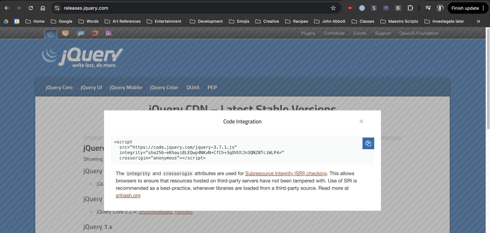

---
# General Information
category: "Web Programming I"
title: "jQuery & Event Listeners"
created: "2024-09-15"
coverSrc: "./assets/"
---

# Why do i need to learn this?

This library is one of the most popular tools for JavaScript, powering over 80% of the top 1 million websites globally. It’s more widely used than the major frameworks you've probably heard of, such as Angular, Vue, and React combined

JavaScript is an ugly language and we want to write less of it. This is how you do that.

# Accessing jQuery

To use jQuery in your projects, include the jQuery library in your HTML document.

## Via CDNs

The easiest way to add jQuery is by using a Content Delivery Network (CDN). This method provides a hosted version of jQuery that you can include directly in your HTML file:

```html
<!DOCTYPE html>
<html lang="en">
  <head>
    <!-- other head stuff ... -->

    <!-- ADD THE BELOW HERE -->
    <script src="https://code.jquery.com/jquery-3.6.4.min.js"></script>
  </head>
  <body>
    <!-- other html stuff ... -->
    <script>
      // other js stuff ...
    </script>
  </body>
</html>
```

There’s no need to specify `type="text/javascript"` inside the `<script>` tag, as JavaScript is the default scripting language in HTML5 for all modern browsers.

## Via Local Hosting

Alternatively, you can download jQuery and include it locally in your project. However, that takes longer so we aren't going to do that lol.

## Via Copy and Pasting

## CDN Side Tangent

## What are CDNs?

A CDN, or Content Delivery Network, is a system of servers distributed globally. When a user requests a file, such as a JavaScript library, the CDN delivers it from the server closest to the user's location rather than retrieving it from the original server, which might be located far away. For example, if a user is in Montreal, the CDN will serve the file from a nearby server, reducing delays.

## Why are CDNs cool?

CDNs significantly reduce the time it takes for data to travel between the user and the server, which is more formally referred to as _latency_. By doing so, they improve the load times of websites and applications, making them faster and more responsive (which is important in web dev land)

## Where do I access the jQuery CDN?

The official jQuery CDN can be accessed through the following URL: [https://code.jquery.com/](https://code.jquery.com/). To use the latest version, insert the following in the `<head>` of your HTML page:

```js
<script src="https://code.jquery.com/jquery-3.6.0.min.js"></script>
```

If you want to use the google hosted jQuery for whatever reason, that can be accessed through this URL: [https://developers.google.com/speed/libraries](https://developers.google.com/speed/libraries). To used the latest version, insert the following in the `<head>` of your HTML page

```js
<script src="https://ajax.googleapis.com/ajax/libs/jquery/3.6.0/jquery.min.js"></script>
```

## Do I need to memorize this?

Absolutely not, I just copy and paste this sort of information.

# Recap on Syntax

With the mighty `$` symbol you are able to do a lot more with less.

```js
$(selector).action();
```

Here’s what each part means:

- `$` 👉 represents the jQuery function.
- `selector` 👉 is a jQuery selector to target elements. (e.g. `tag`, `.class`, `#id` )
- `action` 👉 is the action you want to perform. (e.g. `.text()`, `.html()`)

Cam I do multiple actions?

- Yes, we are going to explore the idea of method chaining shortly

```js
$(selector).action().anotherAction().evenMoreActions();
```

## jQuery DOM Manipulation

Modifying content becomes simpler:

```js
// Modify Text
$("p").text("Wow!!!!");

// Modify HTML
$("#coolDiv").html("<strong>a VERY bold WOW</strong>");

// Modify Attributes
$("img").attr("src", "./cats/pet-cat.png");
```

## jQuery Event Listeners

In HTML, adding an event listener directly might look like this:

```html
<button onclick="handleEvent()">Click Me!</button>
```

Where:

- `handleEvent()` is the handler function
- `onclick` is the event listener attribute
- and there is NO NEED for a selector

In pure JavaScript, it would be:

```js
document
  .getElementsByTagName("button")[0]
  .addEventListener("click", handleEvent);
```

Where:

- `handleEvent` is the handler function
- `addEventListener("click", ...)` is the event listener method
- `document.getElementsByTagName("button")[0]` is the selector

Using jQuery simplifies this to:

```js
$("button").on("click", handleEvent);
```

Where:

- `handleEvent` is the handler function
- `on( "click", ...)` event listener method
- `$( "button" )` is the selector

Which is MUCH cleaner and easier on our retinas.

# Exercise 3

Form groups of up to 4 people, or feel free to work solo if that's more your style. Together, you’re going to build the foundation for a simple paperclip clicker game using jQuery.

## The HTML

- Add a button to your HTML that says "Make Paperclip"
- At the top of the page, display "Paperclips: " followed by the number of paperclips created.

## The JS

When the "Make Paperclip" button is clicked:

- Update the number of paperclips at the top.

Your end result should look something like [Universal Paperclips](https://www.decisionproblem.com/paperclips/index2.html), as captured below:



## Solution

```html
<html lang="en">
  <head>
    <meta charset="UTF-8" />
    <meta name="viewport" content="width=device-width, initial-scale=1.0" />
    <title>Universal Paperclips</title>
    <!-- NOTICE THE IMPORT -->
    <script src="https://code.jquery.com/jquery-3.6.4.min.js"></script>
  </head>
  <body>
    <h2 id="paperclip-count">Paperclips: 0</h2>
    <button id="make-paperclip">Make Paperclip</button>
    <script>
      let paperclipCount = 0;

      function makePaperclip() {
        paperclipCount++;
        $("#paperclip-count").text("Paperclips: " + paperclipCount);
      }

      // Event handler for button click - could use the traditional way tho, it's fair game.
      $("#make-paperclip").click(makePaperclip);
      $("#make-paperclip").click(makePaperclip);
    </script>
  </body>
</html>
```
