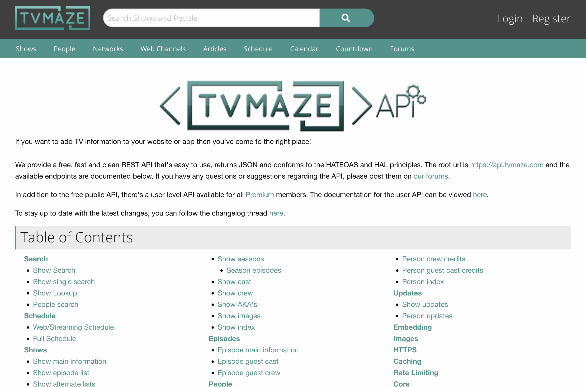

---
# General Information
category: "Web Programming I"
title: "APIs"
created: "2024-10-31"
number: 4
---

# Overview

- Worth: This lab will count towards the Assignment portion of your final grade at `5%`
- Due: `November 15th, 2024 @ 11:59am`
- Submission: Upload a `.zip` file containing your work folder to LEA.
- Late Penalty: Late submissions lose 3% per day to a maximum of 5 days. Nothing is accepted after 5 days and a grade of zero will be given.
- Academic Integrity: The purpose of this assignment is to strengthen your logical thinking and syntax skills. Work independently to benefit fully from the exercise!!

# Goal

Create an AJAX request using the `fetch` method to interact with the [TVMaze API](https://www.tvmaze.com/api).



# Part 0 - Page setup

Set up a web page that allows users to search for TV shows using this base URL:

```text
https://api.tvmaze.com/
```

You can check out all the available endpoints in the [docs](https://www.tvmaze.com/api)

# Part 1 - Search Functionality

In a web page, allow users to search for shows and display up to 3 options.

## Requirements

Your search feature should:

- Include an input field where users can enter a show's name
- Require users to enter at least 3 characters before triggering a search
- Display up to 3 show results. If fewer than 3 are available, display the options that match
- Notify the user if no results are found

Each show result should display:

- The show name
- The average rating (if available)
- A medium-sized image

# Part 2 - Details

Create a detailed view when a show is selected.

## Requirements

When a user selects a show, the detailed view should display:

- A larger image
- The show name
- A detailed summary (if available)
- Genres
- Language
- A list of all episodes. When any episode is clicked, the user should be redirected to its page

# Tips

- Use the TVMaze API endpoint to retrieve show details
- Handle errors by providing a user-friendly message if there’s an issue with the API call
