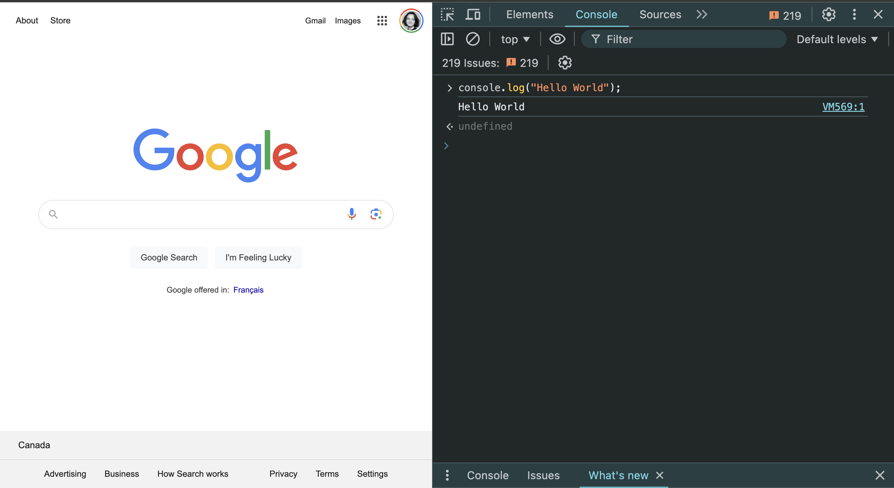

---
# General Information
category: "Web Programming I"
title: "JavaScript Recap"
created: "2024-08-23"
---

# What is JavaScript?

JavaScript is a high-level interpreted language that is supported by all modern web browsers, used by 92% of websites.

It is also probably one of the most hated.

# WTF JS

JavaScript is a great language. It has a simple syntax, large ecosystem and, what is most important, a great community. At the same time, we all know that JavaScript has its quicks. Sometimes these oddities can turn our daily work into a living nightmare, and other times, they can leave us laughing.

If you’re curious about more of JavaScript's wilder examples and want to understand how they work, you can check out the full list [here](https://github.com/denysdovhan/wtfjs).

## But here’s a quick summary

[Let's get into it](https://www.youtube.com/watch?v=et8xNAc2ic8)

# Beyond HTML and CSS

Despite all its quirks, JavaScript remains the most popular programming language in 2024.


Why? JavaScript is what brings your website to life.

# A Quick History Lesson

Christmas 1990 marked the birth of the internet. By the early '90s, Netscape dominated about 80% of the browser market share, and browsers needed to become more dynamic. Initially, they turned to the trendy Java language, but it quickly fell out of favor, just as it has with many developers today. So, they came up with something new.

## How long do you think it took to create JavaScript?

Just 10 days.

It was meant to be a simple scripting language, and its creator, Brendan Eich, could never have predicted that almost every website today would rely on it.

## The evolution of naming

JavaScript’s journey of names:

Mocha -> LiveScript -> JavaScript (Java was popular at the time) -> JScript (Marketing decision) -> ECMAScript (ES6, ES7, ES2017)


## What is ECMA?

Imagine handing one of your hackathon projects over to the entire world to tinker with. Chaos would inevitably ensue, with everyone coming up with creative and extreme ways to push the boundaries. We needed a way to keep that chaos in check, and that's where ECMA comes in.

Think of ECMA as a set of standards and technical reports designed to facilitate and standardize the use of information communication technology. It's like your course outline that you probably only glance at once, or the "Terms and Conditions" you scroll through without reading. You can imagine that not everyone fully respects these conventions, but they're essential for keeping things on track.

## Miscrosoft being Microsoft

Netscape eventually became obsolete and was overtaken by Microsoft's wildly popular Internet Explorer. By the early 2000s, IE controlled 90% of the market share and decided to go its own way, creating its own extensions for JavaScript.

And here we are, nearly two decades later, still dealing with the consequences of that decision. This move caused significant fragmentation within the language, creating challenges that we still need to address when supporting older, legacy browsers.


## Browser Turf Wars

Market share for several browsers between 1995 and 2010, illustrating the First Browser War (NN vs IE). Firefox was originally named "Phoenix", a name which implied that it would rise like a Phoenix after Netscape was killed off by Microsoft.


## The 2000s

This era saw the rise and fall of ECMAScript 4, ActionScript, and Flash. Think of this as the dark ages of JavaScript.

## Modern JavaScript

The release of Google Chrome and its V8 Engine brought us the JavaScript we know today.


# How does JavaScript Work?

JavaSCRIPT is a SCRIPTING language, but what exactly does that mean? How does it differ from traditional compiled languages?

## Compiled Languages

Compiled languages work like this:

- human-readable code translated to machine-readable code (bits)
- step before being able to run
- catch errors - fix once, run many times, but have to regenerate executable
- precompiled runs faster

Some examples include:

- Java
- C#

## Scripting Languages

Scripting languages, on the other hand, function differently:

- interpreters translate into machine-readable code on the fly
- always rely on the source-code
- hit same error every run, but just reload once fixed.
- translating less performant in theory (but caching, optimizations)
- Line getting blurred (compile JavaScript into an exec, very fast compilation JIT)

Some examples include:

- JavaScript
- PHP
- Python

# Where can I write JavaScript?

You can write JavaScript in several places ...

Inside a `<script>` tag within an HTML document. This is the most straightforward way to add JavaScript to a webpage.

```html
<script>
  // TODO
</script>
```

In a separate JavaScript file. This file can be linked to in your HTML document, which helps keep your code organized and makes it easier to maintain.

```js
// example.js
```

You can also type it directly in your browsers? Most modern browsers have a console where you can type and run JavaScript code immediately, which is great for testing small snippets or debugging.



But how is this allowed?

# Where can I run JavaScript?

## In the browser

Going back to our history lesson, JavaScript was originally designed to run ONLY in browsers. All browsers have a JS Engine that allow you to execute the code.

For example, in firefox and chrome, the Javascript engine that's used is spider monkey and v8.

## But what happens if we want to run JavaScript outside of the browser?

Well in 2009, a smart dude named Ryan Dahl took the open-source JavaScript engine that was in chrome and embedded it inside a C++ program. He called this Node.

Now with Node we can run JavaScript outside of a browser allowing us to use JavaScript for the backend for our web and mobile applications.

This innovation is largely why it continues to establish itself as the most popular coding language.


## Why care?

We will cover Node a bit later in week 4. For now why this is so cool is that:

- Cross-Platform: Node.js is compatible with various operating systems, including Windows, macOS, and Linux, making it highly versatile for developing applications across different platforms.

- Package Management: Node.js comes with npm (Node Package Manager), the largest ecosystem of open-source libraries and modules for JavaScript, enabling developers to easily integrate third-party packages into their projects.

- Single Programming Language: With Node.js, developers can use JavaScript for both client-side and server-side development, streamlining the development process and fostering code reuse between the front end and back end.

- High Performance: Node.js leverages the V8 JavaScript engine, renowned for its high performance and optimization, resulting in fast execution speeds for JavaScript code.

Node.js is widely adopted by developers and companies for building scalable, high-performance applications, including web servers, APIs, microservices architectures and real-time chat applications. It's immense impact on software development practices, business agility, and the broader technology ecosystem undoubtedly underscores its significance and value in the digital era.

# Getting Started

Let's open up Chrome DevTools and try the following

## Variables

```js
let name = "wow";
let name = 30; // dynamic typing in action
const isLearningJavaScript = true;
```

## Objects

More on this later, but for now...

```js
let date = new Date();
let person = {
  firstName: "Ford",
  lastName: "Prefect",
  age: 25,
  isStudent: true,
};
```

## Arrays

```js
let brandsWithFruits = ["apple", "banana boat"];
let numbers = [1, 2, 3, 4, 5];
```

## Conditions

```js
if (condition) {
  // do stuff
} else if (otherCondition) {
  // do other stuff
} else {
  // default stuff
}
```

## Loops

```js
for (let i = 0; i < 5; i++) {
  console.log("Counting: " + i);
}

let fruitBasket = ["apple", "banana", "cherry"];
fruitBasket.forEach((fruit) => {
  console.log("I have a " + fruit);
});
```

## Functions

```js
function greet(name) {
  return "Hello, " + name + "!";
}
```

... and so much more. This is just the beginning.

# Dynamic Webpages

What's the interactive part? We can actually select and modify styles on the fly. Let’s open up Google and try modifying the CSS using JavaScript.

```js
// JS to make google pink
document.body.style.backgroundColor = "pink";
```

You will notice that as you type in each of these key words, you will see everything you have access to modify. This is how you can dynamically alter styles, hide elements, or create interactive effects.

# Exercise 1

Try dynamically changing the Google logo to your favorite animal. Use any resources you like—part of web development is being an effective Googler

## Solution Code

Using DevTools, select the main logo to find out where the tag is located. You will notice that the `alt` tag is "Google". We can work with that.

```js
// Step 1) Select the logo using JavaScript
let logo = document.querySelector("img[alt='Google']");
// Step 2) Now that it's selected we can modify the src, the logo is highlighted. Let's change the src :^)
logo.src =
  "https://encrypted-tbn0.gstatic.com/images?q=tbn:ANd9GcQn9RwtnZI2hl3ZvsE5Aa7Dv_jDobsNu20D7Q&s"; // cat URL
```

Nothing has happened yet we changed the `src`. Why? Let's have a closer look at the logo that lives in the HTML. It seems that we have another link we need to modify.

```js
// Step 3) Modify the other link of the logo
logo.srcset =
  "https://encrypted-tbn0.gstatic.com/images?q=tbn:ANd9GcQn9RwtnZI2hl3ZvsE5Aa7Dv_jDobsNu20D7Q&s"; // cat URL
```

# Functions

What does a function return, what is called? First let's take the following [Pen](https://codepen.io/elizabeth-poggie/pen/LYKmyLo) and run the following code

```js
function test() {
  console.log("Hello World");
}
```

What do you think is going to happen when I run it? Nothing? Why?

You need to call a function to make the function run.

```js
// Fixing the previous code
function test() {
  console.log("Hello World");
}
test();
```

What will be logged to console when this script is run?

```js
// Fixing the previous code
function test() {
  console.log("Hello World");
}
console.log(test());
```

first `"Hello World"` will be logged from the execution of the test function. Then the console will show `undefined`, when it logs the return of the call to test. Shown again below:

```js
function test() {
  console.log("Hello World"); // 2. Hello World is Logged
  // 3. test returns nothing. therefore undefined is returned
}
console.log(test()); // 1. test() is invoked
// 4. what test() returns is then logged, in this case that's undefined
```

# Mini Quiz 1

What do you think is going to be logged to console when this script is run?

```js
function test() {
  console.log("Hello World");
}
console.log("Hi");
console.log(test());
```

## Solution

```text
Hi
Hello World
undefined
```

The lines of code in `test` will only be run when they are executed. Even if the test function is defined before the `console.log("hi")`, `console.log("Hi")` is the first line of executed code. console.log("Hello World") will only be run after, when `test()` is executed on the next line.

# Mini Quiz 2

What will be logged to console when this script is run?

```js
function test() {
  console.log("Hello World");
}
console.log(test);
```

## Solution

Then the console will log the test function object. The test function is never invoked.

```text
function test()
    {
        console.log( "Hello World" );
    }
```

We will cover objects soon, so no worries about that.

# Exercise 2

Let's put everything together. Fork the [Pen](https://codepen.io/elizabeth-poggie/pen/xxojdba) and try to make the spider go away. We will go over the solution in a few mins.

## Solution code

```js
// JS to make a spider disappear
function goAwaySpider() {
  document.querySelector("#no").style.visibility = "hidden";
}
```

# Homework

Why was ECMAScript 5 considered the rebirth of JavaScript?

When was the latest version of JavaScript released? What is its official name?

Write a nested loop in JavaScript that prints out all the different seat combinations in a theater. Theater seats often display a row and seat number to help theatergoers find their seats. If there are 26 rows (0 to 25) and 100 seats (0 to 99) in each row, then some of the potential combinations are listed below:

```text
0-0
0-1
0-2
...
25-97
25-98
25-99
```
