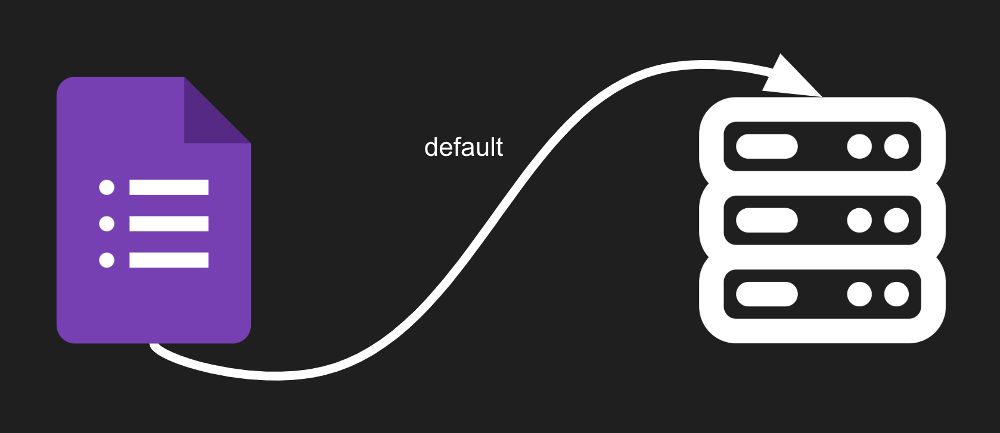
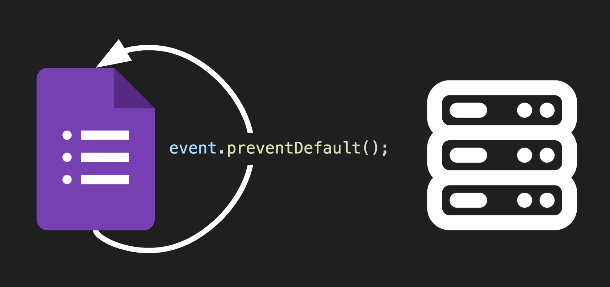
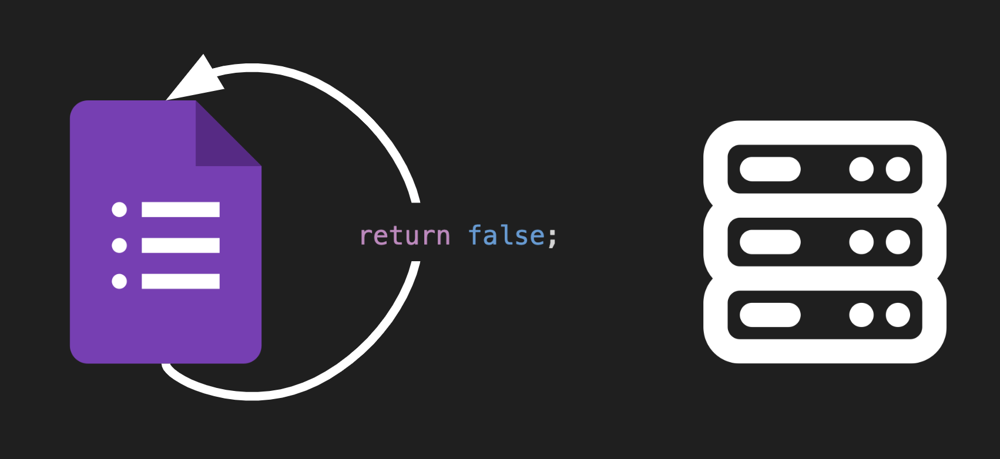
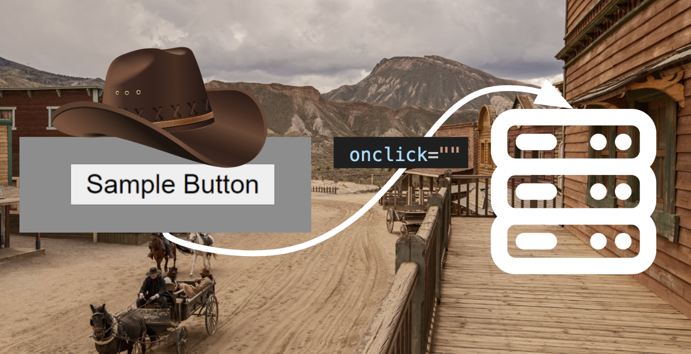
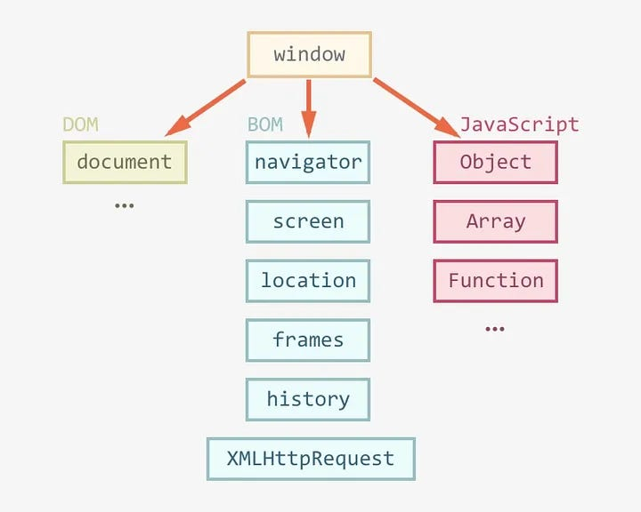

---
# General Information
category: "Web Programming I"
title: "DOMReady Form Validation"
created: "2024-09-20"
number: 13
coverSrc: "./assets/1.png"
---

# Mastering jQuery Motivation

By the end of today's class, you will have the essential tools to understand how [this guy's code](https://levels.io/hoodmaps/) works.

What make's "this guy" so special? He created a mini startup while streaming it on [Twitch](https://www.youtube.com/watch?v=FN144KdOIGM), starting from the very first line of code and transforming it into a fully functioning web app that has attracted over 300,000 users.

If you're curious, you can explore all his other projects on his [Twitter](https://x.com/levelsio).

# event.preventDefault()

The `event.preventDefault()` method in JavaScript is used to stop the default action associated with an event from occurring.

## Why Do I Need This for Form Submissions?

When you submit a form or click a button with `type="submit"`, the browser's default behavior is to reload the page and send the form data to the server. This "default" behavior stems from the traditional use of forms for server-side processing, whereas we often want to handle form submissions client-side with JavaScript.



## Why Do I Need This for Submit Events?

If your goal is to manage the form data with JavaScript to create custom error messages or perform validation, ou must prevent the default form submission behavior. This is why using `event.preventDefault()` in form submission handlers is necessary.



## What about onSubmit="" ?

The onSubmit event handler can be written in two common ways to prevent a form from submitting and reloading the page:

- Using `event.preventDefault()`
- Returning `false` from the handler

Returning `false` from an `onSubmit` event handler is an _older_ approach that implicitly prevents the default action of the event, just like `event.preventDefault()`.



## Why Do I Not Need This for Click Events?

When using an `onclick` event on a button, the browser does not trigger ANY default behavior like page reload or data submission. Instead, the code within your `onclick` event runs directly, without needing to prevent anything.

In other words, think of this as lawless territory.



## Summary

To summarize the key differences are:

- Form Submissions 👉 Trigger a page reload _by default_
- Button Clicks 👉 Does NOT trigger a reload

## Examples

To demonstrate the differences of these concepts. Let's first take a look at how `event.preventDefault()` is used:

```html
<form id="myForm" action="submit-form.php" target="_blank" method="post">
  <div>
    <input type="text" placeholder="Your name" />
    <span id="nope" class="warning">no form submission 4 you</span>
  </div>
  <input type="submit" value="Submit" />
</form>

<script>
  document
    .getElementById("myForm")
    .addEventListener("submit", function (event) {
      event.preventDefault(); /* notice this */
      $("#nope").show();
    });
</script>
```

If you were to use an inline event listener, it could look like this, though it's _not recommended_:

```html
<form
  id="myForm"
  action="submit-form.php"
  target="_blank"
  method="post"
  onsubmit="event.preventDefault(); $('#nope').show();"
>
  <div>
    <input type="text" placeholder="Your name" />
    <span id="nope" class="warning">no form submission 4 you</span>
  </div>
  <input type="submit" value="Submit" />
</form>
```

Using the old school approach, your code might appear as follows:

```html
<form
  id="myForm"
  action="submit-form.php"
  target="_blank"
  method="post"
  onsubmit="return handleSubmit()"
>
  <div>
    <input type="text" placeholder="Your name" />
    <span id="nope" class="warning">no form submission 4 you</span>
  </div>

  <input type="submit" value="Submit" />
</form>

<script>
  function handleSubmit() {
    $("#nope").show();
    return false;
  }
</script>
```

In contrast, for a simple button, no default behavior needs to be prevented since there is nothing to stop:

```html
<div>
  <button id="myButton">I'm a cool button</button>
  <span id="yup" class="ok">button click 4 u</span>
</div>

<script>
  document.getElementById("myButton").addEventListener("click", function () {
    $("#yup").show();
  });
</script>
```

However, mixing vanilla JavaScript with jQuery may lead to complexity. This is where the jQuery `.ready()` function comes into play.

# $().ready()

The jQuery `.ready()` function ensures that your code runs only after the DOM is fully loaded and ready to be used.

## How is this State Captured in our Webpage?

`.ready()` listens for the `DOMContentLoaded` event. This event signals that the HTML document has been completely loaded and parsed, making all DOM elements accessible.

## How does this work?

- Event Listening: When you use `$(document).ready()`, jQuery attaches an event listener to the document. This listener waits for the `DOMContentLoaded` event to fire.
- Code Execution: Once the DOM is ready, any code inside the `.ready()` function is executed. This ensures you can safely manipulate DOM elements without encountering issues related to unavailable elements.

## How does this relate to form validation?

When working with forms, it is often necessary to validate data or manipulate elements before submission. By using the DOM ready event handler, you ensure that all form elements are available for your manipulations.

Returning to our earlier example, here’s how it looks when adapted to work with `.ready()`:

```html
<form id="myForm" action="submit-form.php" target="_blank" method="post">
  <div>
    <input type="text" placeholder="Your name" />
    <span id="nope" class="warning">no form submission 4 you</span>
  </div>
  <input type="submit" value="Submit" />
</form>

<script>
  // First ensure the DOM is fully loaded.
  $(document).ready(function () {
    // Event listener for form submission
    $("#myForm").on("submit", function (event) {
      // Prevent the default form submission
      event.preventDefault();
      $("#nope").show();
    });
  });
</script>
```

In this example, we wait until the DOM is fully ready using `$(document).ready()` before adding a submit event listener to the form. The listener prevents the default submission if the username field is empty and displays an error message.

## Why can't I just use .on()?

Wrapping your jQuery code in `$(document).ready()` is important to ensure that the DOM is fully loaded before your JavaScript executes:

- If your script runs before the DOM is fully loaded, it won't find the elements (like `#myForm`) because they haven't been created yet. Without `$(document).ready()`, trying to attach event handlers or perform actions on those elements MAY fail.
- It’s a best practice in jQuery to use `$(document).ready()` to avoid potential problems, especially in larger applications where scripts might be placed in various locations. While things may seem simpler now, unpredictable behavior WILL lead to painful midnight debugging sessions in larger projects.

Think of this as like DOM consent. You can only access the DOM when it is ready, and the DOM communicates it's consent is through the `DOMContentLoaded` event.

## Can we use this same concept for Images?

No lol.

When we need to add an event listener to an image instead of a form, we may encounter different scenarios and for this I need to introduce another event.

# Exercise 1

Form a group of up to three people, but if you prefer to work independently, that's fine too.

## The Task

Head over to [Omnivox](https://johnabbott.omnivox.ca/Login/Account/Login?ReturnUrl=%2fintr%2f) and try to replicate the form submission behavior using jQuery. Your form should include:

- A _Student ID_ field
- A _Password_ field

If you want to include more in your work, go for it :)

## Solution

To start, copy and paste the styles directly from Omnivox:

```css
.warning {
  color: #f44336;
  font-size: 0.8rem;
  display: none;
}
```

Your HTML should close to the following:

```html
<form id="loginForm">
  <div>
    <label for="studentId">Student ID:</label>
    <input type="text" id="studentId" placeholder="Enter Student ID" />
    <span class="warning" id="idError"
      >The 'Student ID' field is required.</span
    >
  </div>
  <div>
    <label for="password">Password:</label>
    <input type="password" id="password" placeholder="Enter Password" />
    <span class="warning" id="passwordError"
      >The 'Password' field is required.</span
    >
  </div>
  <input type="submit" value="Login" />
</form>
```

And finally add the JavaScript code:

```js
// before running any code, the DOM needs to be ready
$(document).ready(function () {
  // listen for a submit event on the login form
  $("#loginForm").on("submit", function (event) {
    // prevent default behavior
    event.preventDefault();

    // Get the values from the form fields
    var studentId = $("#studentId").val();
    var password = $("#password").val();

    // error showing
    if (!studentId) {
      $("#idError").show();
    }

    if (!password) {
      $("#passwordError").show();
    }
  });
});
```

# The Load Event

The `load` event plays an important role in managing web pages and their resources.

## Why is Load important?

The `load` event triggers when the entire page, including all external resources like images and stylesheets, has finished loading. Trying to manipulate elements before they are fully loaded can result in errors, as those elements might not yet exist in the DOM.

## DOMContentLoaded vs Load

The `DOMContentLoaded` and `load` events are both important for handling when content is available in the browser, but they serve different purposes and are triggered at different times.

## Timing is Everything

The `DOMContentLoaded` event fires when the DOM is fully constructed, without waiting for stylesheets, images, or other external resources. This makes it perfect for scripts that need to interact with the DOM but don't depend on other resources. A common use case would be handling `<form>` submissions or modifying text content.

```js
// Using jQuery
$(document).ready(function () {
  console.log("DOM is ready");
});

// Using pure JS
document.addEventListener("DOMContentLoaded", function () {
  console.log("DOM is ready");
});
```

On the other hand, the `load` event fires when _everything_ on the page, including all resources like images and stylesheets, are completely loaded. This is essential for scripts that need to manipulate images, apply styles, or rely on all external resources being available.

```js
// Using jQuery
$(window).on("load", function () {
  console.log("EVERYTHING is loaded");
});

// Using pure JS
window.addEventListener("load", function () {
  console.log("Everything is fully loaded");
});
```

## Why Does Load Use Window?

The `window` object represents the entire browser `window`, including all content on the page, such as images, styles, and external resources. That's why the `load` event is tied to `window`, as it fires only after everything in that window is fully loaded.

The `document` object, on the other hand, refers solely to the HTML document. It doesn't need to wait for external resources, which is why the `DOMContentLoaded` event is tied to `document`. It fires as soon as the DOM is ready.



## When to use what

- `DOMContentLoaded` 👉 Fires when the DOM is ready and therefore uses the `document`
- `load` 👉 Fires when _everything_ is fully loaded and therefore uses the `window`

## Why care?

So, we have different events to remember, but what makes the `load` event remarkable? The `load` event is closely related to lazy loading, as both concepts aim to improve page performance and user experience by managing how resources are loaded. We will explore this in more detail next week. For now, let’s get familiar with the syntax through the following exercise:

# Exercise 2

Working independently, use the `load` event to manipulate elements after all resources are fully loaded using jQuery.

## The Task

- Create a single HTML file.
- Inside the file, set up a basic structure with a heading and an image with the following url `https://via.placeholder.com/150`
- Use the load event to change the heading and image once everything on the page has fully loaded.

## Solution

```html
<h1 id="pageHeading">Loading...</h1>


<script>
  // Use the load event to change the heading text
  $(window).on("load", function () {
    $("#pageHeading").text("Wow this has finally loaded!");
    $("#exampleImage").attr(
      "src",
      "https://upload.wikimedia.org/wikipedia/en/3/3d/Longcat_is_loooooooooong.jpg"
    );
  });
</script>
```

# Official Documentation

For those that are curious, you can read more about the concepts here:

- [jQuery .ready()](https://api.jquery.com/ready/)
- [DOMContentLoaded, load, beforeunload, unload](https://javascript.info/onload-ondomcontentloaded)
