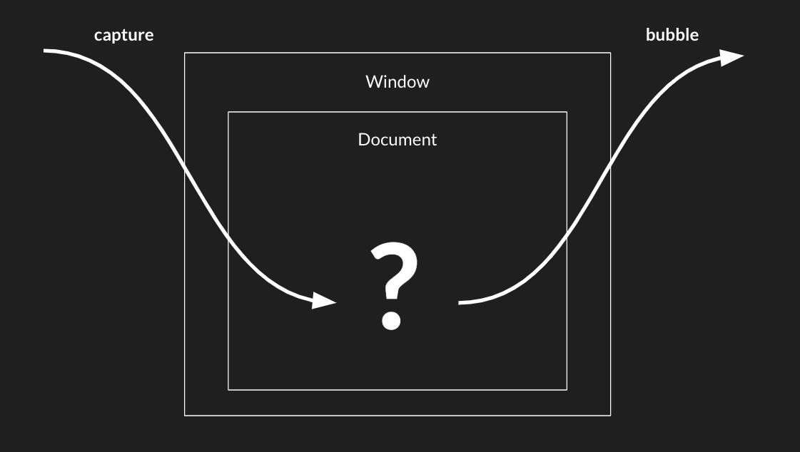

---
# General Information
category: "Web Programming I"
title: "Event Bubbling && Minification"
created: "2024-09-22"
number: 14
coverSrc: "./assets/4.png"
---

# Introduction

We've been exploring Event Listeners and various types of events for a little while now. Today, we are going to make these concepts clearer

The focus of today’s class will be on event propagation, bubbling, and capturing. What are all these spooky terms? It's best explained with an example.

# Event Bubbling Example

Let's say we got three `<div>` elements nested like this:

```js
<div class="one">
  <div class="two">
    <div class="three"></div>
  </div>
</div>
```

We want to make these `<div>` elements easier to interact with, so let's apply some styles:

```css
div {
  padding: 50px;
}
.one {
  background-color: lavender;
}
.two {
  background-color: mistyrose;
}
.three {
  background-color: coral;
}
```

Now, if we add this JavaScript to our `<script>` tag, what do you think will be logged to the console when we click on the innermost `<div>`?

```js
const divs = document.querySelectorAll("div");

function logClass() {
  console.log(this.classList.value);
}

divs.forEach(function (div) {
  div.addEventListener("click", logClass);
});
```

We should see this printed:

```text
three
two
one
```

Wait ok, what's happening here? We just clicked the `.three` div, but the console also logged `two` and `one`. Why?

If we check the Elements tab in Chrome DevTools, we’ll see that clicking the `three` div, we also clicked on `two`, which is inside `one`, which is in the `body`, then `html`, and all the way up to Chrome itself.


It’s like we keep zooming out layer by layer. This is the core idea of "bubbling."

## What is bubbling?

When you click an element, the event "bubbles" up through its parent elements. The browser not only identifies the element you clicked on but also triggers click events for every parent element up the DOM tree.


Think of this as A "butterfly effect" in the DOM.

# Example continued...

To further illustrate this concept, lets say we add an event listener of `click` to the body. What do you think will happen?

```js
document.body.addEventListener("click", logClass);
```

You’ll see this logged to the console:

```text
three
two
one
body
```

In this case, the event will propagate all the way up the document, triggering `click` events on each of the elements. Normally, you might not notice it because you’re not listening for those events, but with multiple nested event listeners, this behavior becomes clear.

## How does this work in JavaScript?

Modern browsers handle this process by first "capturing" events. When you click on an element, the browser starts from the top of the DOM tree, moving downward, temporarily capturing events without firing them yet.


The browser is trying to figure out exactly what you clicked. Once it determines the target, it triggers events from the bottom up.


## What triggers the event?

Your "click" action, however more precisely, the `target`.

In JavaScript, `event.target` refers to the element that triggered the event. When an event occurs (like a click), the browser creates an event object that contains various properties and methods to provide information about the event.

## How can we prevent this?

If you want to prevent this bubbling behavior, you can modify the `addEventListener` method as follows:

```js
divs.forEach(function (div) {
  // this is an "options" object
  div.addEventListener("click", logClass, {
    capture: true, // notice me
  });
});
```

With `capture: true`, the event listener will now log:

```text
one
two
three
```

This happens because `capture: true` ensures that the function is triggered during the capturing phase (as the event moves down the tree) rather than during the bubbling phase (as it moves back up).

Think of "capture" as zooming in on the element before focusing on it. In this case, we're focusing on the innermost `<div>` first.

By default, this "options" object has `capture: false`, meaning events are handled during the bubbling phase:

```js
divs.forEach(function (div) {
  div.addEventListener("click", logClass, {
    capture: false, // notice me AGAIN
  });
});
```

## How do we prevent bubbling?

Now that we understand how events bubble up, let's modify our function to stop this behavior:

```js
function logClass(event) {
  console.log(this.classList.value);
  event.stopPropagation(); // notice me
}
```

If we click the innermost `<div>`, only this will be printed:

```text
three
```

Why? Once the event runs this function, `stopPropagation()` prevents it from continuing up the DOM tree and triggering events on parent elements.

# DOMContentLoaded && Event Bubbling

## What is DOMContentLoaded?

The `DOMContentLoaded` event ensures that the entire DOM is fully constructed and ready to be interacted with.

## Why is this important for Event Bubbling?

For event bubbling to work, the DOM structure MUST be fully loaded. The `DOMContentLoaded` event guarantees that all elements are available and accessible. . If you try to attach event listeners before this event, they won't work because the elements you're trying to bind them to might not exist yet.



In other words, if the DOM hasn't loaded, there are no elements (no `event.target`) for your event listeners to attach to, which would stop "bubbling" from happening.

# How do we make our example to be safe?

To ensure that event listeners are attached at the right time, we need to wait until the `DOMContentLoaded` event fires.

Going back to our unsafe example...

## Unsafe example

```js
function logClass() {
  console.log(this.classList.value);
}

const divs = document.querySelectorAll("div");

divs.forEach(function (div) {
  div.addEventListener("click", logClass);
});
```

Here we are risking unpredictable behavior. Ff the DOM isn't loaded yet, no event listeners will be attached and In larger code bases this would be bad practice.

## Safe Example (Vanilla JS)

Using Vanilla JS, you can fix the code as follows:

```js
function logClass() {
  console.log(this.classList.value);
}

// only the part of the code that attempts to access the DOM needs to be protected
document.addEventListener("DOMContentLoaded", function () {
  const divs = document.querySelectorAll("div");

  divs.forEach(function (div) {
    div.addEventListener("click", logClass);
  });
});
```

Now, the code guarantees that event listeners are added only when the DOM is ready, ensuring reliable bubbling behavior in larger applications.

# Safe Example (jQuery)

For our jQuery enthusiasts, you can achieve the same result with fewer lines:

```js
// everything done in JS can be done in fewer lines with jQuery
$(document).ready(function () {
  $("div").on("click", function () {
    console.log($(this).attr("class"));
  });
});
```

# Why did the Event Bubbling work without DOMReady?

In small, simple projects, you might not notice DOM issues because of ...

## Simple DOM structure

In smaller codebases, the DOM structure is often simpler, meaning that the HTML may load quickly.

## Script position

If your script is placed at the bottom of the HTML, just before the closing `</body>` tag, it will run after the browser has loaded all elements above it. This can sometimes give the impression that event listeners are working even without waiting for `DOMContentLoaded`.

# Future Proofing Event Bubbling

As projects grow, the DOM structure becomes more complex and loading times can vary as well as the script position may change depending on a company's best practices. This is when waiting for `DOMContentLoaded` becomes important to ensure that all elements are available before interacting with them.

# Exercise 1

## The Task

Today, you will recreate the butterfly effect. Using the current example, place a butterfly image in the center div. When a user clicks on the butterfly, the outer divs will gradually change their color.

Hint: Use this css property to delay the changing of the background:

```js
div.style.transition = "background-color 4s";
```

## Solution (HTML)

```html
<div class="one">
  <div class="two">
    <div class="three">
      
    </div>
  </div>
</div>
```

## Solution (Vanilla JS)

Using vanilla JS with detailed comments, this would be the solution:

```js
const butterfly = document.getElementById("butterfly");
const divs = document.querySelectorAll("div");

// listen for DOMReady
document.addEventListener("DOMContentLoaded", function () {
  // Listen for click on butterfly
  butterfly.addEventListener("click", function () {
    console.log("wow you clicked me");
  });

  // now propagate that event to the parents
  divs.forEach(function (div) {
    div.addEventListener("click", function () {
      console.log(this.classList.value);
      div.style.transition = "background-color 4s";
      div.style.backgroundColor = `blue`;
    });
  });
});
```

This code demonstrates two key concepts in JavaScript: event handling and event bubbling.

- Event Handing: The code sets up an event listener on the butterfly element. When the butterfly image is clicked, it logs "wow you clicked me" to the console. This shows how to attach an event handler to a specific element.

- Event Bubbling: After setting up the click event for the butterfly, the code adds click event listeners to all div elements on the page. When any div is clicked, it changes its background color to blue with a lovely transition.
