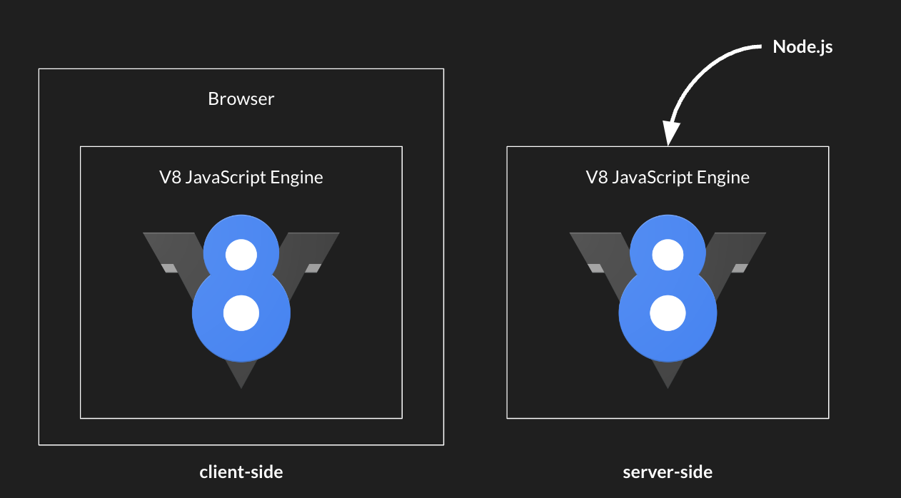
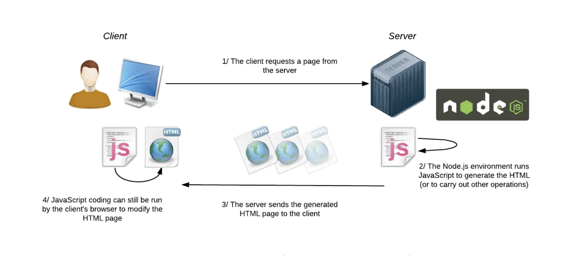

---
# General Information
category: "Web Programming I"
title: "Node.js"
created: "2024-09-27"
number: 16
---

# Course updates

Test 1 is scheduled for _October 11_, and _Assignment 2_ is due that same evening.

## Assignment 2

This assignment is designed to help you practice all the concepts we've covered in class up to this point. Completing it will ensure you are well-prepared for the programming part of the test.

IMO, the best way to learn how to code is to build something meaningful from scratch. Part of today's class will be dedicated to getting a head start on the project.

## Test 1

The test will encompass all the material from Assignments 1 and 2, as well as the theory covered in the quizzes leading up to the test.

# Introduction

Node.js is an open-source, cross-platform JavaScript runtime environment that enables the execution of JavaScript code outside a web browser.

I have used it almost every day during my three years as a professional developer.

## Why learn it?

Learning Node.js is one of the most valuable skills for any full-stack web developer. Its importance will not diminish anytime soon due to its strong role in the industry.

## What is it?

Node.js is not a programming language; rather, it is a runtime that allows you to write JavaScript on a server. When JavaScript first emerged in the 1990s, it was designed exclusively for the browser as a simple scripting language.

In 2009, Node.js was released, transforming the web development landscape by enabling programmers to use just one language, JavaScript, to build full-stack applications.

TLDR: It allows you to run JavaScript on the server side.

## How was it made?

While you don't need to know the technical details as a beginner, it's important to know that Node.js runs the V8 JavaScript engine outside the browser environment.



## How does it work?

When you visit a URL that points to your server running Node.js, the server receives the request. Using Node.js, we can handle this request, read files from the server's file system, generate an HTML file, and perform various operations before sending the response back to the client.



## What can Node.js do?

Instead of listing out a bunch of use cases, I will guide you through setting up a simple project using Node.js, so you can see its functionalities in action.

# Getting Started with Node.js

First, let's open Visual Studio Code and launch the terminal by pressing `Ctrl + backtick` on Windows 🪟 and `Cmd + backtick` on Mac 🍎

## Installation

Node.js is likely already installed on your system. To confirm this, type the following command:

```bash
node -v
```

This command will display your Node.js version in the console. If you encounter an error at this point, it indicates that Node.js is not installed.

## NVM

we will set up Node Version Manager (`nvm`) to manage different Node.js versions easily. Even if you already have Node.js installed, knowing how to use NVM is helpful, especially for switching between versions, which is common in the industry.

Follow the instructions for your system here:

- MacOS / Linux: [nvm-sh](https://github.com/nvm-sh/nvm)
- Windows: [nvm-windows](https://github.com/coreybutler/nvm-windows)

To verify your installation, open up a new terminal and run the following command:

```bash
nvm -v
```

Once installed, we can start having fun :^)

# REPL Mode

REPL (Read-Eval-Print Loop) mode allows you to experiment with JavaScript directly in the terminal. Type `node` into the terminal, and you should see the following pop up:

```text
Welcome to Node.js v20.10.0.
Type ".help" for more information.
>
```

Now, type the following command:

```js
console.log("Hello World");
```

Most of the time, however, we want to write JavaScript that exists in an actual file. To exit REPL mode, hit `Ctrl+C` twice.

# Our First Node App

Create an empty folder in VSCode called `node-app`. Inside this folder, create a file named `index.js`. This file serves as the default entry point for all our Node.js applications.

```md
node-app
├── index.js
```

Add the following to your `index.js` to make sure your project has been set up right:

```js
console.log("Hello World ✨");
```

To run your app, go back to the terminal, navigate to the root folder, and execute the following command:

```bash
node .
```

Congrats, you just created your first Node.js app :^)

# NPM

## What is it?

The package manager for node.js. It allows us to install packages inside our projects.

## What are packages

A package is a reusable collection of code, usually containing functions, modules, or libraries, that can be easily shared, installed, and integrated into a Node.js project.

Remember out library, jQuery? jQuery can be considered a package in the context of Node.js and npm :^)

## How do I install npm?

You don't need to, it comes with Node.js

## What can I install with npm?

Head over to [npmjs.com](https://www.npmjs.com/) and here you can browse everything you want to install.

## How do I install a package?

```bash
npm install package-name
```

When I run the above in a blank project with a package, you should see the following pop up:

```md
node-app
├── node-modules
│ ├── a bunch of stull lol
├── package-lock.json
├── package.json
```

what do all these things mean? Let's get into it.

# package.json

It contains metadata about the project and its dependencies, making it easier to manage and share the project with others.

## Real World Example

Let's say I put my project up on git, well now when i pass it to a friend or colleague, they know what exactly all my code depends on. If you are curious, you can see all my project dependencies for this website on my [github repo](https://github.com/elizabeth-poggie/elizabeth-poggie/blob/main/package.json)

Imagine you wanted to steal all my public code and create a website for yourself using my template. Do you want to individually install every single one of these packages manually?

Absolutely not.

When we steal code we want to do it as efficiently and lazy as possible.

## Installing ALL dependencies

Simply type the following in the terminal:

```bash
npm install
```

And this should install all the dependencies in one shot.

# Node Modules

When you install a package with `npm install <package-name>` (or just `npm install` if you have a `package.json`), npm retrieves the specified package from the npm registry and installs it locally within your project.

This installation process is what generates the `node_modules` directory.

# package-lock.json

`package-lock.json` is a file automatically generated by npm when you install packages in a Node.js project. This helps track exactly what is installed in your `node_modules` directory.

Since this is autogenerate, you thankfully will never really need to read this thing.

# Using a Package

At the top of your file, where you want to use the package you just brought in, add the following

```js
const packageName = require("package-name");
```

# Exercise 1

As an exercise, try setting up a project with node and installing `express` and `lodash`

## Solution

Your package.json should look something like this:

```json
{
  "dependencies": {
    "express": "^4.21.0",
    "lodash": "^4.17.21"
  }
}
```
