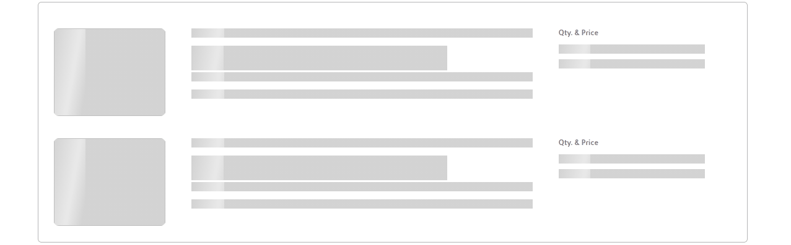

---
# General Information
category: "Web Programming I"
title: "Lazy Loading"
created: "2024-10-01"
number: 18
coverSrc: "./assets/skeleton.gif"
---

# Update

I'm adding some images to the assignment to guide you through the creation phase by the end of today. I'll also be extending the deadline to the 14th. While I originally designed this assignment as a way to help you prepare for the upcoming test, I understand if that's not how you study best.

SO, you'll still have a few extra days after the test to complete it if you need it :^)

# Quick Recap

- What is a module?
  - It's a file that exports some code
- How do you export/ import your modules? You have two options:
  - ES Modules (modern syntax)
  - CommonJS (default in Node.js)
- What's the syntax for ESModules?

```js
// Named Module Export Statement
export const name = "value";

// Named Module Import Statement
import { name } from "...";
```

- What's the syntax for CommonJS?

```js
// CommonJS Import Statement
const { name } = require("...");

// CommonJS Export Statement
module.exports = { name };
```

- Which syntax should I use? It depends.
  - If you are working with modern JavaScript frameworks or libraries, such as React or Vue, the recommended approach is to use `import` for modules.
  - If you are maintaining older projects or working on projects that need to be backwards compatible, then using `require` is the preferred method.
- Can I use the modern syntax right away? No lol.
  - You need to make modifications to your `package.json`

```json
{
  "type": "module" // add me to your package
}
```

- Do I need to know both methods? Yes lol.

# Common Module problems and how to fix them

## Cannot use import statement outside a module

If you encounter an error message like this:

```text
import { myModule } from "some/link/to/myModule";
^^^^^^

SyntaxError: Cannot use import statement outside a module
```

This indicates that you need to configure your `package.json` with the following line:

```json
{
  "type": "module" // add me to your package
}
```

## Cannot find module

If you see an error similar to this:

```text
Error [ERR_MODULE_NOT_FOUND]: Cannot find module 'node-app/some/link/to/myModule' imported from node-app/index.js
Did you mean to import ../utils/myModule.js?
```

Make sure that the file path in your import statement is correct. If your paths still do not work, ensure that your import statement ends with `.js`, like so:

```js
import { myModule } from "./utils/myModule.js"; // notice the extension
```

The extension is necessary for ESmodules in Node.js.

# Exercise 2

In this exercise, you will create some useful utilities.

First, set up the following folder structure:

```md
node-app
├── node_modules
├── utils
│ ├── textFormatters.js
├── index.js
├── package-lock.json
├── package.json
```

Next, make the necessary changes in your `package.json` to use ES modules and create the following functions in `textFormatters.js`:

- `formatDateShort`: Takes a `dateString` as input and formats the date in short form.
- `formatDateLong`: Takes a `dateString` as input and formats the date in long form.

_Hint: You can convert the `dateString` into a `Date` object with the following code snippet_

```js
// dateString: 2024-09-30
const date = new Date(dateString);
```

You can read the documentation [here](https://developer.mozilla.org/en-US/docs/Web/JavaScript/Reference/Global_Objects/Date/toLocaleDateString) to find out how to format the date correctly.

## Solution

Your `textFormatters.js` should be close to the following:

```js
export function formatDateShort(dateString) {
  const date = new Date(dateString);
  const options = { month: "short", day: "numeric" };
  return date.toLocaleDateString(undefined, options); // Formats to Month Day
}

export function formatDateLong(dateString) {
  const date = new Date(dateString);
  const options = { year: "numeric", month: "long", day: "numeric" };
  return date.toLocaleDateString(undefined, options); // Formats to 'Month Day, Year'
}
```

While your `index.js` should be close to this:

```js
import { formatDateShort, formatDateLong } from "./utils/textFormatters.js";

console.log(formatDateShort("2024-09-29"));
console.log(formatDateLong("2024-09-29"));
```

# Lazy Loading

## What is it?

Lazy loading is a design pattern or technique used to defer the loading of resources (like images, scripts, or data) until they are actually needed instead of loading everything upfront.

## Why does it matter?

```js
Performance++;
Cost--;
```

- Faster Page Load Times 👉 smaller web pages load faster and this leads to a better user experience.
- Reduced Bandwidth Usage 👉 lazy loading ensures that only the content users interact with or scroll to is downloaded. Cloud hosting services might charge based on number of bytes transferred on every request and now you are making less requests :^)

## Real World Example

You know when you go to access a [youtube](https://www.youtube.com/) and you sometimes get a bunch of grey boxes? This is because the content is being loaded lazily. The official name for these fun grey boxes is a _skeleton loader_ and it acts as a visual placeholder that mimics the layout of the content that is still being loaded lazily.



## Practical example

In modern HTML, you can use the `loading="lazy"` attribute for images:

```html

```

# Simulating Bad Wifi

We are going to force [Youtube](https://www.youtube.com/) to load lazily slower so you can appreciate the concept.

- Open up Chrome DevTools
- Go to the Network tab
- At the top of the Network tab, you’ll see a dropdown menu labeled `No throttling`.
- Click this dropdown, and you’ll see several predefined options to simulate different network speeds:
  - Fast 4G
  - Slow 4G
  - Offline
- For this example select `Slow 4G`
- Now refresh the page, what happens?

# Lazy Loading in Node.js

Let's build on our example from last class

## CommonJS Approach

When you import a module in Node.js using CommonJS, it gets loaded immediately at the time of execution

```js
const { caps } = require("./utils/customModule"); // Loaded immediately
```

## Lazy Loading - CommonJS

```js
let customModule; // Declare, but don't use

function useCaps(str) {
  if (!customModule) {
    customModule = require("./utils/customModule"); // Load only when needed
  }
  // use caps finally
  return customModule.caps(str);
}

// now call the function
console.log(useCaps("ahhhhhhh"));
```

## Lazy Loading - ES Modules

There is a way to do it, but you might find the syntax spooky at the moment. We will explore this in greater detail in week 8

# Exercise 2

Now it's your turn. Using CommonJS, take your Exercise 1 and load your custom modules lazily.

## Solution

Your `textFormatters.js` should be close to the following:

```js
function formatDateShort(dateString) {
  const date = new Date(dateString);
  const options = { month: "short", day: "numeric" };
  return date.toLocaleDateString(undefined, options); // Formats to Month Day
}

function formatDateLong(dateString) {
  const date = new Date(dateString);
  const options = { year: "numeric", month: "long", day: "numeric" };
  return date.toLocaleDateString(undefined, options);
}

module.exports = { formatDateShort, formatDateLong }; // notice me
```

While your `index.js` should be close to this:

```js
let textFormatters; // Declare, but don't use

function loadTextFormatters() {
  if (!textFormatters) {
    textFormatters = require("./utils/textFormatters"); // Lazy load the module
  }
  return textFormatters;
}

function useFormatDateShort(date) {
  const { formatDateShort } = loadTextFormatters();
  return formatDateShort(date);
}

function useFormatDateLong(date) {
  const { formatDateLong } = loadTextFormatters();
  return formatDateLong(date);
}

console.log(useFormatDateShort("2024-09-29"));
console.log(useFormatDateLong("2024-10-01"));
```

# Friday Quiz

Focus on Node.js and Event Bubbling for this friday.
