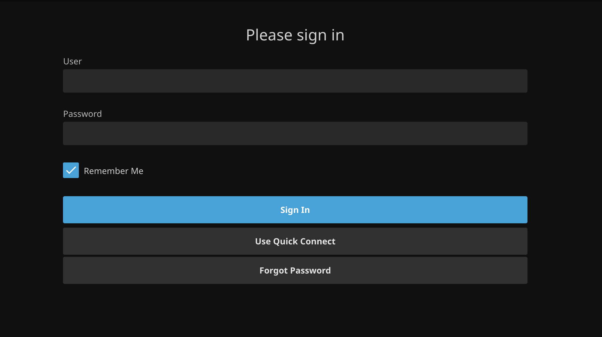
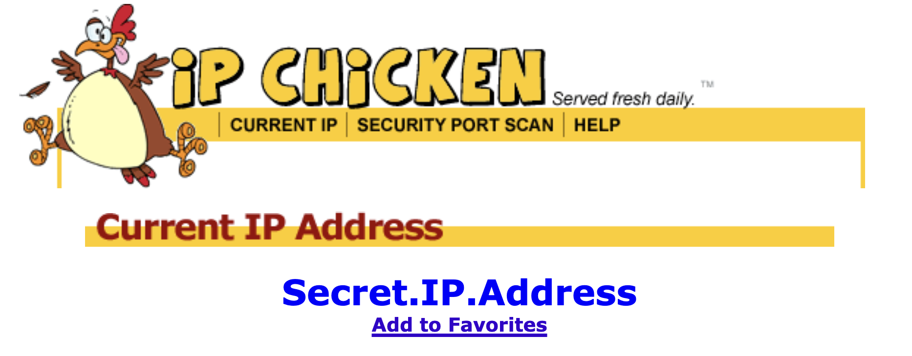

---
# General Information
category: "Web Programming I"
title: "Your first Photo Server"
created: "2024-10-03"
number: 19
coverSrc: "./assets/wendy.png"
---

# Creating your own webserver

Today, we are taking our Lazy Loading knowledge to the next level.

## Getting started

In your `index.js`, import the necessary modules to set up a basic server:

```md
myServer
├── index.js
```

## Importing the Modules

In your `index.js` import the required modules to create a basic server:

```js
const http = require("http");
const fs = require("fs");
```

In Node.js, `fs` and `http` are "core modules", which means they come pre-installed with Node.js and do not need to be included in your `package.json` as dependencies. What does this mean for you? You don't need to `npm install` these guys.

## Why these Modules?

- http 👉 This module provides functionality to create and manage HTTP servers
- fs 👉 This module offers functions for interacting with the file system

Fun fact: I actually use `fs` to fetch [this very note](https://github.com/elizabeth-poggie/elizabeth-poggie/blob/main/src/utils/helpers/noteFetchers.ts#L1) :^)

## Creating a Server

Shockingly, Creating a server using the `http` module is as follows:

```js
http.createServer(function (req, res) {
  // other stuff
});
```

This function is executed each time the server receives a request. The `req` parameter represents the incoming request (e.g. someone accessing your server), while `res` represents the response (e.g. what the server gives). Here are some examples of what you might handle:

- `req` options: "GET", "POST"
- `res` options: "200 OK", "404 Not Found"

## Reading Files

Now that we have set up the basic structure of our server, let’s read a file:

```js
fs.readFile("demo.html", "utf8", function (err, data) {
  // other stuff
});
```

- `err` is an error object.
- `data` is the content of the file.

## Sending a Response

If the file is read successfully, we want the server to respond with a status code of 200, indicating that everything went well. We can then write the data (the HTML content) to the response like this:

```js
res.writeHead(200, { "Content-Type": "text/html" });
res.write(data);
return res.end();
```

Food for thought: What happens when we change `200` to something else?

## Listening on a project

Finally, we set the server to `listen` on port `5555`. This means you can access the server by navigating to http://localhost:5555 in your browser.

```js
http
  .createServer(function (req, res) {
    // other stuff
  })
  .listen(5555);
```

## Running our server

To start your server, simply type the following command in your terminal:

```bash
node .
```

Now when we navigate to our server on port `5555`, we will be able to see the contents of `demo.html` being "served" up.

## All Together

```js
const http = require("http");
const fs = require("fs");

http
  .createServer(function (req, res) {
    fs.readFile("demo.html", function (err, data) {
      res.writeHead(200, { "Content-Type": "text/html" });
      res.write(data);
      return res.end();
    });
  })
  .listen(5555);
```

## Terminating your Server

Hit `Ctrl + C` to kill your server. You'll notice that `http://localhost:5555` will no longer be accessible.

If you're thinking about setting up your own server at home, consider repurposing an old computer that can run 24/7 and keep it in a closet. This setup allows you to host and serve your local content without interruptions, and you can access it remotely at any time.

## Servers IRL

Why is this so cool? You can create your own servers to store <del> illegally pirated</del> movies to share with friends.



Alternatively, every photography nerd I know uses these servers to create their own photo libraries instead of relying on cloud storage services like _Google Drive_ or Microsoft's _OneDrive_.


# Exercise 1

As an exercise, work in groups to set up a server that serves a webpage on port `4242` that serves up a static webpage.

## Solution

```js
// index.js
const http = require("http");
const fs = require("fs");

http
  .createServer(function (req, res) {
    fs.readFile("my-cool-server.html", function (err, data) {
      res.writeHead(200, { "Content-Type": "text/html" });
      res.write(data);
      return res.end();
    });
  })
  .listen(4242);
```

# Fancier Servers

Instead of using the default `http` server, let's use `http-server` instead. This is a simple, lightweight command-line tool that serves static files over HTTP without requiring extensive configuration.

## Why use http-server?

By using `http-server`, you can easily serve static content starting ONLY with an `index.html` file. This is particularly useful because it allows you to incorporate cool stuff like `jQuery` into your projects :^)

Additionally, you can share your local server with others on the same network by providing your [public IP address](https://www.ipchicken.com/), port number, and configuring your firewall to accept incoming requests on this port. HOWEVER, maybe don't make your local IP address accessible to the world cause that would be like posting your phone number on instagram.



Do you want to get harassed? Absolutely not. What people don't know cannot be exploited :^)

## Getting Started

To get started, install the dependency using `npm` if you only want to use it within your specific project:

```bash
npm install http-server
```

After installation, your folder structure should look like this:

```md
myServer
├── node_modules
├── index.html
├── package-lock.json
├── package.json
```

Alternatively, you can install the dependency _globally_ using the `-g` flag:

```bash
npm install -g http-server
```

## Troubleshooting

If you do not see a `package.json` file created automatically when locally installed, you will need to create it manually and include an empty JSON object:

```json
// package.json
{}
```

After that, rerun the `npm install <dependency>` command and you should see the following in your `package.json` now:

```json
{
  "dependencies": {
    "http-server": "^14.1.1" // could be another version tho
  }
}
```

## Using http-server

If locally installed, open up your `package.json` and add the following:

```json
// package.json
{
  "scripts": {
    "start": "http-server"
  }
  // other stuff
}
```

To run your server, open the terminal and execute:

```bash
npm run start
```

If everything is set up correctly, you should see output like this:

```bash
Available on:
  http://127.0.0.1:8080
  http://192.168.0.10:8080
Hit CTRL-C to stop the server
```

If you installed `http-server` globally, then all you need to do to start the server is:

```bash
http-server
```

# Static Sites && Content

Now that we have our static site up and running, lets add some high res content :^)

## Folder structure

Create a `public` directory. In here we are going to add high res images that are `public`ly accessible

```md
myServer
├── public
├── node_modules
├── index.html
├── package-lock.json
├── package.json
```

## Getting Content

Head over to [Unsplash.com](https://unsplash.com/). This website lets you get high quality stock images for free. It's a tool I have been using to create websites, presentations, and marketing materials for my entire professional life.

## Importing Content

Add a high-res image to your `public` directory and import it in your `index.html` file comme ca:

```html
<!-- index.html -->
<!DOCTYPE html>
<html lang="en">
  <head>
    <meta charset="UTF-8" />
    <meta name="viewport" content="width=device-width, initial-scale=1.0" />
    <title>Cool Cats</title>
  </head>
  <body>
    
  </body>
</html>
```

Keep in mind that larger images may take a moment to load. You can improve your page's performance by adding the attribute `loading="lazy"` to the image tag, which allows the browser to load the image only when it's about to enter the viewport.

## Exercise 2

In your groups from Exercise 1, set up a server using `http-server` with `index.html` as the entry point. Find 3 hi-res images from the internet and save them in your `public` folder.

Next, measure how long it takes to load your page when using `loading="lazy"` on the images. What happens when you remove this attribute? Test the loading time when you simulate a _Slow 4G_ connection using Chrome DevTools.

```md
| Wifi    | Page Load time - Regular (ms) | Page Load time - Lazy (ms) |
| ------- | ----------------------------- | -------------------------- |
| Online  |                               |                            |
| Slow 4G |                               |                            |
```

## Solution

Your folder structure should look like this:

```md
myServer
├── public
│ ├── image1
│ ├── image2
│ ├── image3
├── node_modules
├── index.html
├── package-lock.json
├── package.json
```

In your `index.html`, include the following code:

```html
<!-- index.html -->
<!DOCTYPE html>
<html lang="en">
  <head>
    <meta charset="UTF-8" />
    <meta name="viewport" content="width=device-width, initial-scale=1.0" />
    <title>Cool Cats</title>
  </head>
  <body>
    
    
    
  </body>
</html>
```

Then by navigating to the `Network` Tab, look for your `localhost` and take note of the load time in each scenario :^)
