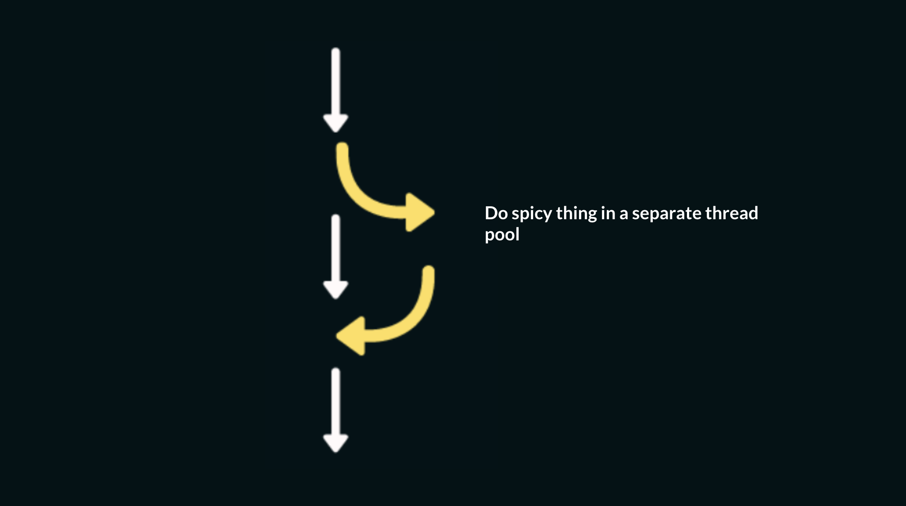
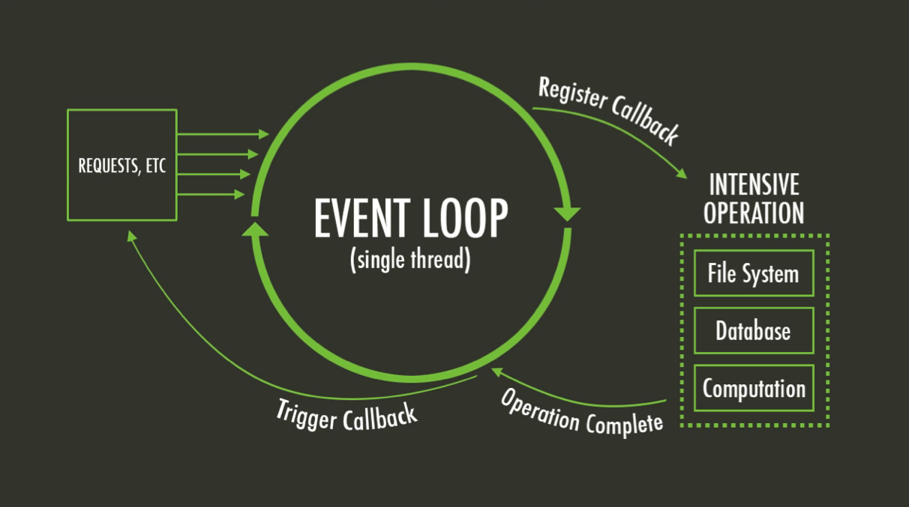
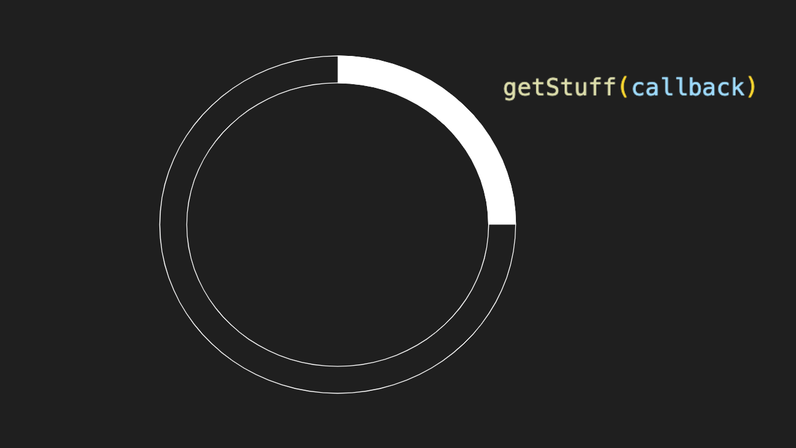
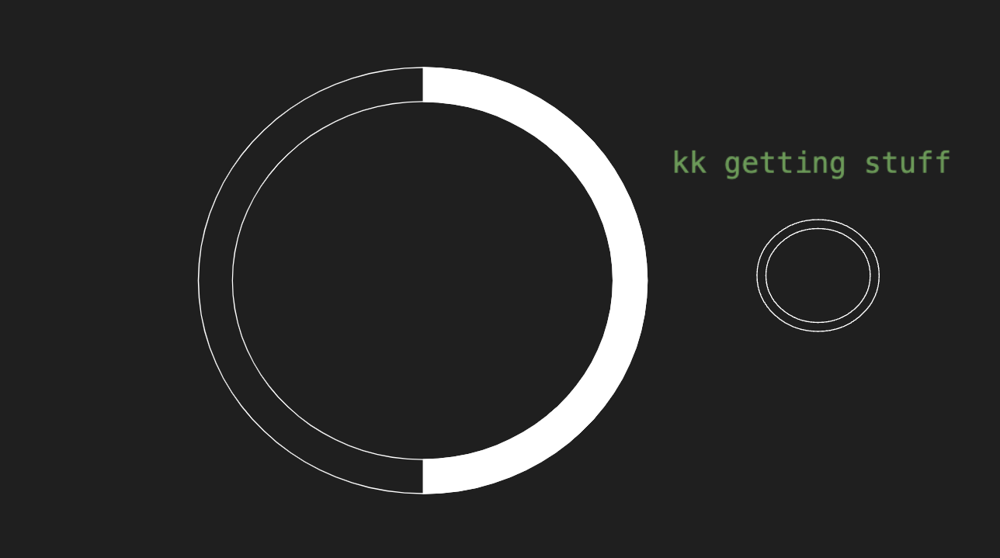
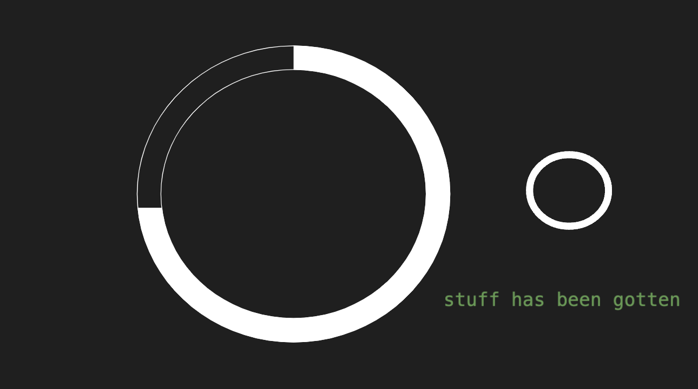
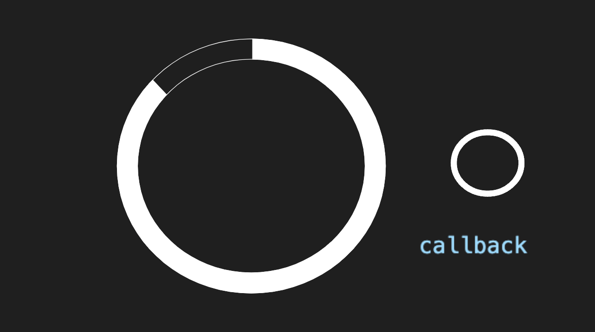
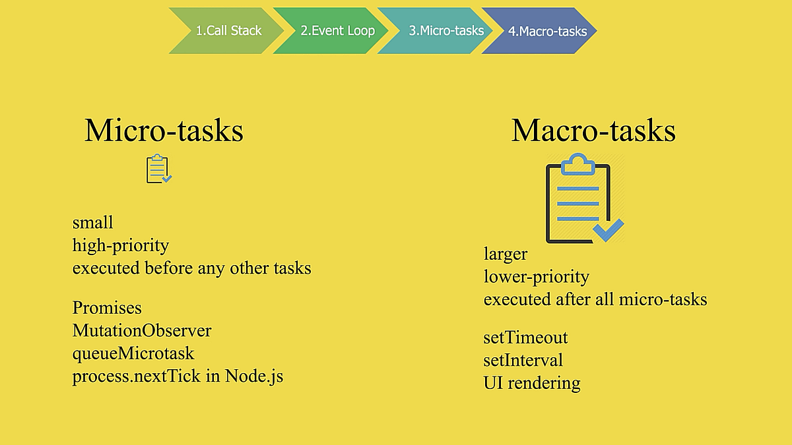

---
# General Information
category: "Web Programming I"
title: "The Event Loop"
created: "2024-10-20"
number: 24
coverSrc: "./assets/tasks.gif"
---

# Quick Recap

Last week, we took time to familiarize ourselves with the syntax associated with the Intersection Observer API. Today we are going to get more into the theory

# Asynchronous Programming

Async programming allows code to execute without blocking the main thread, enabling other operations to continue while waiting for other tasks to complete.

## How does this relate to Web Development?

This is especially important in web development to avoid freezing or slowing down a page while waiting for resources from a server.

## In the context of Web Development, what is the main thread?

In the context of web development, the main thread refers to the single thread where most of the execution of JavaScript, rendering of HTML/CSS, event handling, and general browser operations occur.

## What blocks the main thread?

JavaScript is traditionally single-threaded, meaning it runs one task at a time on the main thread. However many things we do in the web tend to be time consuming or "blocking" causing the browser to freeze or become unresponsive.

## What are common blocking operations?

Synchronous tasks (like loops or long computations) can block the main thread, preventing it from doing other work. Some examples include:

- Long loops and complex calculations
- Modifying the DOM and heavy DOM traversal (e.g. animations)
- Any synchronous file operations (e.g. reading large files using local file access)
- Parsing Large JSON

## How does Async Programming help?

To prevent blocking the main thread, web developers use asynchronous programming to offload tasks that can take time, such as `fetch`ing data from a server or performing complex calculations.



## Why is this so useful?

The browser can continue to render and respond to user interactions while the task completes in the background.

# Async Programming and the IntersectionObserver API

## Why does async programming relate to the IntersectionObserver API?

The Intersection Observer API allows you to "asynchronously" observe changes in the intersection of a `target` element within a viewport. The main benefits include and are not limited to:

- Non blocking behavior
- Efficient Resource Loading

## Non-blocking Behavior

The Intersection Observer API performs asynchronous observation of elements. You specify what to `observe()`

```js
observer.observe(someElement);
```

When the conditions are met (like an element entering the viewport), a "callback" is triggered.

```js
const observer = new IntersectionObserver(callback);
```

This happens asynchronously, without blocking the main thread which improves performance.

## Efficient Resource Loading

The Intersection Observer can delay the loading of certain resources, such as images, until they are actually needed:

```js
function callback(entries, observer) {
  entries.forEach((entry) => {
    if (entry.isIntersecting) {
      // Get the image
      let img = entry.target;
      // Set the URL to be a local file
      img.src = img.dataset.src;
      // Stop observing once image is loaded
      observer.unobserve(img);
    }
  });
}
```

However there is much more to this. Today we are going to explore stuff beyond lazy loading of images and see how async programming is implemented in the rest of JavaScript.

To understand anything async, we need to take a moment to appreciate the event loop.

# The Event loop

Both the browser and Node.js are always running a single threaded event loop to run your code.



On its first pass, the event loop runs all your "synchronous" code. However, it also manages "asynchronous" events by placing them in a queue to be handled later, without blocking the main thread. Let’s break this down with an example.

## Example Scenario

Imagine you need to run a function called `getStuff`, but first, you need to "fetch" some data from the server. (e.g. the stuff to be gotten)



Here, the event loop says: "ok sounds good function, I'll keep doing my thing while you go do your thing"



Your function, `getStuff()`, goes off to fetch the data. This happens in the background (often in a separate thread pool).



At some point in the future, when the server responds, `getStuff()` completes and notifies the event loop that it’s ready to be "called back"



It is at this point where things start to get a bit more complicated (I'm sorry). Depending on the type of task, the event loop handles the callback in different ways:

- If it's a _macro task_ (e.g., a big task), it will run in the next iteration of the event loop.
- If it's a _micro task_ (e.g., a small task), it will run before the next iteration of the event loop.

What does this all mean? This will make (hopefully) more sense in the code.

# The Code behind the Loop

Lets run the following code in "Run and Debug" mode and add breakpoints to each line:

```js
console.log("I am a synchronous task"); // 1

setTimeout(() => console.log("short timeout"), 0); // 2

Promise.resolve().then(() => console.log("what is a promise?")); // 3

console.log("I am also synchronous"); // 4
```

At first glance, you might expect these tasks to execute in the order they're written (1, 2, 3, 4), but that’s not actually the case. The order in which they run is actually 1, 4, 3, 2, as demonstrated below:

```text
I am a synchronous task
I am also synchronous
what is a promise?
short timeout
```

## What is happening?

To understand the order of execution, you need to know the difference between synchronous tasks, micro tasks, and macro tasks.



## Synchronous Tasks

These tasks block the event loop, meaning the next task cannot be executed until the current one is completed. For example:

```js
console.log("I am a synchronous task");
console.log("I am also synchronous");
```

## Asynchronous Macro Tasks

These tasks have their callbacks executed in the next iteration of the event loop, after all synchronous code and micro tasks are completed.

Examples of macro tasks:

- `setTimeout`
- `setInterval`
- `observe`
- event listeners

In our example:

```js
setTimeout(() => console.log("short timeout"), 0);
```

Even though the timeout is set to 0, this is a macro task and is deferred until the next loop cycle.

## Asynchronous Micro Tasks

These are smaller tasks that run before the next iteration of the event loop. They don’t block the execution, but take priority over macro tasks.

Some "Micro" Tasks include:

- `Promise` resolutions

In our example:

```js
Promise.resolve().then(() => console.log("what is a promise?"));
```

This micro task runs after the synchronous code but before any macro tasks.

## Conclusion

Let’s organize the statements into categories to understand the flow of execution:

```js
// Sync task
console.log("I am a synchronous task");
//  Macro task
setTimeout(() => console.log("short timeout"), 0);
// Micro task
Promise.resolve().then(() => console.log("what is a promise?"));
// Sync task
console.log("I am also synchronous");
```

Now the flow of execution is as follows:

```js
// Step 1 - Sync tasks are blocking
console.log("I am a synchronous task");
// Step TBD - Macro task does it's own thing on another thread
setTimeout(() => console.log("short timeout"), 0);
// Step TBD - Micro task does its own thing on another thread
Promise.resolve().then(() => console.log("what is a promise?"));
// Step 2 - Sync tasks are blocking and happen in order
console.log("I am also synchronous");
// Step 3 - the Micro task's callback finally gets executed
// Step 4 - the Marco task's callback finally gets executed
```

Which results in the following output:

```text
I am a synchronous task
I am also synchronous
what is a promise?
short timeout
```

Now that we know how event loops work, we can start looking at promises.

## Visual Aid

If you're still confused, here’s a lovely `gif` to help illustrate how tasks are processed:


# Promises && AJAX

## How can we make server requests?

For the purposes of this class, we will be learning how to use AJAX to make requests to a server.

## What is AJAX?

AJAX (Asynchronous JavaScript and XML) allows web applications to send and retrieve data from a server asynchronously.

## How does it work?


Why is this so neat? It allows parts of web pages to be asynchronously updated without reloading the whole page.

## How do you make a server request with AJAX?

The browser sends a request to the server via JavaScript, typically using the `XMLHttpRequest` object or using the more modern `fetch` API.

When you make a request to the server, you are being "promised" by that server that it will get the data you desire.

## How is that response consumed?

Once you get that response, it is consumed as a "Promise" with the contents of that message containing the data that was "requested".

## What happens to the Webpage?

Once JavaScript has finished processing the response, it updates specific parts of the webpage dynamically.

## Can you create Promises from scratch?

Yes, but you will likely make a lot of mistakes and we will slowly work our way up to such topics.

## Why even use AJAX?

- Server Side Form validation
- Lazy loading images from a server
- Search suggestions and autocomplete
- Notifications

## Docs

You can read more about it [here](https://www.w3schools.com/xml/ajax_intro.asp)

# XMLHttpRequest

All modern browsers have a built in XMLHttpRequest object:

```js
let xhttp = new XMLHttpRequest();
```

## GET requests

If I want to make a GET request to a server using this object, it would be as follows:

```js
xhttp.open("GET", "<url>", true); // true ~ asynchronous
xhttp.send(); // send request
```

## Example

Let's explore the following using Quokka.js

```js
let requestURL =
  "https://mdn.github.io/learning-area/javascript/oojs/json/superheroes.json";
let request = new XMLHttpRequest(); // Install using the command

request.open("GET", requestURL, true);
request.responseType = "text";
request.onload = function () {
  var superHeroes = request.response;
  console.log(superHeroes);
};
request.send();
```

You made need some extra configs to ensure it's working in your system, check the output for next steps :)

# Exercise 1

Head over to [W3 Schools](https://www.w3schools.com/xml/ajax_examples.asp) and complete the "Simple Examples". If the syntax is spooky, be sure to read over the "Examples Explained"

Next, try creating a `XMLHttpRequest()` object in a clean `.js` file. If you have trouble running Quokka.js I will walk around and help with the configs.

# Async Operations Summary

Today we discussed the following async operations:

- Callbacks 👉 Functions passed as arguments that are executed once a task is completed.
- `Promise`s 👉 Objects representing a future result of an async operation, which can be resolved or rejected.

We will later cover `async` and `await` which is just a more readable syntax for working with Promises
