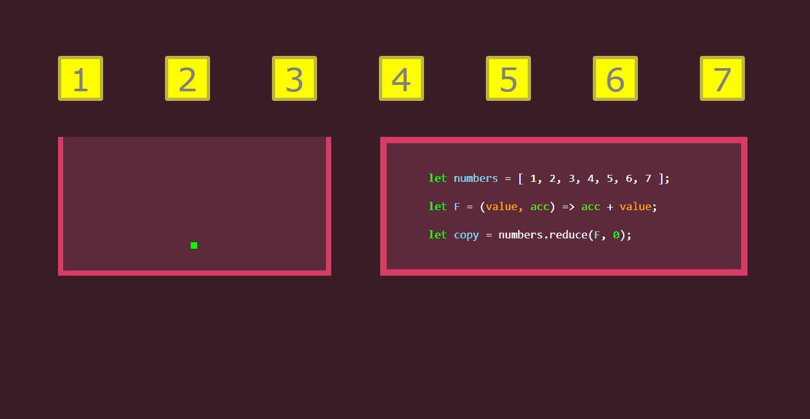
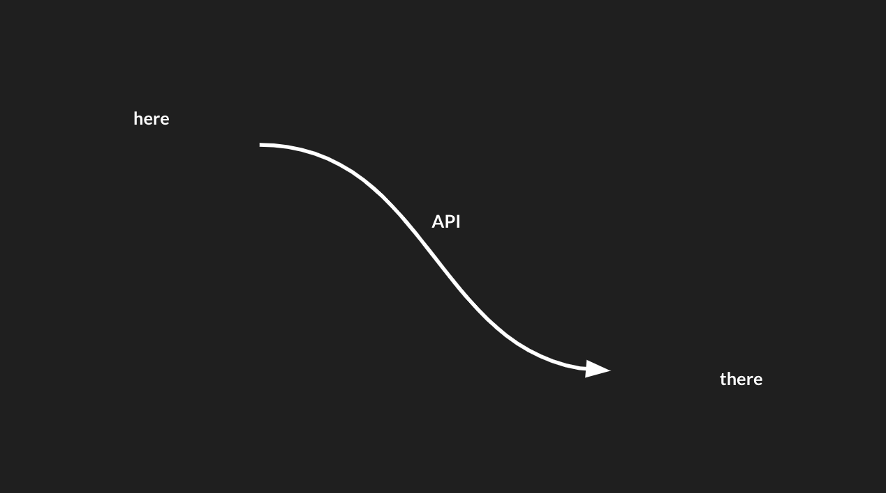

---
# General Information
category: "Web Programming I"
title: "Intro to APIs and AJAX"
created: "2024-10-25"
number: 26
---

# Quick Recap

## How can the UI stay responsive while handling server requests, lazy loading images, and more?

Thanks to the browser's event loop and asynchronous processing, background tasks run without blocking user interactions. This is also why JavaScript doesn’t always run in a predictable order :^)

## What is AJAX?

AJAX (Asynchronous JavaScript and XML) allows web pages to fetch server data and update content without reloading the page

## How do reducers work in JavaScript?

Refer to the previous lecture for a detailed explanation, however please see attached a really cool `gif` that covers the concept well:



# Intro to APIs

In today’s connected world, we rely on instant access to just about everything, whether it’s products, knowledge, or services. If I want any product, I can have it delivered to my doorstep within 24 hours thanks to Amazon. If I want to learn something about web development, chances are that some dude on Youtube has already posted a tutorial about it.

In a lot of ways, everything I want, I can get almost instantaneously.

## How does this happen?

How does data get from here to there? How does it move across systems, from me to you, or from one device to another?


The unseen force behind this seamless exchange is the Application Programming Interface, or API for short:



## What is an API?

An API is like a messenger: it takes a request, tells a system what you want, and returns a response.

## Conceptual Example

Think of an API like a waiter at a restaurant.


Picture yourself at a restaurant with a menu of choices and a kitchen where orders are prepared.


What’s missing? A link that communicates your order to the kitchen and brings the food back to your table. That’s where the waiter comes in.


The waiter is the messenger that takes your order (request), tells the kitchen (system) what to prepare, and then brings the completed dish (response) back to you.


## Real World Example

Let’s take a look at the [Pokemon API](https://pokeapi.co/)

Similar to ordering from a menu, you can choose what information you want from the API by referencing the available options in the [docs](https://pokeapi.co/docs/v2)

Any useful API in the modern age uses detailed documentation that explains each of the endpoints.

Now, open [Postman](https://www.postman.com/) (or [Download it here](https://www.postman.com/downloads/)). If you don't already have an account, create one. If you can't download the Desktop App on the schools computer, use the [web interface](https://web.postman.co/) instead :)

In this example, Postman works like the tablet waiters give you at those unlimited sushi restaurants. It’s a tool that lets you communicate what you want, just like telling the waiter—or in this case, the API—your order.

To get started, let’s create a "Pokemon Collection" and add a "New Request." Using Postman, we’ll send a simple "GET" request to call the API and retrieve my favorite Pokemon:

```text
https://pokeapi.co/api/v2/pokemon/ditto
```

What is this response type anyways? Why is the default response `JSON`?

# JSON Data

## What is it?

JSON (JavaScript Object Notation) is a lightweight format for representing structured data.

## Why is the default response JSON?

APIs return JSON data because it works really well with JavaScript, making it ideal for web applications.

## Syntax

It’s organized using key-value pairs and arrays much like the JavaScript object. However, JSON is language-independent despite looking REALLY similar to JavaScript object syntax:

```JSON
{
    "abilities": [
        {
            "ability": {
                "name": "limber",
                "url": "https://pokeapi.co/api/v2/ability/7/"
            },
            "is_hidden": false,
            "slot": 1
        },
        {
            "ability": {
                "name": "imposter",
                "url": "https://pokeapi.co/api/v2/ability/150/"
            },
            "is_hidden": true,
            "slot": 3
        }
    ]
}
```

Conveniently, if I store this JSON data in a JavaScript variable called `ditto`, I can access its properties like this:

```js
ditto.abilities.forEach((ability) => console.log(ability));
```

# Exercise 1

Now it's your turn. Setup postman, and use the Pokemon API to fetch information on your favorite Pokemon :^)

# Intro to AJAX

Now lets ping shit with JavaScript

## AJAX requests

## Using XMLHttpRequest

## Using fetch

## HTTP Methods:

# Docs

## API Documentation Overview:

## Api Keys

## Base URL and Query Parameters
