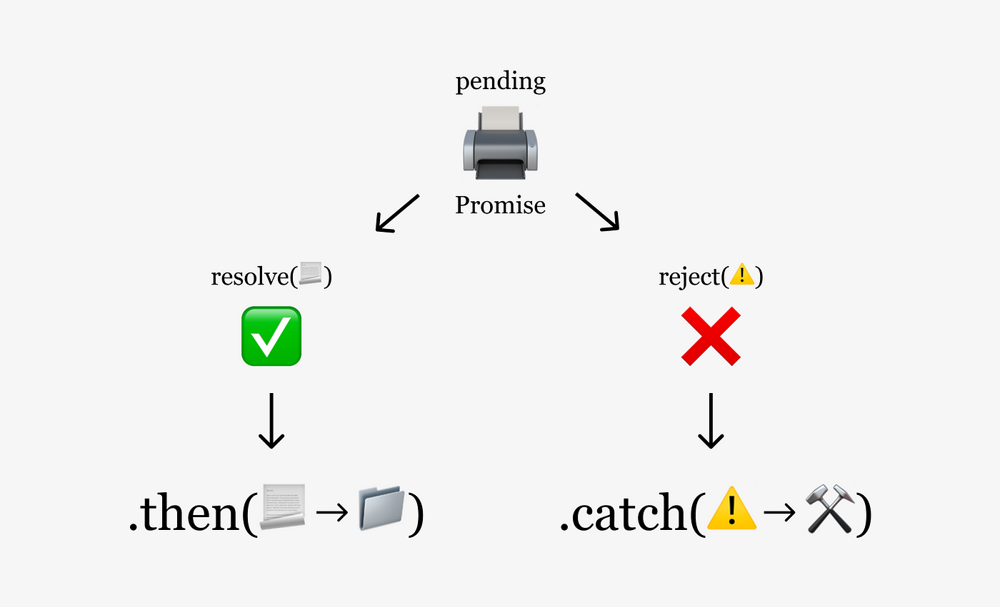

---
# General Information
category: "Web Programming I"
title: "Promises"
created: "2024-10-29"
number: 28
coverSrc: "./assets/emojis.png"
---

# Intro to Promises

In JavaScript, promises are a way to handle asynchronous operations more effectively.

## What is a Promise in human words?

In simple terms, it is a "promise" that you will get a result (eventually)

## Why is this cool?

Promises let you decide what should happen when the result arrives before the result is even available. So, instead of pausing everything while waiting for an operation to finish, your code can keep running other tasks. This approach allows for more efficient, non-blocking code.

## Why Promises?

If we already have event listener callbacks, why promises tho?

The key advantage is that promises allow for chaining operations in a more readable way. For example:

- When operation A finishes, its result is automatically passed to operation B
- When B finishes, its result goes to C

This lets you avoid “callback hell,” where multiple callbacks get deeply nested and stinky.

## Callback Hell

Consider this example with nested callbacks:

```js
// callback hell
call1(function (result, error) {
  if (error) {
    //handle error
  }
  call2(result, function (result2, error2) {
    if (error2) {
      //handle error
    }
    call3(result2, function (result3, error2) {
      if (error3) {
        //handle error
      }
      // do something with result3
    });
  });
});
```

The above structure is hard on our retinas. Alternatively, this is what the same logic would look like with promises:

```js
// Promises
call1()
  .then(function (result) {
    return call2();
  })
  .then(function (result2) {
    return call3();
  })
  .then(function (result3) {
    // do something with result3
  });
```

## Benefits of Chaining with Promises

- Easily handle errors across multiple chained operations
- You can actually run multiple asynchronous tasks in parallel, and wait until they’re all done (using `Promise.all`).

# Creating a Promise

```js
let myPromise = new Promise(function (resolve, reject) {
  // Asynchronous operation
});
```

What's happening here?

- `resolve` 👉 A function to call when the operation is successful. It can pass along a value
- `reject` 👉 A function to call if the operation fails. It can pass along an error

## When do Promises run?

A promise starts running _immediately_ upon creation, and it’s common to return a promise from a function like this:

```js
function myFunction() {
  return new Promise(function (resolve, reject) {
    // Promise content the async code I want to run
    resolve(myResult);
  });
}
```

Now, you can call `myFunction`:

```js
myFunction();
```

## Chaining Syntax

Promises allow you to handle results using `.then()` and `.catch()`:

```js
myFunction()
  .then(function (result) {
    // Do something with the result
  })
  .catch(function (error) {
    // Handle the error
  });
```

What's happening here?

- `then` 👉 handles the successful result
- `catch` 👉 handles any error.

# Exercise 1 - Getting used to the syntax

Write a function that takes a single parameter (a number) and returns a promise:

```js
new Promise(function (resolve, reject) {
  /* code here */
});
```

Here's what the promise should do:

- If the number is even, the promise should resolve with the message “yes.”
- If the number is odd, the promise should reject without any message.

When using this function, add a `.then` block to log the result to the console, and a `.catch` block to log “the number is odd” if the promise is rejected.

Finally, test your function by calling it with a few different numbers to see how it handles each case.

## Solution

```js
function checkEvenOdd(number) {
  return new Promise(function (resolve, reject) {
    if (number % 2 === 0) {
      resolve("yes");
    } else {
      reject();
    }
  });
}

// Test with even
checkEvenOdd(4)
  .then(function (result) {
    console.log(result);
  })
  .catch(function () {
    console.log("The number is odd");
  });

// Test with odd
checkEvenOdd(3)
  .then(function (result) {
    console.log(result);
  })
  .catch(function () {
    console.log("The number is odd");
  });
```

# Overall, how do Promises work?

A promise is created using the Promise constructor and can be in one of three states:

- _Pending_ 👉 The initial state. The promise is still in progress and hasn't yet completed.
- _Fulfilled_ 👉 The operation completed successfully, and the promise has a result.
- _Rejected_ 👉 The operation failed, and the promise has an error.


