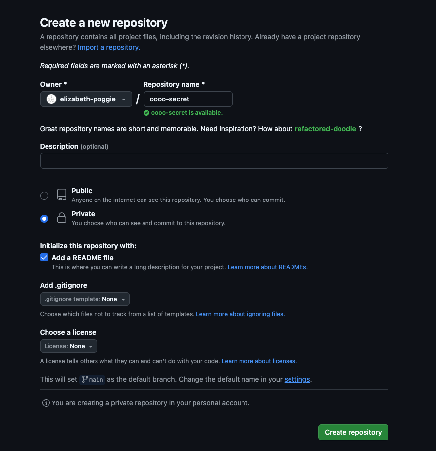
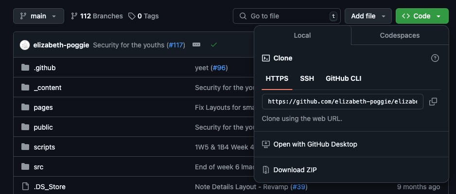
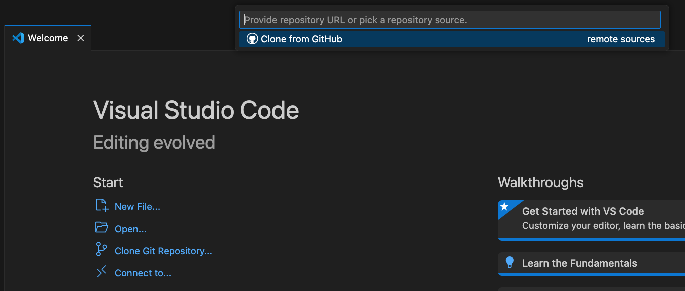

---
# General Information
category: "Web Programming I"
title: "VSCode && Github"
created: "2024-11-29"
number: 37
---

# Avoiding Git Commands

Don't like running `git` commands? VSCode has your back :^)

# Getting started

Head over to github and [create a new private repo](https://github.com/new) for your project. Ensure that you are adding a `README.md` at the start.



Now click the fun green `<> Code` button on your new repo and copy the link:



Now open up a new VSCode window and select the option `Clone Git Repository` from the start screen and paste your link in where prompted:



Select the destination for the repo. On my side, I like to store all my repos in the same root folder comme ca:

```text
lab4
├── Desktop
├── Documents
│ ├── repos
│ │ ├── elizabeth-poggie
│ │ ├── ... other repos ...
```

Notice how in the bottom left corner, you are in the `main` branch. However merging code to main is bad practice and bad news, so lets work some magic 🧙‍♀️

# Branches

Click the bottom left corner that contains `main`, this should open up a display that allows you to create a new branch or change your branch. You should see something like this:

```text
-------------------------
+ create new branch
+ create new branch from
checkout detached
-------------------------
...

main
```

## Creating Branches

- Select the option `+ create new branch`
- create a new branch name
- ...and voila, now the bottom left corner contains your new branch name letting you know that you are in a new branch :)

## Publishing branches

Although your "Local Repository" knows that you have a new branch in the repo, it's time to let the "Remote Branch" know.

- Navigate to the "Source Control" option on the left hand side of your VSCode
- Click the option "Publish Branch" and boom just like that you are in business

# Committing && Pushing

Whenever you are creating files or changing files, it's good to periodically save your work so you don't lose any progress. Once you are ready to commit the changes to your "Remote Repository", follow these simple steps:

- Navigate to the "Source Control" option on the left hand side of your VSCode.
- Click the file you've changed, this will open up a view to see how the code compares from before and after. Usually you need entire tools to get this behavior, however it's built in with VSCode.
  - Notice you can still edit your code in this view as well
- Press the `+` icon on the files you want to "Stage". Alternatively, you can select all of them from the top to "Stage All Changes"
- Enter a commit message to describe what those changes mean
- Now click the "Commit" button to get them ready to push.
- Once clicked, that same button should change to say "Sync Changes #"
- ... and just like that you committed and pushed code exclusively with clicking buttons

# Exercise ❤️

As an exercise:

- create a branch with your student number
- under `src` create the file `<your student number>.html` and add whatever content you desire
- commit and push those changes

# Merging changes

Let's say that the `main` branch changed since the last time you `pull`ed your changes. To update your branch:

- Navigate to the "Source Control" option on the left hand side of your VSCode.
- Select the `...` option
- Navigate to `Branch` and select `Merge`
- It will prompt you to select which branch to merge from, in our case select `main`
- Now your "Local Repository" has reflected those changes, to have the "Remote Repository" reflect those changes, click the "Sync Changes #" button

# Resolving Merge Conflicts

Let's say the main branch edited a particular code snippet that you also edited in your branch and you want to consolidate all the changes together. This is what is known as a "Merge Conflict". There are conflicting changes made to the same part of the code and `git` isn't sure which one is the change is needs to keep.

Despite being very frustrating at times, conflict is inevitable whenever there is collaboration. VSCode allows you to handle those conflicts with ease and in a timely manner.

## Merging

- Navigate to the "Source Control" option on the left hand side of your VSCode.
- Select the `...` option
- Navigate to `Branch` and select `Merge` and choose to merge with the main

## Resolving Conflicts

When there are conflicting changes, a "Merge Changes" panel will pop up showing you the conflicting lines of code. Once visible you can go line by line and either:

- Accept current changes (What you did in your branch)
- Accept incoming changes (What is being merged from main)
- Accept both changes

Once resolved you can click the `+` button to stage the changes, leave the default commit message, and then "Sync" those changes with the "Remote Repository" :^)

# Pulling changes

Next to the branch name in the bottom left corner there is a cute circular arrow button ♺

Clicking that button is all you need to do to pull the latest changes.

# Exercise ❤️

As an exercise:

- Try to edit the `README.md` file in your own branch.
- Commit and push those changes
- On my side, i will modify the `README.md` to be different
- Now try to resolve the merge conflicts with main

# GitLens

Want to see all the history of a repo at a glance? Add the [GitLens — Git supercharged](https://marketplace.visualstudio.com/items?itemName=eamodio.gitlens) extension to your VSCode.

## Line annotations

You now get historical context about line changes through annotation at the end of the current line and on the status bar :^)

## Git blame

Hover over a line annotation and you can see who, what, where, and when that line of code was created. Now when things go wrong its easier than ever to blame others for their mistakes ✨

## GitLens Inspect

On the Left side of your VSCode, select the `GitLens Inspect` option. Here you get rich details and insights to what you're actively working on now :)

## GitLens

On the Left side of your VSCode, select the `GitLens` option. Here there are even more features (that i haven't really explored tbh)
