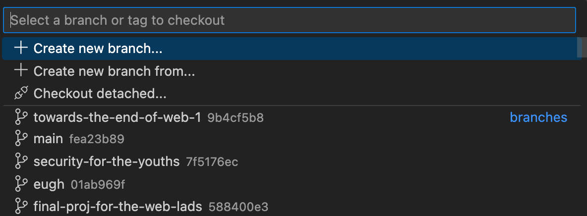
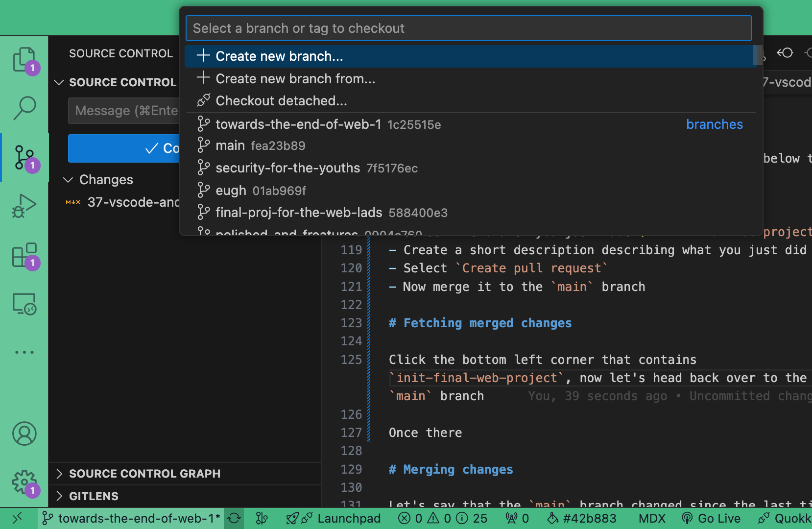

---
# General Information
category: "Web Programming I"
title: "VSCode && Github"
created: "2024-11-29"
number: 37
---

# Avoiding Git Commands

Don't like running `git` commands? VSCode has your back :^)

# Getting started

Head over to github and [create a new private repo](https://github.com/new) for your project. Ensure that you are adding a `README.md` at the start.


Now click the fun green `<> Code` button on your new repo and copy the link:


Now open up a new VSCode window and select the option `Clone Git Repository` from the start screen and paste your link in where prompted:


Select the destination for the repo. On my side, I like to store all my repos in the same root folder comme ca:

```text
├── Desktop
├── Documents
│ ├── repos
│ │ ├── elizabeth-poggie
│ │ ├── ... other repos ...
```

Notice how in the bottom left corner, you are in the `main` branch. However merging code to main is bad practice and bad news, so lets work some magic 🧙‍♀️

# Branches

Click the bottom left corner that contains `main`, this should open up a display that allows you to create a new branch or change your branch. You should see something like this:



## Creating Branches

- Select the option `+ create new branch`
- create a new branch name
- ...and voila, now the bottom left corner contains your new branch name letting you know that you are in a new branch :)

## Publishing branches

Although your "Local Repository" knows that you have a new branch in the repo, it's time to let the "Remote Branch" know.

- Navigate to the "Source Control" option on the left hand side of your VSCode
- Click the option "Publish Branch" and boom just like that you are in business

# Committing && Pushing

Whenever you are creating files or changing files, it's good to periodically save your work so you don't lose any progress. Once you are ready to commit the changes to your "Remote Repository", follow these simple steps:

- Navigate to the "Source Control" option on the left hand side of your VSCode.
- Click the file you've changed, this will open up a view to see how the code compares from before and after. Usually you need entire tools to get this behavior, however it's built in with VSCode.
  - Notice you can still edit your code in this view as well
- Press the `+` icon on the files you want to "Stage". Alternatively, you can select all of them from the top to "Stage All Changes"
- Enter a commit message to describe what those changes mean
- Now click the "Commit" button to get them ready to push.
- Once clicked, that same button should change to say "Sync Changes #"
- ... and just like that you committed and pushed code exclusively with clicking buttons

# Exercise 1

As an exercise:

- Create a branch called `init-final-web-project`
- Create the different sections on your `README.md`:
  - Project Name
  - Designs
  - APIs
  - Resources
- Organize your project files as shown below
- Commit and push all your changes

```md
name-of-your-game
├── index.html
├── pages
│ ├── character-selection.html
│ ├── gameplay.html
├── scripts
│ ├── ...
├── public
│ ├── sprite.jpeg
│ ├── ...
├── styles
│ ├── ...
├── classes
│ ├── player.js
│ ├── character.js
├── package.json
```

# Creating Pull Requests

Once you have those changes down, follow the steps below to create a Pull Request (PR):

- Select `New pull request`
- Select the branch you just made (`init-final-web-project`)
- Create a short description describing what you just did
- Select `Create pull request`
- Now merge it to the `main` branch

# Fetching merged changes

Click the bottom left corner that contains your new branch (`init-final-web-project`), now let's head back over to the `main` branch:



Once there select the ♺ icon to fetch your merged changes.

# Exercise 2

As an exercise, take time to replicate all those steps

# GitLens

Want to see all the history of a repo at a glance? Add the [GitLens — Git supercharged](https://marketplace.visualstudio.com/items?itemName=eamodio.gitlens) extension to your VSCode.

## Line annotations

You now get historical context about line changes through annotation at the end of the current line and on the status bar :^)

## Git blame

Hover over a line annotation and you can see who, what, where, and when that line of code was created. Now when things go wrong its easier than ever to blame others for their mistakes ✨

## GitLens Inspect

On the Left side of your VSCode, select the `GitLens Inspect` option. Here you get rich details and insights to what you're actively working on now :)

## GitLens

On the Left side of your VSCode, select the `GitLens` option. Here there are even more features (that i haven't really explored tbh)
