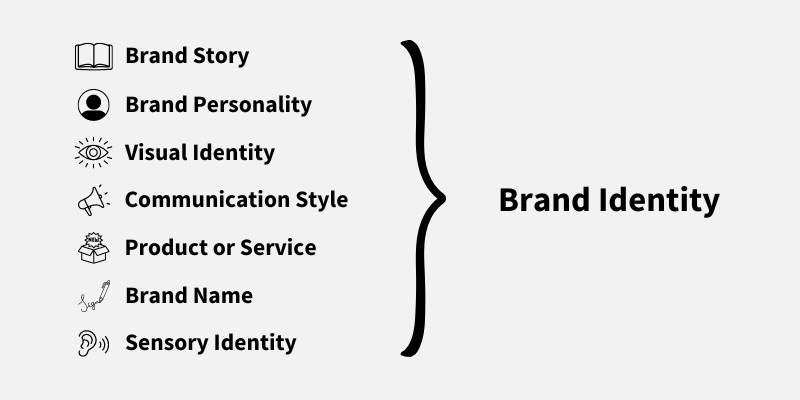

---
# General Information
category: "Web Programming I"
title: "Final Project Polishes - Custom Fonts && Health"
created: "2024-12-03"
number: 38
coverSrc: "./assets/branding.jpg"
---

# Fonts

Establishing a strong brand identity is the foundation of a successful marketing strategy—and it’s also the first step toward monetizing your project :^)



Every strong brand is built on a sleek and consistent visual style, and fonts play a big role in creating that impression. (which is why I know some very smart people that argue about font choices)

## Selecting a Font

You have several _free_ options:

- [Google Fonts](https://fonts.google.com/) 👉 Free and easy to implement
- [Fontshare](https://www.fontshare.com/) 👉 If you like a modern vibe
- [DaFont](https://www.dafont.com/) 👉 Free, however might be a bit 90s

## Download the font

When you download fonts, you’ll come across a variety of file formats. Here’s what you need to know:

- `.woff` / `.woff2` 👉 The modern choice
- `.ttf` / `.otf` 👉 Traditional and less optimized for the web
- `.eot`👉 If you are using this format you have failed as a developer since this is only really used for Internet Explorer
- `.svg` 👉 What are you doing? This was maybe rarely used on like the first version of a blackberry

After downloading, place the font files in a dedicated folder (e.g., `./fonts/`) to keep your project organized.

## Using fonts with CSS

To integrate your custom font, add the following to your `./styles/styles.css` file:

```css
/* Add your custom font to your CSS using @font-face */
@font-face {
  font-family: "My Cool Font";
  src: url("../fonts/MyCoolFont.woff2");
}

/* Use the custom font in your styles */
body {
  font-family: "My Cool Font", sans-serif;
}
```

Then, don't forget to link your CSS file to your HTML document like this:

```html
<link rel="stylesheet" href="./styles/styles.css" />
```

Have fun and let your creativity THRIVE 💅✨

# Health Bar

A "Health Bar" has a lot of potential! Whether you are tracking points in a loyalty program, visualizing your package’s delivery progress, or building a web game, this concept adds a fun interactive visual touch to any web project :^)

## HTML Structure

Let’s start by creating the basic structure for our health bar:

```html
<div id="health-bar-container">
  <div id="health-bar"></div>
</div>
```

## CSS for Styling

Now we’ll give the health bar some personality:

```css
#health-bar-container {
  width: 300px;
  height: 30px;
  border: 2px solid #2a2a2a;
  border-radius: 20px;
  overflow: hidden;
  position: relative;
}

#health-bar {
  height: 100%;
  /* Default full health */
  width: 100%;
  /* Default full health */
  background-color: #4caf50;
  /* Smooth transition when health changes */
  transition: width 0.3s ease;
}
```

## JavaScript Functionality

Now let's add some magic 🤹💫

We’ll create buttons for testing the functionality, but these can be replaced or enhanced depending on your use case:

```html
<button onclick="decreaseHealth(10)">Take Damage</button>
<button onclick="increaseHealth(10)">Heal</button>
```

Here’s the JavaScript to make the health bar interactive:

```js
// Init health value
let health = 100;

// Reusable function to update the health bar
function updateHealthBar() {
  const healthBar = document.getElementById("health-bar");
  // update the width dynamically
  healthBar.style.width = `${health}%`;

  // Change color dynamically
  if (health > 70) {
    // Green means GOOD
    healthBar.style.backgroundColor = "#4caf50";
  } else if (health > 30) {
    // Orange means things are SPOOKY
    healthBar.style.backgroundColor = "#ff9800";
  } else {
    // Red means your death is immanent
    healthBar.style.backgroundColor = "#f44336";
  }
}

// Call this function to decrease health
function decreaseHealth(amount) {
  // Pro Tip 👉 Prevent health from going below 0
  health = Math.max(0, health - amount);
  updateHealthBar();
}

// Call this function to increase health
function increaseHealth(amount) {
  // Pro Tip 👉 Prevent health from going above 100
  health = Math.min(100, health + amount);
  updateHealthBar();
}

// Pro Tip 👉 no need for a DOM ready check when using defer
updateHealthBar();
```

## Tips

- For prod, consider replacing inline event handlers with event listeners to improve scalability.
- This code is fully customizable. Feel free to add some animations :)
