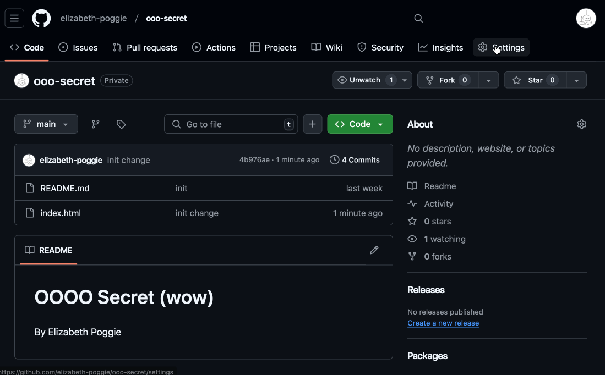
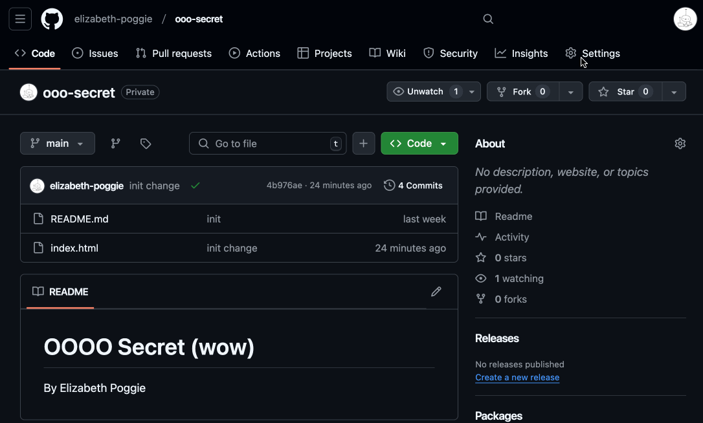

---
# General Information
category: "Web Programming I"
title: "Creativity Tools && Publishing Content"
created: "2024-12-06"
number: 39
---

# Creativity Tools

Here are tools I use in my workflow that you will find handy:

- [Remove.bg](https://www.remove.bg/upload) 👉 Remove backgrounds of images
- [Unsplash](https://unsplash.com/) 👉 HD content (remember to sort by the License "Free")
- [LICEcap](https://www.cockos.com/licecap/) 👉 Turn screen recordings into gifs so your demos look fancy
- [ezgif](https://ezgif.com/maker) 👉 Turn screen recordings into gifs if you want to make bootleg animations
- [makeemoji](https://makeemoji.com/) 👉 Turn images into emojis
- [bing AI](https://www.bing.com/images/create) 👉 AI generated images (for free)
- [leonardo](https://app.leonardo.ai/auth/login?callbackUrl=%2Fai-generations) 👉 AI generated images (for free)

Happy creating :^)

# GitHub Pages

Once you have your private repo ready, let's cook with some GAS 🧑‍🍳🔥

## Configuring your repo

- Ensure that your `index.html` is in the ROOT of your project
- Go to your repository’s Settings tab
- Scroll down to the "Pages" section (in the "Code and automation" category on the left)
- Under Source, choose the branch you want to deploy from. You have 2 options:
  - `main` 👉 What I do for this very website (except a bit more complicated)
  - `gh-pages` 👉 What I do for your assignment deployments
- Select Save

## Demo



## Accessing your site

```JS
`https://${username}.github.io/${repository-name}`
```

## Custom domains

If you want to use your own domain:

- Go to the Pages section in Settings.
- Add your custom domain in the Custom domain field.
- Remember DNS from User Interfaces? This is where you apply that knowledge :^) Update your domain's DNS settings to include a record pointing to `username.github.io`

## Documentation

📖 To access the official documentation, visit [here](https://docs.github.com/en/pages/getting-started-with-github-pages/creating-a-github-pages-site).

# Secrets

Setting up secrets is handy for managing sensitive information like API keys, access tokens, and other personal stuff

## Configuring your repo

- Go to your repository’s Settings tab
- Scroll down to the "Secrets and variables" section
- Select "Codespaces" section and click "New repository secret"
- Select Save

## Demo



## Documentation

📖 To access the official documentation, visit [here](https://docs.github.com/en/codespaces/managing-your-codespaces/managing-your-account-specific-secrets-for-github-codespaces)
