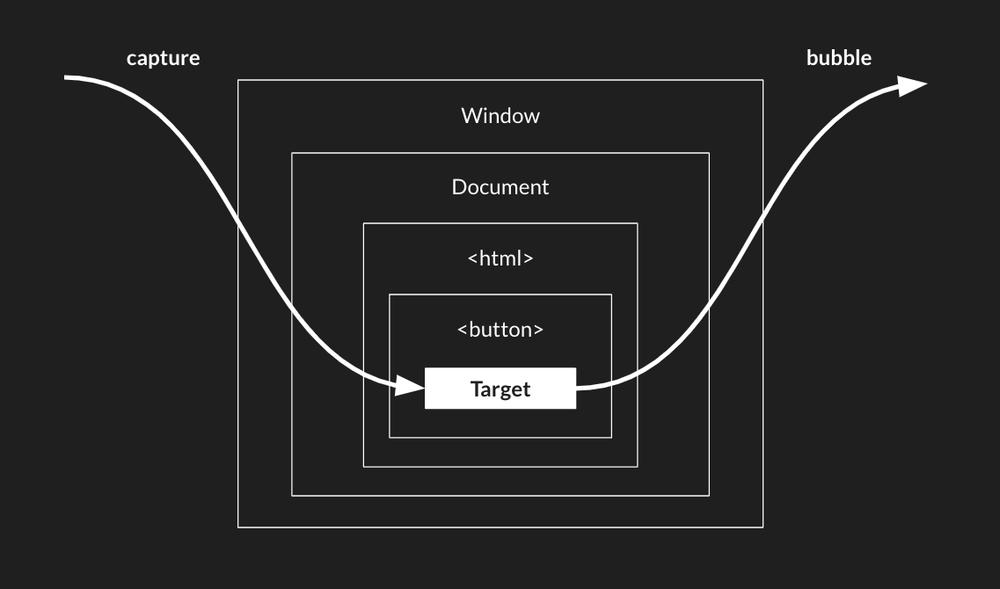

---
# General Information
category: "Web Programming I"
title: "Event Bubbling && Node.js"
created: "2024-10-07"
number: 6
---

# Question 1

What is event bubbling?

- ❌ A method for preventing an event from being triggered
- ❌ The process of an event moving from the outermost element to the innermost element
- ✅ The process of an event propagating from the innermost element to it's outermost elements
- ❌ A way to execute an event on multiple elements simultaneously

## Why?

Event bubbling is the process where an event starts from the innermost element (the `target` element) and then propagates or "bubbles up" to its parent elements in the DOM hierarchy.



This means that when an event is triggered on an element, the event handler for that element is executed first, and then the same event propagates upwards through its parent elements, allowing those parent elements to handle the event as well if they have event listeners :^)

# Question 2

How do you prevent event bubbling in JavaScript?

- ❌ Adding `{ capture: false }` to your event listener
- ✅ Calling `event.stopPropagation()` within your event handler
- ❌ Adding `{ bubbling: false }` to your event listener.
- ❌ Returning `false` from your event handler

## Why?

This stops the event from continuing to propagate up through the DOM, effectively preventing any parent elements from receiving the event. All the other options are wrong or don't actually exist

# Question 3

Which of the following is _NOT_ part of the Event Life Cycle in JavaScript?

- ❌ Event propagation
- ❌ Event capturing
- ❌ Event creation
- ✅ Event serialization

## Why?

Event serialization is a problem for like week 12 or web 2 and isn't part of the event lifecycle

# Question 4

Which line, if any, will cause an error in the following script?

```js
var size = 12; // option 1
beans = 9000; // option 2
test();

function test() {
  "use strict";
  size++; // option 3
  count++; // option 4
}
```

- ❌ There are no problems with this code
- ❌ option 1
- ✅ option 4
- ❌ option 2
- ❌ option 3
