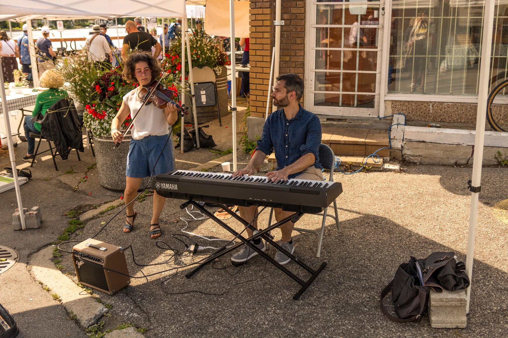
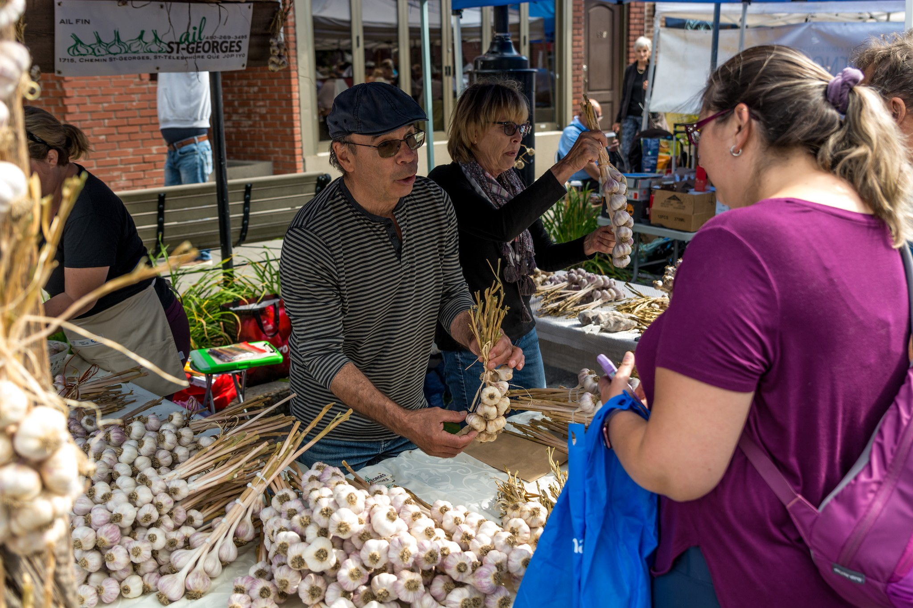

---
# General Information
category: "Event"
title: "Garlic Festival 2023"
created: "2023-08-26"
coverSrc: "./assets/cover.jpeg"
---

Coordinated the largest garlic festival in Quebec on a 3 month timeline with limited budget for ~7000 attendees. In my time as lead, I managed all aspects of event logistics, including vendor selection, sponsorship negotiation, media partnerships, budgeting, and on-site coordination.

## Our Partners

CBC, All in a Weekend with Sonali Karnick

CJAD, Weekends with Ken

## Summary of work

- Managed all aspects of event logistics, including vendor selection, sponsorship negotiation, media partnerships, budgeting, and on-site coordination.
- Recruited and provided guidance to 30 volunteers and 10 workshop hosts; including meetings to discuss roles, responsibilities and expectations, workshop specifications and activity schedules.
- Developed email marketing strategies, social media marketing campaigns, and coordinated a team to deliver a media release that was later aired on CBC and CHOM.
- Developed and maintained positive relationships with vendors, sponsors, volunteers, and leaders within the community.
- Conducted post-event evaluations to assess success and identify areas for improvement.

  

  

  

  

