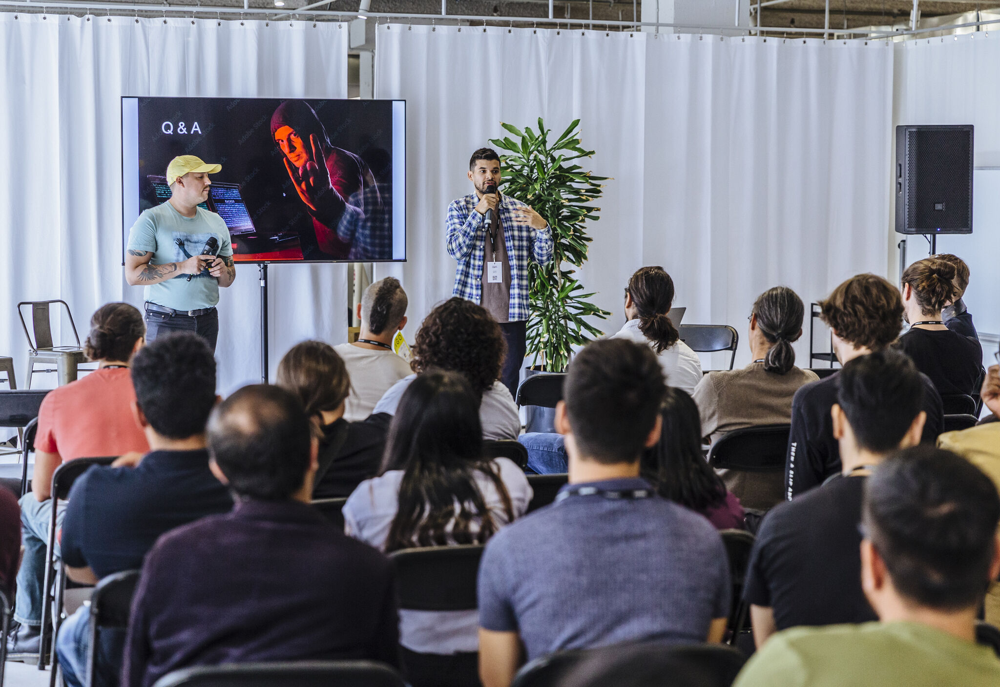
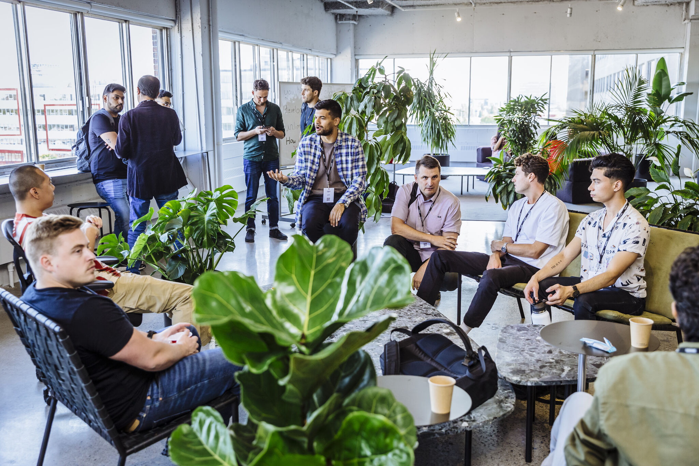
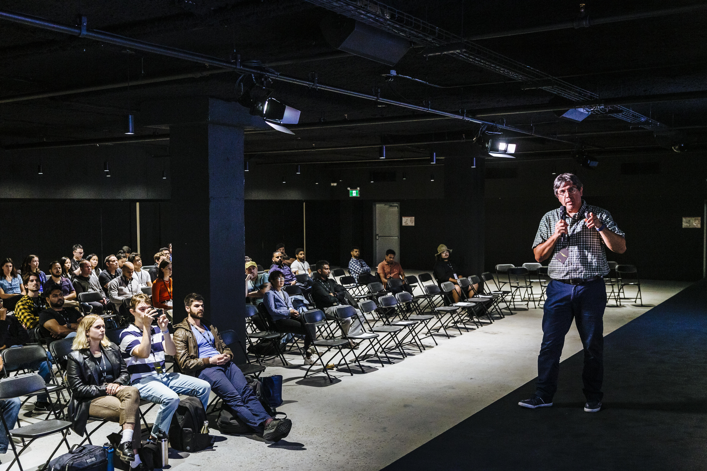

---
# General Information
category: "Event"
title: "Innovation Day"
created: "2022-07-27"
coverSrc: "./assets/cover.jpeg"
---

Supported senior management in delivering SSENSE’s first in-person tech conference by coordinating several teams in delivering networking opportunities for 300 engineers. The event yielded 95% satisfaction in a survey with the key positive feedback directly attributed to my strategies.

## Summary of work

- Recruited and trained 15 volunteers on meeting facilitation techniques.
- Researched, scheduled, and implemented community building strategies.
- On-site support to ensure smooth event operations.

  

  

  

  

