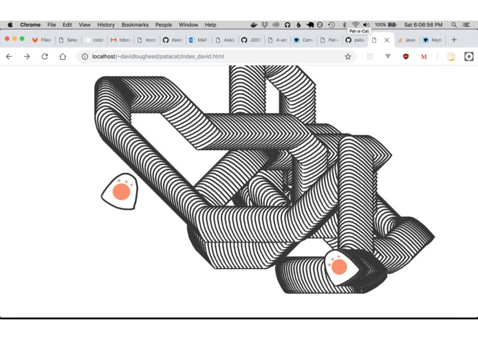
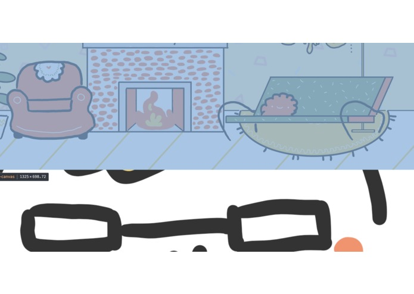

---
# General Information
category: "Hackathon"
title: "Pat-a-Cat"
created: "2019-02-02"
coverSrc: "./assets/1.jpeg"
---

Pat-a-cat was inspired when Aidon Lebar said "all i want to do is pet cats" and from there started a story of heroism as David Lougheed, Elizabeth Poggie, and Allan Wang made it happen. Winner of best design, cats took McHacks by storm and in you could witness the cats being drawn, meows being recorded, and code being coded.

  

  

  

