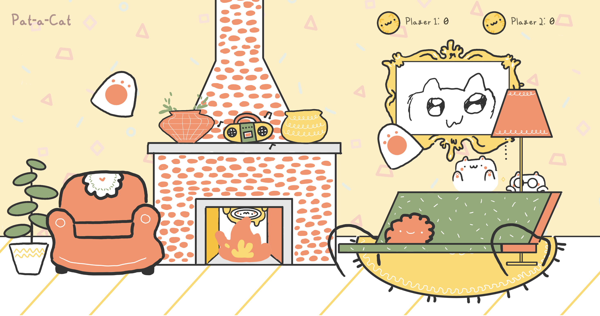
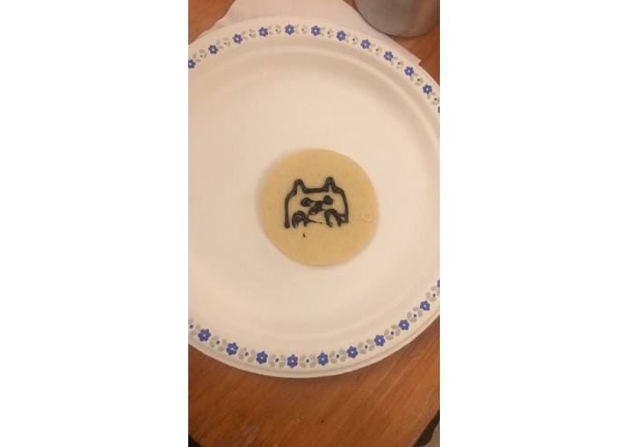

---
# General Information
category: "Hackathon"
title: "Pat-a-Cat"
created: "2019-02-02"
coverSrc: "./assets/meow.gif"
---

Pat-a-Cat was inspired by a simple desire from Aidon Lebar: "All I want to do is pet cats." This sparked a heroic journey as David Lougheed, Elizabeth Poggie, and Allan Wang turned that dream into reality. Designed to help you relax with some lofi hip hop beats while petting cats, Pat-a-Cat offers an escape from everyday stress. After you pat a cat, you'll hear the happy meows of hackers, sponsors, and coordinators of McHacks. The project went on to win Best Design at McHacks 6, catpuring the hearts of everyone involved.

## Try it out

[patacat.github.io](https://patacat.github.io/)

## Controls

- WASD to move Player 1, E to pat with Player 1.
- IJKL to move Player 2, O to pat with Player 2.

  

  

  

