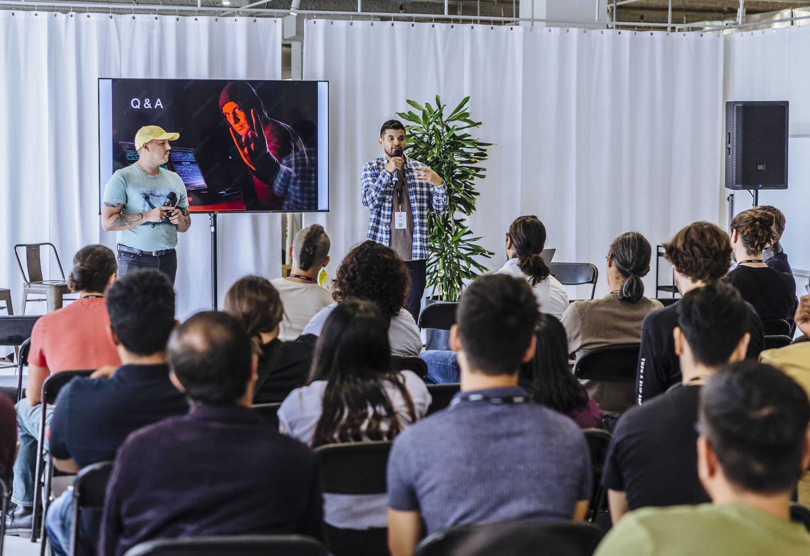
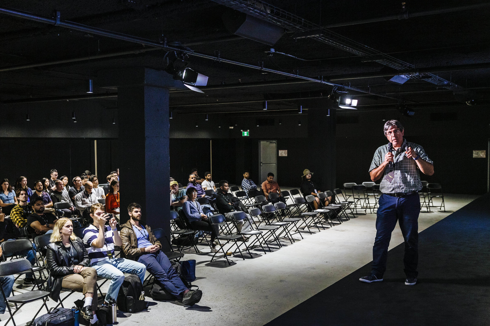

---
# General Information
category: "Management"
title: "Innovation Day"
created: "2022-07-27"
coverSrc: "./assets/cover.jpeg"
---

Supported senior management in delivering SSENSE’s first in-person tech conference by coordinating several teams in delivering networking opportunities for 300 engineers. The event yielded 95% satisfaction in a survey with the key positive feedback directly attributed to my strategies.

# Community Engagement Highlights

## Custom Slack Emojis

A community building workshop centered around SSENSE's thriving emoji culture to provide networking opportunities between cross functional teams and senior leadership.

Check out the slides [here](./assets/custom-slack-emojis-slides.pdf) for a detailed guide. The tools used are:

- [remove.bg](https://www.remove.bg/upload) for background removal
- [ezgif.com](https://ezgif.com/help/adding-background-to-transparent-gif) for adding backgrounds to transparent GIFs
- [ezgif.com](https://ezgif.com/maker) for GIF creation
- [makeemoji.com](https://makeemoji.com/) for creating custom emojis

  

  

# Summary of work

- Recruited and trained 15 volunteers on meeting facilitation techniques.
- Researched, scheduled, and implemented community building strategies.
- On-site support to ensure smooth event operations.

  

  

  

  

