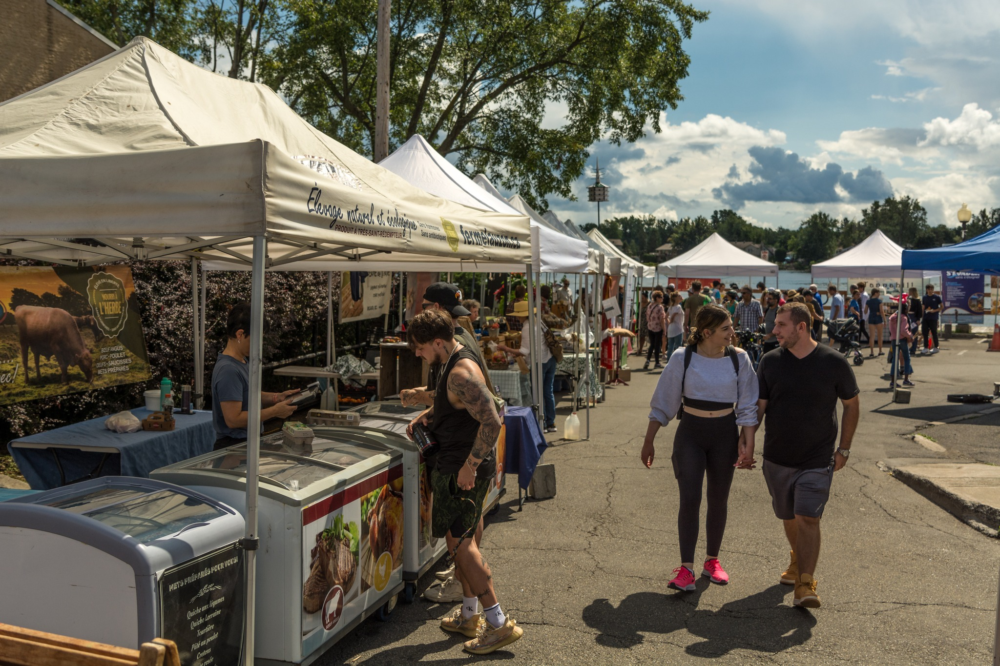
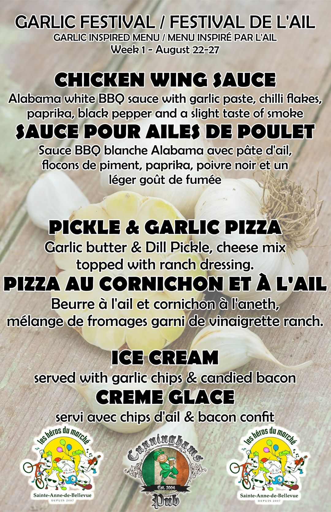
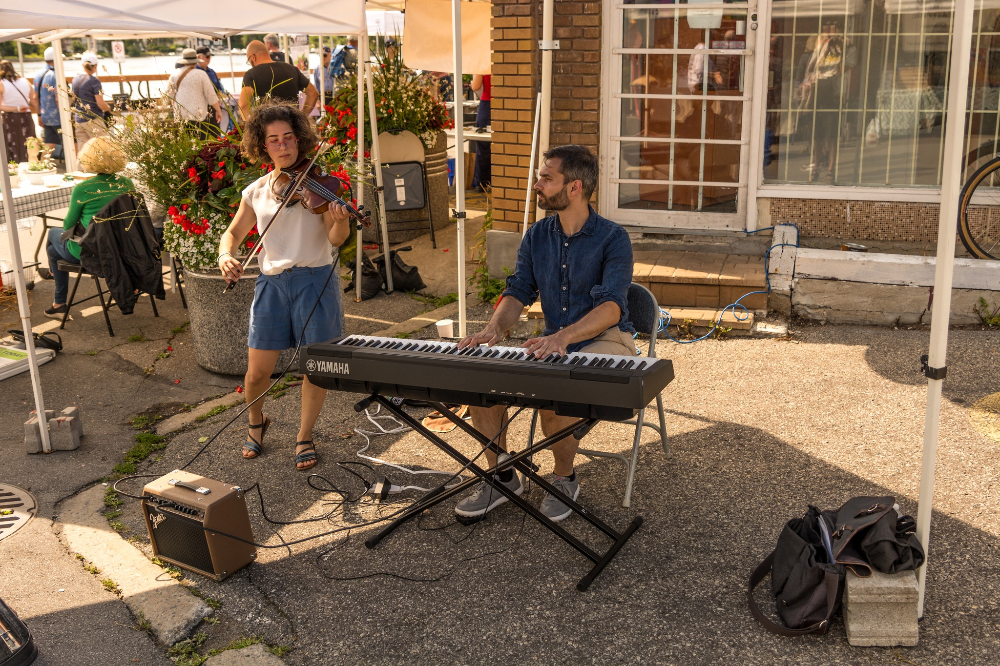
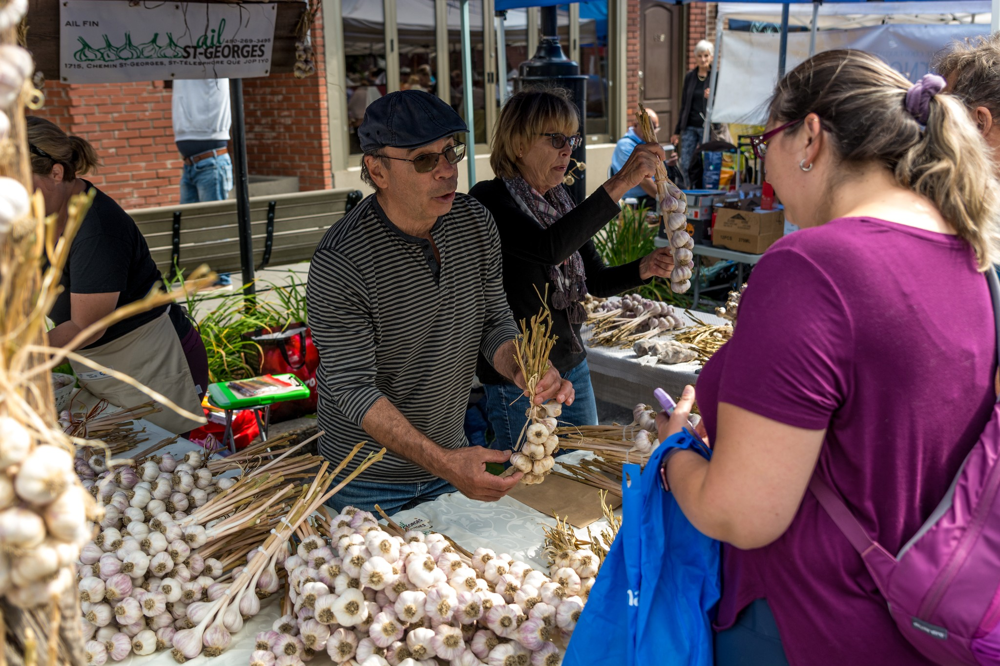

---
# General Information
category: "Project Management"
title: "Garlic Festival"
created: "2023-08-26"
coverSrc: "./assets/1.jpeg"
---

Coordinated the largest garlic festival in Quebec on a 3 month timeline with limited budget for ~7000 attendees. In my time as lead, I managed all aspects of event logistics, including vendor selection, sponsorship negotiation, media partnerships, budgeting, and on-site coordination.

# Partner Highlights

## CBC

Listen to Sonali Karnick on All in a Weekend as she chats with festival founder Dan Brisebois about the festival activities, workshops, and the garlic dessert competition here:

<audio
  controls
  src="/portfolio/management/2023-garlic-festival/assets/sonali.mp3"
  style={{
    paddingTop: "20px",
  }}
></audio>

## CJAD 800

On Weekends with Ken: Tracey McKee, program dean at John Abbott College, talks about the Garlic Festival in Ste Anne de Bellevue. Listen to the clip here:

<audio
  controls
  src="/portfolio/management/2023-garlic-festival/assets/The_St-Anne-De-Bellevue_Garlic_Festival_Is_On_Today!.mp3"
  style={{
    paddingTop: "20px",
  }}
></audio>

## Cunninghams Pub

Jim Beachamp collaborated with his chefs to create a special menu just for the festival:

# Summary of work

- Managed all aspects of event logistics, including vendor selection, sponsorship negotiation, media partnerships, budgeting, and on-site coordination.
- Recruited and provided guidance to 30 volunteers and 10 workshop hosts; including meetings to discuss roles, responsibilities and expectations, workshop specifications and activity schedules.
- Developed email marketing strategies, social media marketing campaigns, and coordinated a team to deliver a media release that was later aired on CBC and CHOM.
- Developed and maintained positive relationships with vendors, sponsors, volunteers, and leaders within the community.
- Conducted post-event evaluations to assess success and identify areas for improvement.

  

  

  

  

# Meet the Team

## Our Partners

- Cunninghams Pub
- Café T.W.I.G.S.
- Café Elba
- Plant Love Grow

## Spec-ail Guests

- Tracey McKee 👉 Program Dean, John Abbott College
- Paola Hawa SADB 👉 Mayor, Ville de Sainte Anne de Bellevue
- Jim Beauchamp 👉 President, Cunninghams Pub
- Line Chatel 👉 Owner, Les Caieux de Saint-Georges

## Media Partners

- Sonali Karnick 🤝 Host, All in a Weekend @ CBC
- Ken 🤝 Host, Weekends with Ken @ CJAD 800 Montreal
- Geneviève 🤝 Association des Producteurs Ail Quebec
- Stephanie 🤝 West Island Home & Life

## Hosts

- Dan Brisebois ☀️ La Ferme Coopérative Tourne-Sol
- Leda ☀️ Macdonald Student-run Ecological Gardens - MSEG
- Remy ☀️ Ferme le champs libre
- Luc Gagnon ☀️ Ail de la montagne
- Isabelle Demers ☀️ LE Port'ail DU Cul-De-Sac
- Gillian ☀️ So Succulents

## Muscicians

- Augie & Ron 🎶
- Ram & Ferenc 🎶

## Artists

- Tatiana 🎨 Maquillage // face painting
- Noamie 🎨 Maquillage // face painting
- Montreal Clown - Lulu the Clown 🎨 Sculptures de ballons // balloon sculptures
- Elaheh Bos 🎨 Station de coloriage // Colouring station

## Volunteers

- Julie Vaillancourt 🫶 Leadership Support, Marché Ste Anne
- Caroline Begg 🫶 Head of Finance, Marché Ste Anne
- Sharon Rutherford 🫶 Shadow Leader, Head of Recruitment & Partner in Crime
- Patti Murphy 🫶 Media ✨ EXPERT ✨
- Nathalie Paquin 🫶 Chief Executive Hype Woman and Co-Conspirator
- Rachel Sutherland 🫶 Chief Communications Officer and Product Visionary
- Hannah Wiebe and Aidon Lebar 🫶 Product Visionary Co-Conspirators
- Katherine Dulong 🫶 Market Enthusiast
- Kiana 🫶 Head of Logistics, Marché Ste Anne
- David Lougheed 🫶 Principal Director of Photography
- Andreas 🫶 Official Photographer - Andreas K Photography
- Alessandro Commodari 🫶 Fashion Icon
- ..... And another 15 that were there for the event
