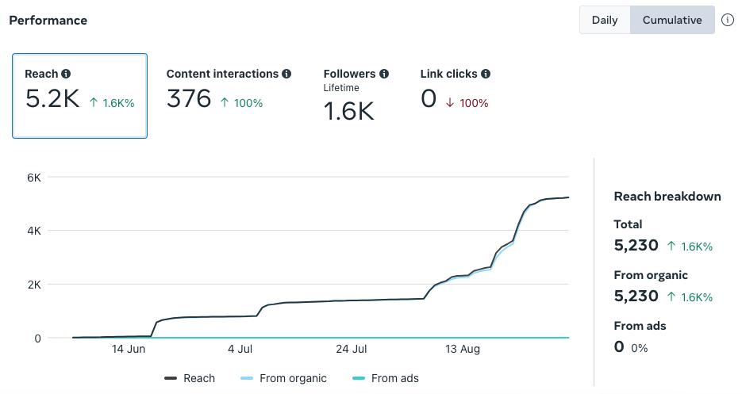
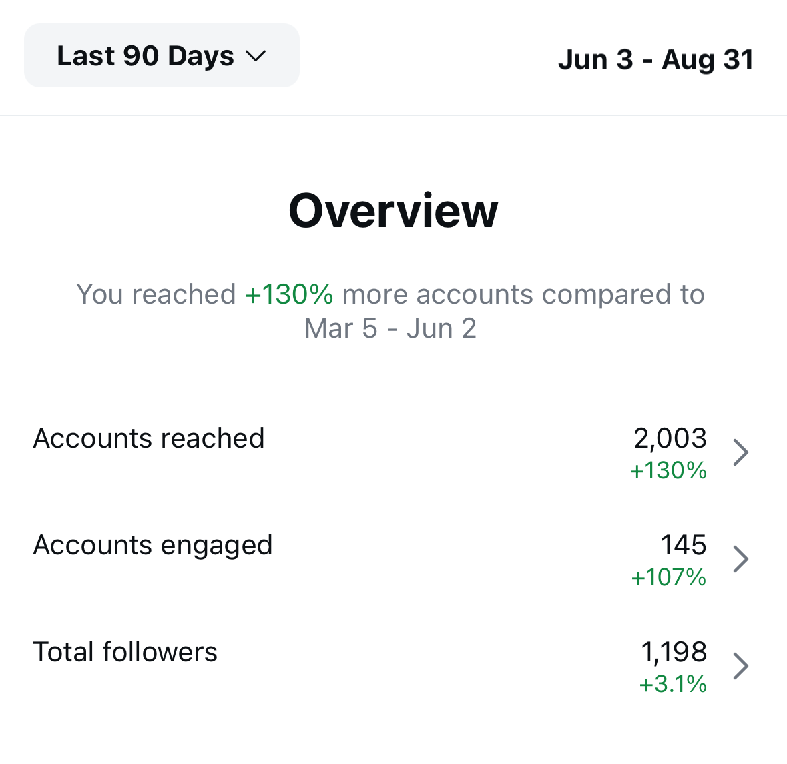
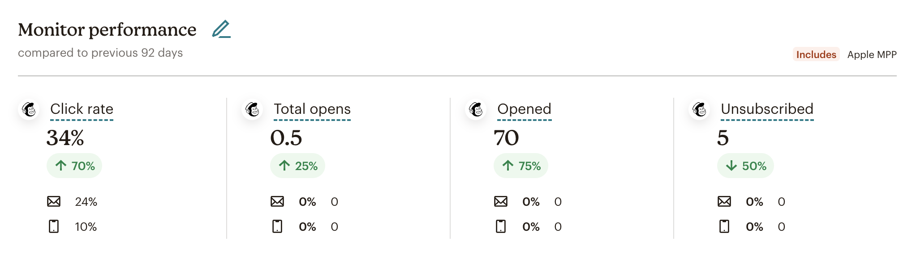

---
# General Information
category: "Management"
title: "Marché Sainte-Anne"
created: "2024-09-01"
coverSrc: "./assets/1.jpg"
---

Organized three community outreach events on a four-month timeline, attracting over 10,000 participants. In my time as lead, I managed every aspect of event logistics, from securing major donations and forming key partnerships to expanding social media reach. I also led a cross-functional team of 30, successfully delivering these projects while minimizing risks to ensure smooth delivery.

# Summary of work

- Planed and executed strategies for identifying, cultivating, soliciting, and securing special gifts, which led to the formation of six key partnerships and the establishment of multiple relationships to secure major donations of $5,000+ in 2025
- Organized three community outreach events to foster relationships with individual donors, vendors, and foundations, resulting in a combined attendance of over 10,000 participants.
- Developed and implemented strategic campaign plans that expanded Instagram reach by 130%, expanded facebook reach by 1.6k% and increased email engagement by 70%.
- Led a cross-functional team of 30 in delivering high-profile projects, consistently meeting tight budget constraints while ensuring successful event execution.
- Worked closely with the Board to refine project management practices, regularly tracking progress and adjusting plans as needed to meet deadlines.
- Managed content creation for the website, social media, and email campaigns, significantly enhancing brand visibility and deepening engagement with our core demographic and donor groups.
- Proactively identified and managed risks through targeted mitigation strategies, including diffusing crisis situations with key stakeholders, rebuilding damaged relationships with potential donor groups, and implementing effective recruitment strategies to ensure smooth project delivery with minimal disruption.

# Marketing Analytics

## Insights

The following results were achieved through a modernization effort of our social media and email campaigns, which helped solidify our brand identity and strengthen our public image, deepening engagement with our core demographic. Key strategies included updating content for each platform using newly developed Brand Kits, tailoring our approach to remain competitive, and actively engaging our audience with interactive elements.

Our primary goal was to showcase the strong sense of community at the market, demonstrating that we offer more than just a place to buy vegetables. Our campaigns focused on highlighting our partners, vendors, and family-friendly activities to attract young families, positioning us as an affordable option with a strong sense of belonging.

All advertisements were created using accessible software, ensuring that the brand can be easily maintained even after my time.

## Facebook

## Instagram

## Email

# Meet the Team

## Our Partners

- Cunninghams Pub
- Café Elba
- Plant Love Grow
- B Factory
- Locks & Ladle
- Sauvetage Baie-D'Urfé Rescue Squad

## Spec-ail Guests

- Roberta Šilerová 👉 Program Dean, John Abbott College
- Paola Hawa 👉 Mayor, Saint-Anne-de-Bellevue
- Jim Beauchamp 👉 President, Cunninghams Pub
- Line Chatel 👉 Owner, Les Caiux de Saint-Georges
- Luc Gagnon 👉 Owner, Ail de la Montagne

## Media Partners

- Sonali Karnick 🤝 Host, All in a Weekend @ CBC
- Geneviève 🤝 Association des Producteurs Ail Quebec
- Natacha G. Filion 🤝 Comedian and Influencer

## Hosts

- Dan Brisebois ☀️ Founder, Tourne-Sol Ferme Coopérative
- Samuel Liptay ☀️ Macdonald Student-run Ecological Gardens
- Isabelle Demers ☀️ Owner, LE Port'ail DU Cul-De-Sac
- Patti M Murphy ☀️ Writer and Garlic Enthusiast

## Musicians

- Augie & Ron 🎶 R&B, pop, rock and soul
- Ram & Ferenc 🎶 Contemporary classics with a kick

## Artists

- Stephanie's Face Painting 🎨 Face painting
- Face Painting Montreal 🎨 Face painting
- Elaheh Bos 🎨 Coloring station
- Emilia & Emma 🎨 Chalk station

## Volunteers

- Julie Vaillancourt 🫶 Strategic Support, Marché Ste Anne
- Caroline Begg 🫶 President, Marché Ste Anne
- Sharon Rutherford 🫶 Shadow Leader, Head of Recruitment & Partner in Crime
- Katherine Dulong 🫶 Market Enthusiast
- Nathalie Paquin 🫶 Chief Executive Hype Woman and Co-Conspirator
- Hannah Wiebe and Aidon Lebar 🫶 Product Visionary Co-Conspirators
- Emma 🫶 Head of Market Logistics, Ste Anne Market
- Andreas K Photography 🫶 Official Photographer
- Jean Djamen 🫶 Fashion Icon
- Davidee Inukpuk 🫶 Head of Sales
- Carolina 🫶 Sales Growth Specialist
- Angela 🫶 Client Support Expert
- Mark 🫶 Local Garlic Enthusiast
- Dan 🫶 Foreign Garlic Enthusiast
- Heloise 🫶 Garlic Clothing Enthusiast
- Gaby 🫶 Garlic Hat Enthusiast

## Spec-ail Mentions

- Salim ATTOU 💪 Project Management Support
- Davidee Inukpuk 💪 Enterprise Sales Support
