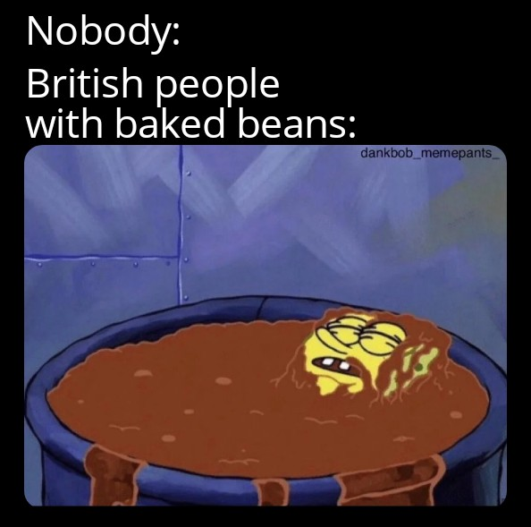

---
# General Information
category: "Breakfast"
number: 1
type: "Recipe"
title: "Beans on Toast"
created: "2024-07-05"
subtitle: "bestowed upon us by the queen, adapted by colin"
coverSrc: "./assets/beans.jpeg"
---

# Ingredients

- Heinz baked beans
- White Bread
- Some butter

# Instructions

- Toast the Toast
- Once crispy and brown, put a little bit of butter on it
- smother with baked beans
- Joy

"experience immense pleasure" - Coblin
